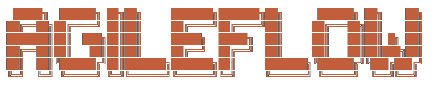

<p align="center">
  
</p>

[](https://www.npmjs.com/package/agileflow)
[](docs/04-architecture/commands.md)
[](docs/04-architecture/subagents.md)
[](docs/04-architecture/skills.md)
[](docs/04-architecture/agent-expert-system.md)

**AI-driven agile development for Claude Code, Cursor, Windsurf, and more.** Combining Scrum, Kanban, ADRs, and docs-as-code principles into one framework-agnostic system.

---

## Quick Start

### Installation

**Global (Recommended):**
```bash
npm install -g agileflow
agileflow setup
```

**Project-Level:**
```bash
npm install agileflow
npx agileflow setup
```

### After Setup

```bash
/agileflow:help              # View all commands
/agileflow:babysit           # Interactive mentor for implementation
/agileflow:configure         # Configure hooks, status line, etc.
```

### Supported IDEs

| IDE | Status | Config Location |
|-----|--------|-----------------|
| Claude Code | Supported | `.claude/commands/agileflow/` |
| Cursor | Supported | `.cursor/rules/agileflow/` |
| Windsurf | Supported | `.windsurf/workflows/agileflow/` |

---

## Why AgileFlow?

AgileFlow combines three proven methodologies:

- **Agile (Scrum/Kanban)** - Break work into Epics → Stories → Acceptance Criteria
- **ADRs** - Record architectural decisions so future teams don't re-debate
- **Docs-as-Code** - Humans and AI agents coordinate via versioned files

**Key Benefits:**
- Clear priorities and testable increments
- Durable memory and decision history
- Multi-agent collaboration via message bus
- Works with any tech stack or framework

---

## Core Components

| Component | Count | Description |
|-----------|-------|-------------|
| [Commands](docs/04-architecture/commands.md) | 41 | Slash commands for agile workflows |
| [Subagents](docs/04-architecture/subagents.md) | 26 | Specialized agents for focused work |
| [Skills](docs/04-architecture/skills.md) | 23 | Auto-activated context helpers |
| [Experts](docs/04-architecture/agent-expert-system.md) | 26 | Self-improving knowledge bases |

---

## Documentation

Full documentation lives in [`docs/04-architecture/`](docs/04-architecture/):

### Reference
- [Commands](docs/04-architecture/commands.md) - All 41 slash commands
- [Subagents](docs/04-architecture/subagents.md) - All 26 specialized agents
- [Skills](docs/04-architecture/skills.md) - 23 auto-loaded skills

### Architecture
- [AgileFlow CLI Overview](docs/04-architecture/agileflow-cli-overview.md) - System architecture
- [Agent Expert System](docs/04-architecture/agent-expert-system.md) - Self-improving agents
- [Multi-Expert Orchestration](docs/04-architecture/multi-expert-orchestration.md) - Parallel expert analysis

### Configuration
- [Configuration System](docs/04-architecture/configuration-system.md) - 8 configuration agents
- [Hooks System](docs/04-architecture/hooks-system.md) - Event-driven automation
- [Session Harness](docs/04-architecture/session-harness.md) - Test verification and sessions

---

## Examples

### Create an Epic with Stories
```bash
/agileflow:epic EPIC=EP-0001 TITLE="User Authentication" OWNER=AG-API GOAL="Secure login"
```

### Work on a Story
```bash
/agileflow:assign STORY=US-0001 NEW_OWNER=AG-UI NEW_STATUS=in-progress
# ... implement ...
/agileflow:status STORY=US-0001 STATUS=in-review SUMMARY="Login form complete"
```

### Use Multi-Expert Analysis
```bash
/agileflow:multi-expert Is this authentication implementation secure?
```

---

## Project Structure

After running `/agileflow:setup`:

```
docs/
  00-meta/             # Templates, conventions
  01-brainstorming/    # Ideas and sketches
  02-practices/        # Testing, git, CI practices
  03-decisions/        # ADRs
  04-architecture/     # Architecture documentation
  05-epics/            # Epic definitions
  06-stories/          # User stories
  07-testing/          # Test cases
  08-project/          # Roadmap, backlog
  09-agents/           # Agent status, message bus
  10-research/         # Research notes
```

---

## License

MIT

## Support

For issues or questions, visit the [GitHub repository](https://github.com/projectquestorg/AgileFlow).
