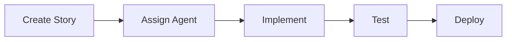
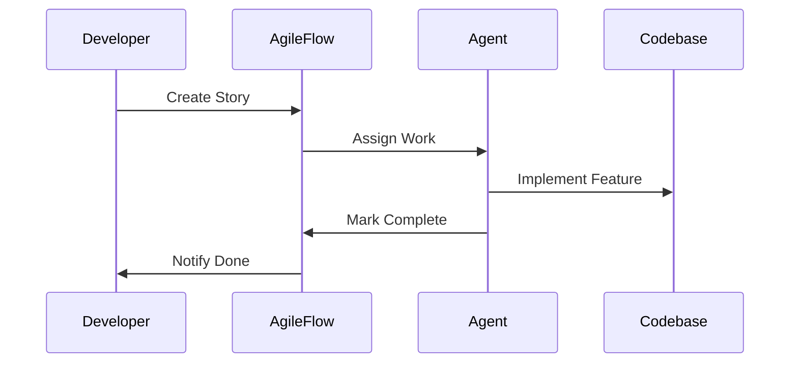

import { Card, Cards } from 'fumadocs-ui/components/card';
import { Callout } from 'fumadocs-ui/components/callout';
import { Steps, Step } from 'fumadocs-ui/components/steps';
import { Tab, Tabs } from 'fumadocs-ui/components/tabs';
import { Accordion, Accordions } from 'fumadocs-ui/components/accordion';
import { File, Folder, Files } from 'fumadocs-ui/components/files';
import { TypeTable } from 'fumadocs-ui/components/type-table';
import { ImageZoom } from 'fumadocs-ui/components/image-zoom';

# Component Showcase

This page showcases all the Fumadocs UI components available for the AgileFlow documentation.

---

## Callouts

Callouts are used to highlight important information.

<Callout>
  This is a default callout. Use it for general information.
</Callout>

<Callout type="info">
  This is an info callout. Use it for helpful tips.
</Callout>

<Callout type="warn">
  This is a warning callout. Use it for important warnings.
</Callout>

<Callout type="error">
  This is an error callout. Use it for critical issues.
</Callout>

---

## Cards

Cards are used to display linked content in a grid.

<Cards>
  <Card
    title="Getting Started"
    description="Learn the basics of AgileFlow"
    href="#"
  />
  <Card
    title="Installation Guide"
    description="Set up AgileFlow in your project"
    href="#"
  />
  <Card
    title="Quick Start Tutorial"
    description="Create your first story in 5 minutes"
    href="#"
  />
</Cards>

---

## Steps

Steps are used to show a sequence of actions.

<Steps>
  <Step>
    ### Install AgileFlow

    Run the installation command:

    ```bash
    npx agileflow install
    ```
  </Step>
  <Step>
    ### Create Your First Story

    Use the story command:

    ```bash
    /agileflow:story
    ```
  </Step>
  <Step>
    ### Start Developing

    Assign the story to an agent and start coding!
  </Step>
</Steps>

---

## Tabs

Tabs are used to organize content into different views.

<Tabs items={['npm', 'pnpm', 'yarn', 'bun']}>
  <Tab value="npm">
    ```bash
    npx agileflow install
    ```
  </Tab>
  <Tab value="pnpm">
    ```bash
    pnpm dlx agileflow install
    ```
  </Tab>
  <Tab value="yarn">
    ```bash
    yarn dlx agileflow install
    ```
  </Tab>
  <Tab value="bun">
    ```bash
    bunx agileflow install
    ```
  </Tab>
</Tabs>

---

## Accordions

Accordions are used to show/hide content sections.

<Accordions>
  <Accordion title="What is AgileFlow?">
    AgileFlow is an AI-driven agile development system that brings powerful automation to your workflow with **41 commands**, **26 specialized agents**, and **23 reusable skills**.
  </Accordion>
  <Accordion title="How do I install it?">
    Simply run `npx agileflow install` in your project directory. AgileFlow will set up all the necessary files and configurations.
  </Accordion>
  <Accordion title="What IDEs are supported?">
    AgileFlow works with Claude Code, Cursor, and Windsurf. More IDE integrations are coming soon!
  </Accordion>
</Accordions>

---

## File Tree

Display file and folder structures.

<Files>
  <Folder name=".agileflow" defaultOpen>
    <File name="config.json" />
    <Folder name="commands">
      <File name="story.md" />
      <File name="sprint.md" />
      <File name="board.md" />
    </Folder>
    <Folder name="agents">
      <File name="api.md" />
      <File name="ui.md" />
      <File name="testing.md" />
    </Folder>
  </Folder>
  <Folder name="docs">
    <File name="status.json" />
    <Folder name="epics">
      <File name="EP-0001.md" />
    </Folder>
  </Folder>
</Files>

---

## Type Table

Display TypeScript types and interfaces.

<TypeTable
  type={{
    name: {
      description: 'The name of the story',
      type: 'string',
      default: 'undefined',
    },
    status: {
      description: 'Current status of the story',
      type: "'todo' | 'in-progress' | 'done'",
      default: "'todo'",
    },
    points: {
      description: 'Story points estimate',
      type: 'number',
      default: '1',
    },
    assignee: {
      description: 'Agent assigned to the story',
      type: 'string | undefined',
      default: 'undefined',
    },
  }}
/>

---

## Code Blocks

Syntax highlighted code with copy button.

```typescript title="story.ts"
interface Story {
  id: string;
  title: string;
  description: string;
  status: 'todo' | 'in-progress' | 'done';
  points: number;
  assignee?: string;
}

function createStory(title: string): Story {
  return {
    id: `US-${Date.now()}`,
    title,
    description: '',
    status: 'todo',
    points: 1,
  };
}
```

With line highlighting:

```typescript title="highlighted.ts" {3-5}
function example() {
  // This line is not highlighted
  // This line IS highlighted
  // This line IS highlighted
  // This line IS highlighted
  // This line is not highlighted
}
```

---

## Tables

Standard markdown tables.

| Command | Description | Example |
|---------|-------------|---------|
| `/agileflow:story` | Create a new story | `/agileflow:story "Add login"` |
| `/agileflow:sprint` | Plan a sprint | `/agileflow:sprint` |
| `/agileflow:board` | View kanban board | `/agileflow:board` |
| `/agileflow:pr` | Generate PR description | `/agileflow:pr US-001` |

---

## Blockquotes

> "AgileFlow reduced our sprint planning time from 2 hours to 30 minutes. The AI-generated acceptance criteria are spot-on."
>
> — Development Team Lead

---

## Lists

### Unordered List

- Write stories with AI-generated acceptance criteria
- Plan sprints with velocity tracking
- Assign work to specialized AI agents
- Track progress with visual kanban boards

### Ordered List

1. Install AgileFlow
2. Create your first epic
3. Break it down into stories
4. Assign to agents
5. Ship to production

### Nested List

- Agents
  - API Agent
    - Handles backend services
    - Generates API documentation
  - UI Agent
    - Creates components
    - Manages styling
  - Testing Agent
    - Writes test suites
    - Ensures coverage

---

## Inline Elements

This is **bold text** and this is *italic text*.

This is `inline code` within a sentence.

This is a [link to GitHub](https://github.com/projectquestorg/AgileFlow).

This is ~~strikethrough text~~.

---

## Headings

# Heading 1
## Heading 2
### Heading 3
#### Heading 4

---

## Horizontal Rules

Content above the rule.

---

Content below the rule.

---

## Mermaid Diagrams





---

## Image with Zoom

<ImageZoom
  src="/logo.png"
  alt="AgileFlow Logo"
  width={200}
  height={200}
/>

---

## Combined Example

Here's an example combining multiple components:

<Callout type="info">
  Follow these steps to get started with AgileFlow.
</Callout>

<Steps>
  <Step>
    ### Choose Your Package Manager

    <Tabs items={['npm', 'pnpm']}>
      <Tab value="npm">
        ```bash
        npx agileflow install
        ```
      </Tab>
      <Tab value="pnpm">
        ```bash
        pnpm dlx agileflow install
        ```
      </Tab>
    </Tabs>
  </Step>
  <Step>
    ### Verify Installation

    Check that these files were created:

    <Files>
      <Folder name=".agileflow" defaultOpen>
        <File name="config.json" />
      </Folder>
      <File name="CLAUDE.md" />
    </Files>
  </Step>
</Steps>

<Cards>
  <Card
    title="Next Steps"
    description="Learn more about AgileFlow features"
    href="#"
  />
</Cards>
