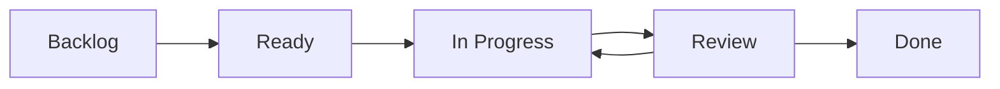

import { Callout } from 'fumadocs-ui/components/callout';
import { Card, Cards } from 'fumadocs-ui/components/card';

# Core Concepts

AgileFlow is built around core agile development concepts that help you manage and deliver software effectively.

## The AgileFlow Philosophy

AgileFlow believes that:

1. **Automation enhances creativity** - Let AI handle repetitive tasks so you can focus on solving problems
2. **Documentation is essential** - Good docs are as important as good code
3. **Structure enables flexibility** - A well-defined process gives you freedom to innovate
4. **AI should augment, not replace** - AgileFlow helps you work better, not work less

## Key Concepts

### Stories

A **story** represents a single unit of work from the user's perspective.

```markdown
**As a** user
**I want** to log in with my email
**So that** I can access my account
```

Stories in AgileFlow include:
- **Title**: Clear, descriptive name
- **Description**: User story format (As a/I want/So that)
- **Acceptance Criteria**: Given/When/Then scenarios
- **Story Points**: Effort estimation
- **Dependencies**: Related stories or blockers

<Callout type="info">
  Use `/agileflow:story` to create stories with AI-generated acceptance criteria.
</Callout>

### Epics

An **epic** is a large feature that contains multiple related stories.

Example epic: "User Authentication System"
- AF-001: User Login
- AF-002: Password Reset
- AF-003: Email Verification
- AF-004: Two-Factor Authentication

Epics help you:
- Break down large features
- Track progress across related work
- Plan releases and milestones

<Callout>
  Create epics with `/agileflow:epic` to automatically generate stories.
</Callout>

### Sprints

A **sprint** is a time-boxed period (usually 1-2 weeks) where you complete a set of stories.

Sprint planning involves:
1. Selecting stories from the backlog
2. Estimating team capacity
3. Assigning work to team members
4. Setting sprint goals

AgileFlow tracks:
- Sprint velocity
- Burndown charts
- Story completion rates
- Team capacity

### Architecture Decision Records (ADRs)

**ADRs** document important technical decisions and their rationale.

An ADR includes:
- **Context**: Why this decision is needed
- **Decision**: What you decided to do
- **Consequences**: Trade-offs and implications

Example ADR:
```markdown
# Use PostgreSQL for Database

## Context
We need a reliable database for user data with ACID guarantees.

## Decision
We will use PostgreSQL 15 as our primary database.

## Consequences
- **Positive**: Strong consistency, JSON support, mature ecosystem
- **Negative**: Requires more setup than SQLite
- **Neutral**: Team needs to learn PostgreSQL-specific features
```

<Callout type="warn">
  Always create an ADR for significant architectural decisions using `/agileflow:adr`
</Callout>

## Workflow States

Stories move through these states:



| State | Meaning |
|-------|---------|
| **Backlog** | Story is defined but not planned |
| **Ready** | Story is planned for upcoming sprint |
| **In Progress** | Actively being worked on |
| **Review** | Code review or testing |
| **Done** | Completed and deployed |

Update status with:
```bash
/agileflow:status AF-001 in-progress
```

## Agents

**Agents** are specialized AI assistants that handle specific types of work.

<Cards>
  <Card title="API Agent" href="/agents#api-agent">
    Backend services, APIs, and data models
  </Card>
  <Card title="UI Agent" href="/agents#ui-agent">
    Frontend components and styling
  </Card>
  <Card title="Testing Agent" href="/agents#testing-agent">
    Test strategies and test suites
  </Card>
  <Card title="DevOps Agent" href="/agents#devops-agent">
    CI/CD, deployment, and infrastructure
  </Card>
</Cards>

Invoke agents with:
```
@api implement user login endpoint
```

## Skills

**Skills** are reusable templates and code generators.

Examples:
- **Acceptance Criteria Generator**: Creates Given/When/Then scenarios
- **API Documentation Generator**: Generates OpenAPI specs
- **Test Case Generator**: Creates test suites from stories
- **Commit Message Formatter**: Formats conventional commits

Use skills within conversations or let agents invoke them automatically.

## Commands

**Commands** are slash commands that trigger specific AgileFlow actions.

Common commands:
- `/agileflow:story` - Create user story
- `/agileflow:epic` - Create epic
- `/agileflow:sprint` - Plan sprint
- `/agileflow:status` - Update story status
- `/agileflow:pr` - Generate PR description
- `/agileflow:adr` - Document decision

<Callout>
  Run `/agileflow:help` to see all 41 commands.
</Callout>

## Story Points

Story points estimate the **effort** required to complete a story.

Common scale (Fibonacci):
- **1**: Trivial change (< 1 hour)
- **2**: Simple feature (1-2 hours)
- **3**: Moderate feature (half day)
- **5**: Complex feature (full day)
- **8**: Very complex (2-3 days)
- **13**: Epic-sized (needs breakdown)

AgileFlow uses story points to:
- Calculate team velocity
- Plan sprint capacity
- Track progress

## Velocity Tracking

**Velocity** is the average story points your team completes per sprint.

Example:
- Sprint 1: 23 points completed
- Sprint 2: 27 points completed
- Sprint 3: 25 points completed
- **Average Velocity**: 25 points/sprint

Use velocity to:
- Plan realistic sprints
- Forecast delivery dates
- Identify capacity issues

AgileFlow calculates velocity automatically based on completed sprints.

## Dependencies

Stories can depend on other stories or external factors.

Types of dependencies:
- **Blocks**: Story A must be done before Story B
- **Related**: Stories are connected but not blocking
- **External**: Depends on third-party or another team

AgileFlow tracks dependencies and warns about:
- Circular dependencies
- Blocked stories in current sprint
- Critical path delays

## Best Practices

<Callout type="info">
  Following these practices will help you get the most from AgileFlow.
</Callout>

### 1. Keep Stories Small
- Aim for stories that complete in 1-3 days
- Break large stories into smaller ones
- Use epics for features that take longer

### 2. Write Clear Acceptance Criteria
- Use Given/When/Then format
- Make criteria testable
- Include edge cases

### 3. Document Decisions
- Create ADRs for significant choices
- Explain the "why" not just the "what"
- Review ADRs during retrospectives

### 4. Update Status Regularly
- Move stories through workflow states
- Keep the board current
- Communicate blockers quickly

### 5. Review Velocity
- Track velocity over multiple sprints
- Use it for planning, not performance reviews
- Adjust estimates based on actuals

## Next Steps

<Cards>
  <Card title="Epics & Stories" href="/epics-and-stories">
    Learn how to create and manage epics and stories
  </Card>
  <Card title="Sprint Planning" href="/sprint-planning">
    Discover sprint planning with velocity tracking
  </Card>
  <Card title="Commands" href="/commands">
    Explore all 41 AgileFlow commands
  </Card>
  <Card title="Agents" href="/agents">
    Meet the 26 specialized agents
  </Card>
</Cards>
