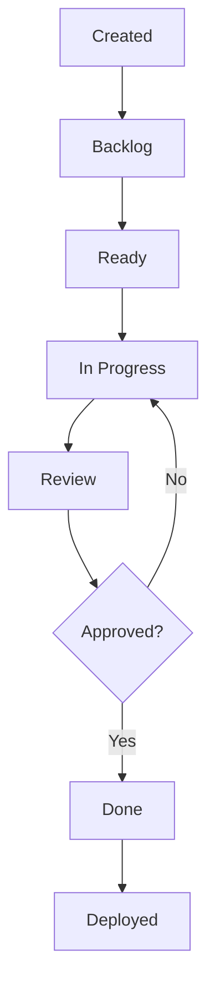

import { Callout } from 'fumadocs-ui/components/callout';
import { Tabs, Tab } from 'fumadocs-ui/components/tabs';
import { Steps, Step } from 'fumadocs-ui/components/steps';

# Epics and Stories

Learn how to effectively create and manage epics and user stories in AgileFlow.

## What are Stories?

A **user story** is a short, simple description of a feature from the user's perspective.

### Story Format

AgileFlow uses the classic user story format:

```markdown
**As a** [type of user]
**I want** [some goal]
**So that** [some reason]
```

### Example Story

```markdown
**As a** registered user
**I want** to reset my password via email
**So that** I can regain access if I forget my password
```

## Creating Stories

<Steps>
  <Step>
    ### Launch Story Command

    In your IDE, run:
    ```
    /AgileFlow:story
    ```
  </Step>

  <Step>
    ### Describe the Feature

    Provide a natural language description:
    ```
    Users need to be able to reset their password if they forget it
    ```
  </Step>

  <Step>
    ### Review Generated Story

    AgileFlow will generate:
    - Formatted user story
    - Acceptance criteria (Given/When/Then)
    - Story points estimate
    - Technical requirements
    - Test scenarios
  </Step>

  <Step>
    ### Refine and Save

    Review and adjust the generated content, then save to `.agileflow/stories/`
  </Step>
</Steps>

## Story Components

A complete story in AgileFlow includes:

### 1. Title
Clear, concise name (e.g., "Password Reset via Email")

### 2. Description
User story in As a/I want/So that format

### 3. Acceptance Criteria

Given/When/Then scenarios:

```markdown
**Given** I am on the login page
**When** I click "Forgot Password"
**Then** I should see a password reset form

**Given** I enter my email and submit
**When** the email exists in the system
**Then** I should receive a reset link via email

**Given** I click the reset link
**When** I enter a new password
**Then** my password should be updated
```

### 4. Story Points

Effort estimation (1, 2, 3, 5, 8, 13):
- **1-2**: Simple changes
- **3-5**: Moderate features
- **8-13**: Complex features (consider breaking down)

### 5. Status

Current workflow state:
- Backlog
- Ready
- In Progress
- Review
- Done

### 6. Dependencies

Related or blocking stories:
```markdown
**Depends on**: AF-005 (User Registration)
**Blocks**: AF-008 (Account Settings)
**Related**: AF-010 (Email Templates)
```

## What are Epics?

An **epic** is a large body of work that can be broken down into multiple user stories.

### Example Epic

**Epic**: User Authentication System

Contains stories:
- AF-001: User Registration
- AF-002: User Login
- AF-003: Password Reset
- AF-004: Email Verification
- AF-005: Two-Factor Authentication
- AF-006: OAuth Integration

## Creating Epics

<Tabs items={['Interactive', 'Automatic', 'Manual']}>
  <Tab value="Interactive">
    Use the epic command:
    ```
    /AgileFlow:epic
    ```

    Then describe your feature:
    ```
    I need a complete user authentication system with login, registration,
    password reset, and two-factor authentication
    ```

    AgileFlow will:
    - Create the epic structure
    - Generate individual stories
    - Set up dependencies
    - Estimate story points
  </Tab>

  <Tab value="Automatic">
    Use the auto-generate command:
    ```
    /AgileFlow:auto
    ```

    Provide a PRD or detailed spec. AgileFlow will:
    - Analyze requirements
    - Create epics
    - Generate stories
    - Set priorities
  </Tab>

  <Tab value="Manual">
    Create an epic file in `.agileflow/epics/`:

    ```markdown
    # EP-001: User Authentication System

    ## Overview
    Complete authentication system for the application

    ## Goals
    - Secure user login/registration
    - Password reset capability
    - Two-factor authentication
    - OAuth integration

    ## Stories
    - [ ] AF-001: User Registration
    - [ ] AF-002: User Login
    - [ ] AF-003: Password Reset
    - [ ] AF-004: Email Verification
    - [ ] AF-005: Two-Factor Authentication
    - [ ] AF-006: OAuth Integration

    ## Acceptance Criteria
    - All auth flows work end-to-end
    - Security audit passes
    - Unit test coverage > 80%
    - Documentation complete
    ```
  </Tab>
</Tabs>

## Epic Components

### 1. Epic Title
High-level feature name

### 2. Overview
Brief description of what the epic accomplishes

### 3. Goals
Business objectives and outcomes

### 4. Stories
List of user stories that comprise the epic

### 5. Milestones
Key checkpoints:
```markdown
## Milestones
- **M1**: Basic auth working (AF-001, AF-002)
- **M2**: Recovery flows (AF-003, AF-004)
- **M3**: Advanced security (AF-005, AF-006)
```

### 6. Dependencies
External dependencies or prerequisites

## Story Lifecycle

Stories move through states:



### Updating Status

```bash
# Mark story as in progress
/AgileFlow:status AF-001 in-progress

# Move to review
/AgileFlow:status AF-001 review

# Complete the story
/AgileFlow:status AF-001 done
```

<Callout>
  AgileFlow tracks status changes and calculates cycle time automatically.
</Callout>

## Story Estimation

### Story Points Scale

Use Fibonacci sequence for estimation:

| Points | Description | Examples |
|--------|-------------|----------|
| 1 | Trivial | Fix typo, update config |
| 2 | Simple | Add validation, simple UI component |
| 3 | Moderate | New API endpoint, form component |
| 5 | Complex | Auth integration, complex feature |
| 8 | Very complex | Major refactor, new subsystem |
| 13 | Epic-sized | Should be broken down |

### Estimation Tips

<Callout type="info">
  Estimates should reflect **effort**, not time. Include complexity, unknowns, and risk.
</Callout>

1. **Compare to known stories**: "This is similar to AF-005 which was 3 points"
2. **Account for uncertainty**: Add points for unknowns
3. **Include all work**: Testing, docs, code review
4. **Be consistent**: Use the same scale across stories

## Story Templates

AgileFlow provides templates for common story types:

### Feature Story
```markdown
**As a** [user type]
**I want** [feature]
**So that** [benefit]

**Acceptance Criteria**:
- Given [context]
- When [action]
- Then [outcome]
```

### Bug Fix Story
```markdown
**Issue**: [description of bug]
**Impact**: [who/what is affected]
**Expected**: [correct behavior]
**Actual**: [current behavior]

**Steps to Reproduce**:
1. [step 1]
2. [step 2]
3. [observe bug]
```

### Technical Story
```markdown
**Technical Need**: [what needs improvement]
**Justification**: [why this matters]
**Approach**: [how to implement]

**Definition of Done**:
- [ ] Implementation complete
- [ ] Tests passing
- [ ] Docs updated
- [ ] No regressions
```

## Best Practices

### For Stories

1. **Keep them small**: 1-3 days of work maximum
2. **Make them testable**: Clear acceptance criteria
3. **Include the why**: Explain business value
4. **Avoid technical jargon**: Write for users
5. **One story, one feature**: Don't bundle unrelated work

### For Epics

1. **Define clear goals**: What success looks like
2. **Break down completely**: All stories identified upfront
3. **Set milestones**: Deliverable checkpoints
4. **Track progress**: Update epic status regularly
5. **Review scope**: Adjust as you learn

## Working with Dependencies

### Identifying Dependencies

```markdown
**Story**: AF-007 User Profile Page

**Depends on**:
- AF-001: User Registration (blocking)
- AF-002: User Login (blocking)

**Blocks**:
- AF-010: Profile Settings

**Related**:
- AF-015: Avatar Upload
```

### Managing Dependencies

AgileFlow helps you:
- Visualize dependency graphs
- Detect circular dependencies
- Plan stories in the right order
- Warn about blocked stories

```bash
# View dependencies
/AgileFlow:deps AF-007

# Plan with dependencies
/AgileFlow:sprint
# AgileFlow will suggest story order based on dependencies
```

<Callout type="warn">
  Circular dependencies indicate stories should be broken down differently.
</Callout>

## Story Refinement

Regularly refine your backlog:

<Steps>
  <Step>
    ### Review Stories

    Check that stories have:
    - Clear acceptance criteria
    - Reasonable estimates
    - No blockers
  </Step>

  <Step>
    ### Break Down Large Stories

    If a story is > 8 points, split it:
    ```
    AF-020: User Dashboard (13 points)

    Becomes:
    AF-020A: Dashboard Layout (3 points)
    AF-020B: Activity Feed (5 points)
    AF-020C: Quick Stats (3 points)
    ```
  </Step>

  <Step>
    ### Update Priorities

    Reorder backlog based on:
    - Business value
    - Dependencies
    - Risk
    - Team capacity
  </Step>
</Steps>

## Next Steps

<Callout>
  Now that you understand stories and epics, learn about planning sprints.
</Callout>

- Read the [Sprint Planning](/sprint-planning) guide
- Explore [Commands](/commands) for story management
- Learn about [Agents](/agents) that help implement stories
