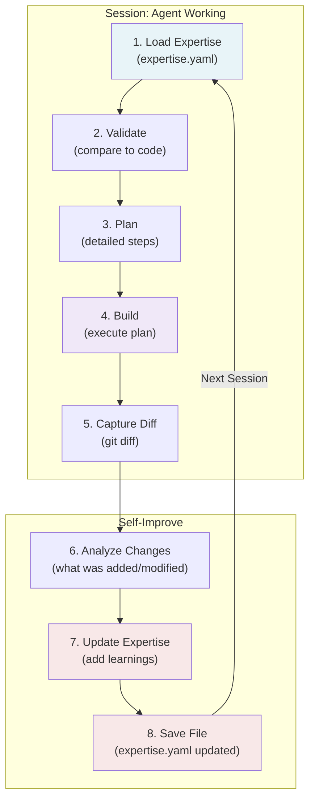

# Agent Expertise System

The Agent Expertise System is a pattern where agents maintain **expertise files** (mental models) of their domain and automatically update them as they work. This creates a closed-loop learning system that makes agents faster and more accurate over time.

## Overview

### The Problem Solved

Without expertise files, each session requires the same exploration:
- Agent starts fresh
- Must search codebase to understand structure
- Repeats exploration for every task
- Never improves or learns

With expertise files, agents become smarter:
- Load mental model at session start
- Skip exploration, focus on building
- Learn from every task
- Improve automatically through self-improvement

### Key Benefits

| Aspect | Without Expertise | With Expertise |
|--------|------------------|----------------|
| **Speed** | Slow (must explore) | Fast (pre-loaded knowledge) |
| **Accuracy** | Variable (depends on exploration) | Consistent (validated knowledge) |
| **Learning** | None - forgets everything | Automatic - builds over time |
| **Knowledge Reuse** | Zero - starts from scratch | Complete - leverages all learnings |
| **Context Size** | Large (exploration + building) | Small (expertise + building) |

## How It Works

The expertise system follows a **three-step workflow**:

### Step 1: Plan (with Expertise)

```
Load expertise.yaml → Validate against code → Create detailed plan
```

The agent:
1. **Reads** the expertise file (mental model of the domain)
2. **Validates** it against actual code (code is source of truth)
3. **Plans** the work based on validated knowledge

**Example:**
```yaml
# expertise.yaml excerpt
files:
  schemas:
    - path: src/db/schema.ts
      purpose: Database table definitions
      key_exports: [tables, relations]
```

Agent reads this and knows exactly where schema files are, skipping directory searches.

### Step 2: Build (Execute Plan)

```
Execute changes → Capture diff → Validate result
```

The agent:
1. **Executes** the implementation plan
2. **Captures** what changed (git diff)
3. **Validates** the result works

Example result:
```
Modified files:
- src/db/schema.ts
- src/db/migrations/20250109_add_users.ts
- src/db/queries/users.ts
```

### Step 3: Self-Improve (Update Expertise)

```
Analyze changes → Update expertise.yaml → Add learnings
```

The agent:
1. **Analyzes** the git diff
2. **Updates** the expertise file with new knowledge
3. **Adds** a learnings entry

**Example learnings entry:**
```yaml
learnings:
  - date: 2025-01-09
    insight: "User schema uses UUID for id field, not auto-increment"
    files_affected:
      - src/db/schema.ts
      - src/db/queries/users.ts
    context: "US-0042: Add user authentication"
```

## Expertise File Structure

Each agent domain has an `expertise.yaml` file documenting:

### 1. Metadata
```yaml
domain: database           # Domain identifier
last_updated: 2025-01-09  # When updated (helps detect staleness)
version: 1.1              # Schema version (for future migrations)
```

### 2. Files Section
Key files the agent needs to know about:

```yaml
files:
  schemas:
    - path: src/db/schema.ts
      purpose: Database table definitions (Drizzle)
      key_exports: [tables, relations]
      conventions: "Table names plural, columns snake_case"

    - path: src/db/migrations/
      purpose: Migration files
      pattern: "YYYYMMDD_description.ts"
```

**Why this matters:** Agent knows where things are without searching.

### 3. Relationships Section
How entities in the domain relate:

```yaml
relationships:
  - parent: users
    child: posts
    type: one-to-many
    key: "posts.user_id references users.id"

  - parent: posts
    child: comments
    type: one-to-many
    cascade: delete
```

**Why this matters:** Agent understands data flow and dependencies.

### 4. Patterns Section
Recurring approaches to follow:

```yaml
patterns:
  - name: "Soft deletes"
    description: "Use deleted_at timestamp instead of hard DELETE"
    location: Tables with user data
    example: "All timestamps use deleted_at, never remove rows"

  - name: "Timestamp columns"
    description: "All tables have created_at and updated_at"
    location: Every table
    convention: "Auto-managed by ORM or triggers"
```

**Why this matters:** Agent applies consistent patterns automatically.

### 5. Conventions Section
Rules to follow in the domain:

```yaml
conventions:
  - "Tables: lowercase, plural (users, posts, categories)"
  - "Columns: lowercase, snake_case (first_name, created_at)"
  - "Foreign keys: <table_singular>_id (user_id, post_id)"
  - "Required columns: id, created_at, updated_at"
  - "All queries use parameterized statements"
  - "Migrations must be reversible (up and down)"
```

**Why this matters:** Agent maintains consistency with existing code.

### 6. Learnings Section
Auto-updated by self-improve:

```yaml
learnings:
  - date: 2025-01-08
    insight: "User model uses UUID primary key, not auto-increment"
    files_affected: [src/db/schema.ts, src/db/queries/users.ts]
    context: "US-0041: User authentication setup"

  - date: 2025-01-09
    insight: "Migrations use TypeORM decorators, not raw SQL"
    files_affected: [src/db/migrations/]
    context: "US-0042: Add user roles table"
```

**Why this matters:** Agent remembers what it learned, improving over time.

## Complete Workflow Example

Here's a real workflow from start to finish:

### Initial Request
> "Add a sessions table to track user login sessions"

### Step 1: Plan

Agent reads expertise.yaml and knows:
- Schemas are in `src/db/schema.ts`
- Migrations go in `src/db/migrations/`
- Pattern: soft deletes with `deleted_at`
- Convention: UUID primary keys
- Relationships: sessions has many audit logs

**Plan created:**
```markdown
1. Add sessions table to src/db/schema.ts
   - Columns: id (UUID), user_id (FK), token, expires_at, created_at, updated_at, deleted_at
2. Create migration: src/db/migrations/20250109_add_sessions.ts
3. Create query functions: src/db/queries/sessions.ts
4. Add pattern to conventions: "Sessions use token field for validation"
```

### Step 2: Build

Agent executes:
1. Modifies `src/db/schema.ts` - adds sessions table
2. Creates migration file
3. Creates query utilities
4. Validates with TypeScript

Git diff shows:
```
 src/db/schema.ts          | +12 lines
 src/db/migrations/...ts   | +35 lines
 src/db/queries/sessions.ts | +45 lines
```

### Step 3: Self-Improve

Agent updates expertise:

```yaml
# New entry added automatically
files:
  queries:
    - path: src/db/queries/sessions.ts
      purpose: Session query functions
      new: true
      created_date: 2025-01-09

patterns:
  - name: "Token-based sessions"
    description: "Use token field for session validation, not auto-increment ID"
    location: src/db/schema.ts (sessions table)
    example: "Sessions stored with UUID token, validated on login"

learnings:
  - date: 2025-01-09
    insight: "Session table implemented with UUID id, token field, and soft delete"
    files_affected:
      - src/db/schema.ts
      - src/db/migrations/20250109_add_sessions.ts
      - src/db/queries/sessions.ts
    context: "US-0045: Add session tracking"
```

**Result:** Next time agent works on sessions, it already knows the structure and patterns.

## Available Agent Experts

AgileFlow includes expertise for these domains:

### Pilot Phase (MVP)
- **Database** - Schema, migrations, queries
- **API** - CLI commands, routes, endpoints
- **UI** - Components, styling, layouts

### Phase 1 Rollout
- **Testing** - Test files, patterns, frameworks
- **CI/CD** - GitHub Actions, Docker, deployment
- **DevOps** - Infrastructure, Kubernetes, monitoring
- **Security** - Auth, tokens, permissions

### Phase 2 Rollout
- **Documentation** - README, API docs, guides
- **Refactoring** - Code cleanup, optimization
- **Performance** - Caching, optimization, benchmarks
- **Accessibility** - WCAG, a11y patterns

### Phase 3+ Rollout
- **Mobile** - React Native, iOS, Android
- **Integrations** - Webhooks, APIs, third-party services
- **Analytics** - Tracking, metrics, dashboards
- **Monitoring** - Observability, alerting

## Three-Step Workflow Patterns

### For Complete Feature Development

Use the **full workflow** when implementing a complete feature:

```bash
# 1. Read the workflow prompt
cat packages/cli/src/core/experts/database/workflow.md

# 2. Make your request
# "Add user authentication with sessions and password reset"

# Agent automatically:
# - Loads expertise.yaml
# - Plans the feature
# - Builds it
# - Self-improves
```

### For Quick Questions

Use the **question prompt** for information:

```bash
# 1. Read the question prompt
cat packages/cli/src/core/experts/database/question.md

# 2. Ask your question
# "Where are the migration files stored?"

# Agent loads expertise and answers from domain knowledge
```

### For Manual Updates

Use the **self-improve prompt** after you make changes:

```bash
# 1. Make your code changes manually

# 2. Read the self-improve prompt
cat packages/cli/src/core/experts/database/self-improve.md

# 3. Run self-improvement
# Agent analyzes your changes and updates expertise.yaml
```

## Expertise Validation

Use the provided validation script to ensure expertise files stay accurate:

```bash
# Validate all expertise files
./scripts/validate-expertise.sh

# Validate specific domain
./scripts/validate-expertise.sh database

# Expected output
PASS  database
PASS  api
PASS  ui
WARN  testing - stale (45 days since update)
```

### Validation Checks

The validator checks:
- **Schema** - Required fields present (domain, last_updated, version)
- **Staleness** - File not older than 30 days
- **Size** - File stays focused (under 200 lines)
- **Learnings** - Agent has self-improved at least once

## Expertise Metrics

Monitor the health of your expertise system:

```bash
# Show metrics dashboard
./scripts/expertise-metrics.sh

# Output as JSON (for logging)
./scripts/expertise-metrics.sh --json

# Output as CSV (for analysis)
./scripts/expertise-metrics.sh --csv
```

### Metrics Tracked

```
╔════════════════════════════════════════════════╗
║        Agent Expert Metrics Dashboard          ║
╚════════════════════════════════════════════════╝

Summary
─────────────────────────────────────────────────
Total Experts:              15
With Learnings:             12 (80%)
Total Learnings Recorded:   48
Avg File Size:              145 lines

Staleness Distribution
─────────────────────────────────────────────────
Updated in last 7 days:     8
8-30 days old:              4
31-90 days old:             2
90+ days old:               1

Self-Improve Health
─────────────────────────────────────────────────
Good adoption: 12/15 agents learning
Average learnings per expert: 3.2
```

### Key Metrics

- **Self-Improve Rate** - % of agents that have self-improved (target: 100%)
- **Average Learnings** - Per-expert learning accumulation (target: 5+)
- **Staleness** - How current expertise files are (target: under 7 days)
- **File Size** - Keep expertise focused (under 200 lines each)

## Automatic Self-Improvement

The system can automatically update expertise files based on work done:

### How It Works

```bash
# Script runs as a session stop hook
node scripts/auto-self-improve.js

# Process:
# 1. Detect which agent was active
# 2. Analyze git diff for changes
# 3. Generate learning summary
# 4. Append to expertise.yaml
```

### Example Auto-Learning

If agent modified these files:
```
src/db/schema.ts        # +10 lines
src/db/migrations/...ts # +25 lines
src/db/queries/users.ts # +30 lines
```

System automatically adds:
```yaml
learnings:
  - date: 2025-01-09
    auto_generated: true
    insight: "Modified 3 database files: added user schema updates and queries"
    files_touched:
      - src/db/schema.ts
      - src/db/migrations/20250109_extend_users.ts
      - src/db/queries/users.ts
    context: "Session work - database domain"
```

## Creating a New Agent Expert

### 1. Create Directory

```bash
mkdir -p packages/cli/src/core/experts/your-domain/
```

### 2. Copy Templates

```bash
cp packages/cli/src/core/experts/templates/expertise-template.yaml \
   packages/cli/src/core/experts/your-domain/expertise.yaml

cp packages/cli/src/core/experts/templates/question-template.md \
   packages/cli/src/core/experts/your-domain/question.md

cp packages/cli/src/core/experts/templates/self-improve-template.md \
   packages/cli/src/core/experts/your-domain/self-improve.md

cp packages/cli/src/core/experts/templates/workflow-template.md \
   packages/cli/src/core/experts/your-domain/workflow.md
```

### 3. Customize expertise.yaml

```yaml
domain: your-domain
last_updated: 2025-01-09
version: 1.0

files:
  primary:
    - path: src/your-domain/
      purpose: Main domain code location

  secondary:
    - path: src/lib/your-domain/
      purpose: Shared utilities

relationships: []
patterns: []
conventions: []
learnings: []
```

### 4. Update Agent File

Modify the main agent file to load expertise:

```markdown
# At the top of your agent (FIRST ACTION)

## FIRST ACTION: Load Expertise

Read your expertise file at `packages/cli/src/core/experts/your-domain/expertise.yaml`.

This contains your mental model of the domain, including:
- Key file locations
- Relationships between entities
- Patterns to follow
- Conventions to maintain
```

And at the end, run self-improve:

```markdown
## FINAL ACTION: Self-Improve

Read `packages/cli/src/core/experts/your-domain/self-improve.md`

Then analyze what you changed and update your expertise file.
```

## Best Practices

### DO

✅ **Validate expertise against code** - Code is source of truth, expertise is working memory
✅ **Keep expertise focused** - One domain per file (under 200 lines)
✅ **Date all learnings** - Track when insights were discovered
✅ **Use specific file paths** - Don't say "somewhere in src/", use exact paths
✅ **Remove stale information** - Delete entries that no longer apply
✅ **Run validation regularly** - `./scripts/validate-expertise.sh`

### DON'T

❌ **Trust expertise blindly** - Always verify against actual code
❌ **Mix domains** - Keep database expertise separate from API expertise
❌ **Manually edit learnings** - Let self-improve handle it
❌ **Keep outdated entries** - Remove knowledge that's no longer accurate
❌ **Skip validation** - Stale expertise hurts more than helps
❌ **Create huge files** - Split into multiple focused domains

## Key Principles

### 1. Code is Source of Truth

Expertise files are mental models - like how an engineer understands a system. They're useful but not authoritative.

**Always validate against actual code** before relying on expertise.

```yaml
# ✅ Good - validated against code
# Confirmed: Database uses UUID primary keys in all tables
# Checked: src/db/schema.ts line 45

# ❌ Bad - speculative
# Probably uses UUIDs
# I think the database is PostgreSQL
```

### 2. Expertise Accelerates, Doesn't Replace

Expertise helps agents work faster by eliminating exploration, but agents should still validate findings.

**Use expertise to skip the search, not to skip thinking.**

### 3. Learning is Automatic

Don't manually maintain expertise files. Run `self-improve.md` after making changes.

**The system learns automatically if you use the workflow.**

### 4. Expertise is Focused

Each expert focuses on ONE domain. Don't create "All Frontend Expert" - create "React Component Expert" or "Form Validation Expert".

**Narrow domains → Better focus → Faster learning**

### 5. Staleness Signals Problems

If expertise hasn't been updated in 30 days, either:
- The domain is stable (good!)
- The agent isn't being used (remove it)
- The expertise is wrong (update it)

**Use the validation script to monitor health.**

## Architecture Diagram



> The closed-loop workflow: experts load knowledge, validate it, build with it, and automatically learn from what they do.

## Comparison: With vs Without Expertise

### Without Expertise (Traditional Agent)

```
Session 1:
├─ Search codebase structure (5 min)
├─ Understand naming conventions (3 min)
├─ Find database schema file (2 min)
└─ Build feature (10 min)
Total: 20 minutes

Session 2: (Same task in different domain)
├─ Search codebase structure (5 min) ← Repeat!
├─ Understand naming conventions (3 min) ← Repeat!
├─ Find database schema file (2 min) ← Repeat!
└─ Build feature (10 min)
Total: 20 minutes ← No improvement
```

### With Expertise (Self-Improving Agent)

```
Session 1:
├─ Load expertise.yaml (instant)
├─ Validate against code (1 min)
├─ Build feature (10 min)
├─ Self-improve (2 min)
└─ Save learnings
Total: 13 minutes

Session 2: (Same task in same domain)
├─ Load expertise.yaml (instant) ← Faster exploration
├─ Validate against code (instant) ← Already knows structure
├─ Build feature (9 min) ← Slightly faster, better patterns
├─ Self-improve (2 min)
└─ Save learnings
Total: 11 minutes ← Improvement!

Session 10: (Regular work in domain)
├─ Load expertise.yaml (instant)
├─ No validation needed (already verified)
├─ Build feature (8 min) ← Experts apply patterns automatically
├─ Self-improve (1 min) ← Minimal updates
└─ Save learnings
Total: 9 minutes ← Continuous improvement
```

## Troubleshooting

### Expertise File is Stale

**Problem:** Last updated 45+ days ago

**Solution:**
1. Read the expertise file
2. Check current code state
3. Update any inaccurate entries
4. Run validation: `./scripts/validate-expertise.sh domain`

### No Learnings Recorded

**Problem:** Agent has never self-improved

**Cause:** Workflow steps weren't followed or self-improve wasn't run

**Solution:**
1. Run work using the full workflow
2. Ensure self-improve step completes
3. Check expertise.yaml for new learnings entry

### File is Too Large (>200 lines)

**Problem:** Expertise file grew too much

**Cause:** Domain is too broad or redundant entries added

**Solution:**
1. Split into multiple focused files
2. Remove duplicate/outdated entries
3. Keep only essential information

### Expertise Doesn't Match Code

**Problem:** Expertise file info is wrong

**Cause:** Code changed without updating expertise, or expertise was never accurate

**Solution:**
1. Run validation: `./scripts/validate-expertise.sh`
2. Manually fix inaccurate entries
3. Set up process to catch this earlier
4. Run self-improve after next work session

## Research & Further Reading

This system is based on the **Agent Expert pattern** from:

- **Source:** IndyDevDan's Tactical Agentic Coding Course
- **Lesson:** 13 - Agent Experts: Finally, Agents That Actually Learn
- **Concept:** Agents maintaining external knowledge bases for accelerated task execution

The pattern recognizes that:
1. Agents exploring everything every session is inefficient
2. Persistent knowledge (expertise files) dramatically accelerates work
3. Self-improving systems learn and get better over time
4. Focused domains create sustainable learning

See research documentation for detailed theory and implementation patterns.

## Summary

The Agent Expertise System enables self-improving agents through:

1. **Expertise Files** - Mental models of each domain
2. **Three-Step Workflow** - Plan → Build → Self-Improve
3. **Automatic Learning** - Expertise updates as agents work
4. **Validation & Metrics** - Tools to ensure quality
5. **Focused Domains** - Specialized knowledge for each area

This closed-loop learning system makes agents faster, more accurate, and increasingly valuable as they accumulate domain knowledge over time.

