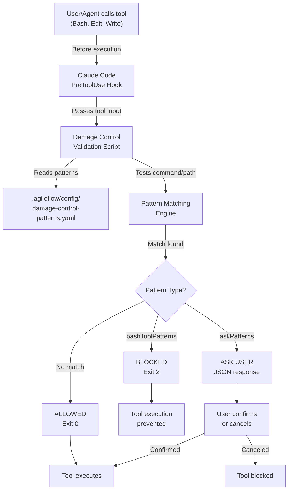

# Damage Control Architecture

This document explains how Damage Control works at a technical level.

## System Overview



## Three Hooks

Damage Control uses three separate PreToolUse hooks, one for each protected tool:

### Hook 1: Bash Command Validation

**File:** `.agileflow/scripts/damage-control-bash.js`

**Intercepts:** All bash commands before execution

**Process:**
1. Receives command string from Claude Code
2. Loads patterns from YAML config
3. Tests command against bash pattern rules
4. Returns: block, ask, or allow

**Exit Codes:**
- 0 = Allow command
- 2 = Block command

**Example:**
```javascript
// Input: { command: "rm -rf /" }
// Loaded patterns: { bashToolPatterns: [...] }
// Test: /\brm\s+-rf\s+/.test("rm -rf /") = true
// Match found in bashToolPatterns
// Return: block
// Exit Code: 2
```

### Hook 2: File Edit Validation

**File:** `.agileflow/scripts/damage-control-edit.js`

**Intercepts:** All edit operations before they modify files

**Process:**
1. Receives file path from Claude Code
2. Loads path protection rules from YAML
3. Tests path against access control rules
4. Returns: allow or block

**Access Levels:**
- Zero Access (0) - Completely blocked
- Read-Only (1) - Can read, not modify
- Writable (2) - Can read and modify

**Example:**
```javascript
// Input: { file_path: "/Users/me/.ssh/id_rsa" }
// Loaded patterns: { zeroAccessPaths: ["~/.ssh/", ...] }
// Test: "/Users/me/.ssh/id_rsa".startsWith("/Users/me/.ssh")
// Match found in zeroAccessPaths
// Return: block
// Exit Code: 2
```

### Hook 3: File Write Validation

**File:** `.agileflow/scripts/damage-control-write.js`

**Intercepts:** All write operations before creating/overwriting files

**Process:**
1. Receives file path from Claude Code
2. Loads path protection rules from YAML
3. Tests path against access control rules
4. Returns: allow or block

**Example:**
```javascript
// Input: { file_path: ".env.production" }
// Loaded patterns: { zeroAccessPaths: [".env.production", ...] }
// Test: "/Users/me/project/.env.production" === "/Users/me/project/.env.production"
// Match found in zeroAccessPaths
// Return: block
// Exit Code: 2
```

## Pattern Matching Engine

### Bash Pattern Matching

The bash hook uses regular expressions to match commands:

```javascript
function matchesPattern(command, rule) {
  const flags = rule.flags || '';
  const regex = new RegExp(rule.pattern, flags);
  return regex.test(command);
}
```

**Matching Order:**
1. Blocked patterns checked first (bashToolPatterns + agileflowProtections)
2. Ask patterns checked second (askPatterns)
3. If no match, command is allowed

**Example Pattern:**
```yaml
- pattern: '\brm\s+-rf\s+'
  reason: "Recursive force delete"
  flags: ""
```

**Matching:**
- Input: `"rm -rf /important"`
- Regex: `/\brm\s+-rf\s+/`
- Test: Returns true (match found)
- Action: Block with reason "Recursive force delete"

### Path Matching

Path matching is more complex than simple regex:

```javascript
function pathMatches(filePath, patterns) {
  const normalizedPath = path.resolve(filePath);

  for (const pattern of patterns) {
    const expandedPattern = expandPath(pattern);

    // Check 1: Directory prefix match
    if (pattern.endsWith('/')) {
      if (normalizedPath.startsWith(expandedPattern)) return pattern;
    }

    // Check 2: Exact match
    if (normalizedPath === expandedPattern) return pattern;

    // Check 3: Filename match
    if (normalizedPath.endsWith(pattern)) return pattern;

    // Check 4: Extension match (*.pem)
    if (pattern.startsWith('*')) {
      const ext = pattern.slice(1);
      if (normalizedPath.endsWith(ext)) return pattern;
    }

    // Check 5: Basename match
    const patternBase = path.basename(pattern);
    if (path.basename(normalizedPath) === patternBase) return pattern;
  }
  return null;
}
```

**Matching Strategies:**

1. **Directory Prefix** (patterns ending with `/`)
   ```yaml
   - ~/.ssh/      # Matches ~/.ssh/id_rsa, ~/.ssh/config, etc.
   - /etc/        # Matches /etc/passwd, /etc/shadow, etc.
   ```

2. **Exact Path Match**
   ```yaml
   - /root/.env.production     # Matches exactly
   - credentials.json          # Matches credentials.json in any dir
   ```

3. **Extension Match** (patterns starting with `*`)
   ```yaml
   - *.pem        # Matches file.pem, key.pem, cert.pem, etc.
   - *.key        # Matches any .key file
   ```

4. **Basename Match**
   ```yaml
   - id_rsa       # Matches any file named id_rsa
   - .env.local   # Matches .env.local in any directory
   ```

## Configuration Format

### Pattern Definition

```yaml
- pattern: 'REGEX_PATTERN'
  reason: "Human-readable reason"
  flags: "i"  # Optional: regex flags (i = case-insensitive)
```

**Regex Flags:**
- `i` - Case insensitive
- `g` - Global (not used for matching)
- `m` - Multiline (not used for matching)

### Pattern Examples

**Simple literal match:**
```yaml
- pattern: 'DROP\s+TABLE'
  reason: "Database destructive operation"
```

**Word boundary match:**
```yaml
- pattern: '\brm\s+-rf'
  reason: "Remove recursive force"
```

**Multiple options:**
```yaml
- pattern: '(DROP|TRUNCATE|DELETE)\s+'
  reason: "Database data loss"
```

**Case insensitive:**
```yaml
- pattern: 'DROP\s+(TABLE|DATABASE|INDEX)'
  reason: "Database drop operation"
  flags: "i"
```

## Runtime Behavior

### Script Execution Flow

Each script follows this pattern:

```javascript
// 1. Find project root
function findProjectRoot() {
  let dir = process.cwd();
  while (dir !== '/') {
    if (fs.existsSync(path.join(dir, '.agileflow'))) {
      return dir;
    }
    dir = path.dirname(dir);
  }
  return process.cwd();
}

// 2. Load configuration
function loadPatterns(projectRoot) {
  const configPaths = [
    path.join(projectRoot, '.agileflow/config/damage-control-patterns.yaml'),
    path.join(projectRoot, '.agileflow/config/damage-control-patterns.yml'),
    path.join(projectRoot, '.agileflow/templates/damage-control-patterns.yaml')
  ];

  for (const configPath of configPaths) {
    if (fs.existsSync(configPath)) {
      try {
        const content = fs.readFileSync(configPath, 'utf8');
        return parseSimpleYAML(content);
      } catch (e) {
        // Continue to next path
      }
    }
  }

  // Fail-open: return empty config if no file found
  return { bashToolPatterns: [], askPatterns: [] };
}

// 3. Validate input
function main() {
  const projectRoot = findProjectRoot();
  let inputData = '';

  process.stdin.on('data', chunk => {
    inputData += chunk;
  });

  process.stdin.on('end', () => {
    try {
      const input = JSON.parse(inputData);
      const command = input.command || '';

      if (!command) {
        process.exit(0);  // No command, allow
      }

      // 4. Load patterns and validate
      const config = loadPatterns(projectRoot);
      const result = validateCommand(command, config);

      // 5. Determine action
      switch (result.action) {
        case 'block':
          console.error(`[BLOCKED] ${result.reason}`);
          process.exit(2);  // Block
          break;
        case 'ask':
          console.log(JSON.stringify({
            result: 'ask',
            message: result.reason
          }));
          process.exit(0);  // Request confirmation
          break;
        case 'allow':
        default:
          process.exit(0);  // Allow
      }
    } catch (e) {
      process.exit(0);  // Fail-open on error
    }
  });

  // 6. Timeout to prevent hanging
  setTimeout(() => {
    process.exit(0);
  }, 4000);
}
```

### Error Handling

Scripts use **fail-open** philosophy:
- Invalid YAML? Allow command
- Missing file? Allow command
- Parse error? Allow command
- Timeout? Allow command

This ensures broken safety systems don't block all operations.

### Timeout Protection

Each script has a 4-second timeout:

```javascript
setTimeout(() => {
  process.exit(0);  // Allow if timeout
}, 4000);
```

This prevents hanging on slow pattern matching or file I/O.

## Integration with Claude Code

### PreToolUse Hook Format

```json
{
  "hooks": {
    "PreToolUse": [
      {
        "matcher": "Bash",
        "hooks": [{
          "type": "command",
          "command": "node /path/to/.agileflow/scripts/damage-control-bash.js",
          "timeout": 5
        }]
      }
    ]
  }
}
```

**Matcher:** Tool to intercept (Bash, Edit, Write)
**Type:** Command type (command, prompt, or function)
**Command:** Shell command to execute
**Timeout:** Seconds before timeout (Claude Code level)

### Input Format

Claude Code passes tool input as JSON to stdin:

```json
{
  "tool": "Bash",
  "tool_input": {
    "command": "rm -rf /",
    "description": "Remove system directory"
  }
}
```

Scripts extract the relevant field:
- Bash hook: `input.command`
- Edit hook: `input.file_path`
- Write hook: `input.file_path`

### Output Format

Scripts communicate exit codes:
- **Exit 0:** Allow (or ask)
- **Exit 2:** Block

For ask patterns, output JSON:
```json
{
  "result": "ask",
  "message": "Publishing to npm - please confirm?"
}
```

Claude Code interprets JSON output to request user confirmation.

## Performance Characteristics

### Latency

- Pattern loading: ~10ms (file I/O)
- Pattern matching: ~1ms per pattern (regex test)
- Total overhead: < 50ms per command

**Example:**
- 40 patterns tested = 40ms
- Plus file I/O = ~50ms total
- Unnoticeable to user

### Memory Usage

- Configuration loaded per command: ~100KB
- Patterns cached in memory: ~50KB
- Total: ~150KB per script instance

### Scalability

Scripts can handle:
- 1000+ patterns without issues
- 100MB+ configuration files
- Deeply nested path hierarchies
- Complex regex patterns

## Security Considerations

### Pattern Injection

Patterns are loaded from local files only:
- Cannot be injected via network
- Cannot be modified by untrusted code
- User controls all patterns

### Bypass Prevention

- Cannot rename tools to avoid hooks
- Cannot work around exit codes
- Cannot modify scripts at runtime

### Information Leakage

Scripts log blocked commands:
- Useful for debugging
- Could expose patterns to observers
- Use in secure environment

### Timeout Safety

- 4-second timeout prevents DoS
- Scripts always exit, even on error
- Claude Code enforces additional timeout

## Customization Hooks

### Pattern Addition

Edit `.agileflow/config/damage-control-patterns.yaml`:

```yaml
customPatterns:
  - pattern: 'YOUR_PATTERN'
    reason: "Your reason"
    flags: ""
```

### Path Addition

Edit `.agileflow/config/damage-control-patterns.yaml`:

```yaml
zeroAccessPaths:
  - "/your/protected/path/"

readOnlyPaths:
  - "/your/readonly/path/"

noDeletePaths:
  - "/your/nodelete/path/"
```

### Hook Configuration

Edit `.claude/settings.json`:

```json
{
  "hooks": {
    "PreToolUse": [
      {
        "matcher": "Bash",
        "hooks": [{
          "type": "command",
          "command": "node .agileflow/scripts/damage-control-bash.js",
          "timeout": 5
        }]
      }
    ]
  }
}
```

## Advanced Topics

### Multi-Pattern Matching

When multiple patterns match, the first match wins:

```javascript
// Order matters!
for (const rule of blockedPatterns) {
  if (matchesPattern(command, rule)) {
    return { action: 'block', reason: rule.reason };
  }
}
```

Place more specific patterns first.

### Case Sensitivity

By default, patterns are case-sensitive:

```yaml
# Case sensitive
- pattern: 'DROP TABLE'      # Matches "DROP TABLE" only

# Case insensitive
- pattern: 'DROP TABLE'
  flags: "i"                 # Matches "drop table", "Drop Table", etc.
```

### Anchored Patterns

Use regex anchors for precision:

```yaml
# Match anywhere in command
- pattern: 'rm -rf'          # Matches "rm -rf /", "rm -rf dir", etc.

# Match at start only
- pattern: '^sudo'           # Matches "sudo rm -rf" but not "echo sudo"

# Match at end only
- pattern: 'localhost$'      # Matches "psql localhost" but not "localhost:5432"
```

## Testing Patterns

### Unit Testing

Test patterns in Node.js:

```javascript
const pattern = /\brm\s+-rf\s+/;
console.log(pattern.test('rm -rf /'));        // true
console.log(pattern.test('rm -f file'));      // false
console.log(pattern.test('command rm -rf')); // true
```

### Integration Testing

Test with actual scripts:

```bash
# Test bash hook
echo '{"command":"rm -rf /"}' | node .agileflow/scripts/damage-control-bash.js
# Exit code 2 = blocked

echo '{"command":"ls -la"}' | node .agileflow/scripts/damage-control-bash.js
# Exit code 0 = allowed
```

## Debugging

### Enable Logging

Add console output to scripts for debugging:

```javascript
console.error(`Command: ${command}`);
console.error(`Patterns: ${config.bashToolPatterns.length}`);
console.error(`Result: ${result.action}`);
```

### Check Configuration

```bash
# Validate patterns file
grep -c "pattern:" .agileflow/config/damage-control-patterns.yaml

# Check syntax
node -e "
const yaml = require('js-yaml');
const fs = require('fs');
const config = yaml.load(fs.readFileSync('.agileflow/config/damage-control-patterns.yaml', 'utf8'));
console.log(JSON.stringify(config, null, 2));
"
```

### Test Hook Integration

```bash
# Check hook is in settings
grep "damage-control" .claude/settings.json

# Check hook is executable
ls -la .agileflow/scripts/damage-control*.js
# Should show -rwxr-xr-x
```

## Related Documentation

- [Damage Control Reference](/features/damage-control)
- [Setup Guide](/features/damage-control-setup)
- [Configuration Options](/features/damage-control#customization)
