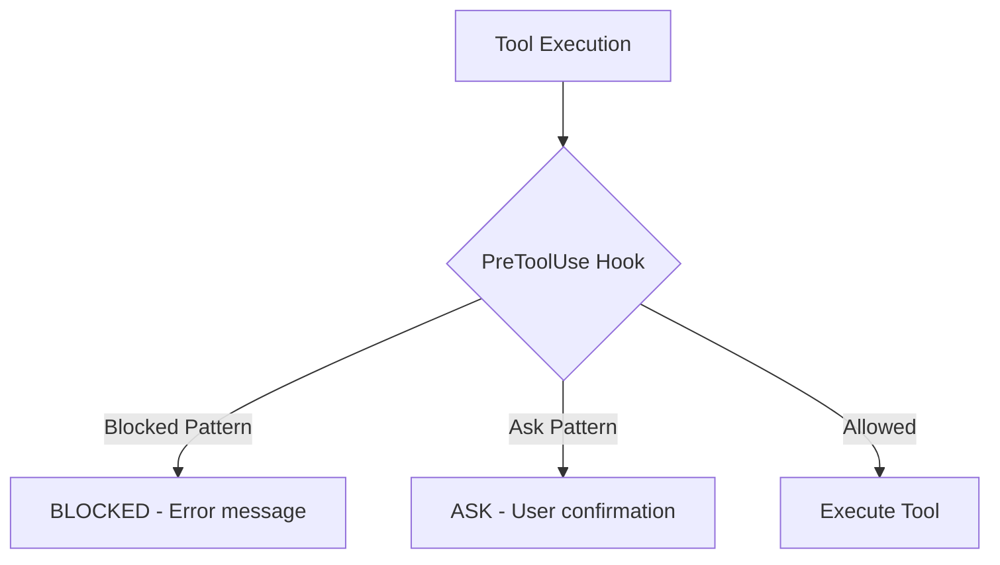

# Damage Control

Damage Control is a safety system that prevents AI agents from running destructive or dangerous commands. It uses Claude Code's **PreToolUse hooks** to validate commands before they execute, protecting your codebase from accidental or malicious changes.

## Overview

Damage Control operates as a defense-in-depth system with three protection layers:

1. **Bash Tool Hook** - Validates bash commands against dangerous patterns
2. **Edit Tool Hook** - Enforces file access controls
3. **Write Tool Hook** - Prevents writes to protected locations



## Protection Layers

### Bash Command Patterns

The bash hook blocks or asks for confirmation on dangerous commands:

**Automatically Blocked:**
- Destructive deletions: `rm -rf /`, `rm -rf ..`, recursive deletes
- Force push: `git push --force`, `git push -f`
- Hard reset: `git reset --hard`
- Database destruction: `DROP TABLE`, `TRUNCATE TABLE`, `DELETE FROM ... ;`
- Disk operations: `dd if=`, `mkfs.`, `fdisk`
- Credential exposure: `cat *.pem`, `cat id_rsa`
- Force kill: `kill -9`, `killall`, `pkill -9`
- And 30+ more patterns

**Requires Confirmation:**
- Database deletes with WHERE clause: `DELETE FROM table WHERE ...`
- Publishing to npm: `npm publish`
- Pushing to main branch: `git push origin main`
- Cloud CLI deletes: `aws delete`, `gcloud delete`, `az delete`
- Database updates: `UPDATE ... SET ... WHERE`
- Removing node_modules: `rm -rf node_modules`

### Path Protection Levels

Damage Control protects files and directories at three levels:

| Level | Read | Write | Edit | Delete |
|-------|------|-------|------|--------|
| **Zero Access** | ❌ No | ❌ No | ❌ No | ❌ No |
| **Read-Only** | ✅ Yes | ❌ No | ❌ No | ❌ No |
| **No Delete** | ✅ Yes | ✅ Yes | ✅ Yes | ❌ No |

**Zero Access Paths** (completely protected):
- SSH keys: `~/.ssh/`, `id_rsa`, `id_ed25519`
- Cloud credentials: `~/.aws/`, `~/.gnupg/`, `~/.config/gh/`
- Production secrets: `.env.production`, `.env.local`, `.env.secrets`
- Private keys: `*.pem`, `*.key`, `credentials.json`, `secrets.yaml`

**Read-Only Paths** (can view, not modify):
- Shell config: `~/.bashrc`, `~/.zshrc`, `~/.gitconfig`
- Lock files: `package-lock.json`, `yarn.lock`, `pnpm-lock.yaml`
- System: `/etc/`

**No Delete Paths** (can read and modify, but not remove):
- AgileFlow core: `.agileflow/`, `.claude/`
- Project status: `docs/09-agents/status.json`
- Source control: `.git/`
- Project roots: `README.md`, `package.json`, `tsconfig.json`

## Enabling Damage Control

### Quick Enable

```bash
/agileflow:configure damagecontrol
```

This launches an interactive configuration that lets you:
1. Choose protection level (Standard or Enhanced)
2. Select additional custom protections
3. Deploy patterns and hooks
4. Restart Claude Code to activate

### Command Line

```bash
node .agileflow/scripts/agileflow-configure.js --enable=damagecontrol
```

### Configuration Steps

1. **Choose Protection Level:**
   - **Standard** (recommended): Fast pattern matching, 0ms latency
   - **Enhanced**: Standard + AI evaluation for unknown threats

2. **Optional Custom Protections:**
   - Production database protection
   - Cloud CLI destructive operations
   - Extra environment file protection

3. **Files Created:**
   - `.agileflow/config/damage-control-patterns.yaml` - Pattern definitions
   - `.claude/settings.json` - PreToolUse hook configuration

4. **Restart Required:**
   - Must completely quit and restart Claude Code
   - Hooks only take effect after restart

## How It Works

### PreToolUse Hooks

When you (or an agent) try to run a command, Claude Code intercepts it and runs the PreToolUse hook:

```
User/Agent wants to run: bash command
                    ↓
      [PreToolUse Hook Invoked]
                    ↓
   damage-control-bash.js executes
                    ↓
  Command matched against patterns
                    ↓
    ├─ Blocked Pattern → Prevent execution
    ├─ Ask Pattern → Request user confirmation
    └─ No match → Allow execution
```

### Exit Codes

The hooks communicate with Claude Code using exit codes:

- **Exit 0** - Command is safe, allow execution
- **Exit 2** - Command is blocked, prevent execution
- **JSON output** - For "ask" patterns, output JSON to trigger confirmation

### Pattern Matching

Patterns use **regular expressions** for flexible matching:

```yaml
bashToolPatterns:
  - pattern: '\brm\s+-rf\s+'
    reason: "Recursive force delete - extremely dangerous"
    flags: ""              # Optional: "i" for case-insensitive

  - pattern: 'DROP\s+(TABLE|DATABASE|INDEX|VIEW)'
    reason: "DROP commands are destructive"
    flags: "i"             # Case-insensitive matching
```

## Configuration File

The patterns configuration lives in `.agileflow/config/damage-control-patterns.yaml`:

```yaml
version: "1.0.0"

# BLOCKED BASH COMMANDS
bashToolPatterns:
  - pattern: '\brm\s+-rf\s+'
    reason: "Recursive force delete"

  - pattern: '\bgit\s+push\s+.*--force'
    reason: "Force push can destroy remote history"

# PATTERNS REQUIRING CONFIRMATION
askPatterns:
  - pattern: 'DELETE\s+FROM\s+\w+\s+WHERE'
    reason: "Deleting specific records - please confirm"
    flags: "i"

  - pattern: '\bnpm\s+publish'
    reason: "Publishing to npm - please confirm"

# FILE/DIRECTORY PROTECTION
zeroAccessPaths:
  - "~/.ssh/"
  - ".env.production"
  - "*.pem"

readOnlyPaths:
  - "~/.bashrc"
  - "package-lock.json"

noDeletePaths:
  - ".agileflow/"
  - "docs/09-agents/status.json"

# AGILEFLOW-SPECIFIC RULES
agileflowProtections:
  - pattern: '\brm\s+.*status\.json'
    reason: "status.json tracks story progress"
```

## Customizing Damage Control

### Add Custom Patterns

Edit `.agileflow/config/damage-control-patterns.yaml` and add your own patterns:

```yaml
# ─── Project-Specific Patterns ───
customPatterns:
  - pattern: '\bpg_restore\s+'
    reason: "Database restore - requires manual execution"

  - pattern: '\bexport\s+PROD_KEY'
    reason: "Production key export - protected"

  - pattern: 'INSERT\s+INTO\s+users'
    reason: "User table insertion - please confirm"
    flags: "i"
```

### Add Protected Paths

Add paths to the appropriate protection level:

```yaml
zeroAccessPaths:
  - "/api/keys/"
  - "secrets/"
  - "private/"

readOnlyPaths:
  - ".github/workflows/"
  - "docker-compose.prod.yml"

noDeletePaths:
  - "infrastructure/"
  - "database/migrations/"
```

## Testing Damage Control

### Test a Blocked Pattern

Try running a blocked command - it should fail immediately:

```bash
# This will be blocked
rm -rf /

# Output:
# [BLOCKED] rm with absolute path - could delete system files
# Command: rm -rf /
```

### Test Path Protection

Try editing a protected file:

```bash
# This will be blocked (zero access)
/agileflow:edit ~/.ssh/id_rsa

# This will be blocked (read-only)
/agileflow:edit package-lock.json

# This will succeed (no delete protection)
/agileflow:edit docs/09-agents/status.json
```

### Test Ask Patterns

Some commands ask for confirmation:

```bash
npm publish

# Output:
# Confirm: Publishing to npm - please confirm?
# [Allow] [Cancel]
```

## Viewing Current Configuration

```bash
# Show all active protections
node .agileflow/scripts/agileflow-configure.js --detect

# List all configured patterns
cat .agileflow/config/damage-control-patterns.yaml
```

## Disabling Damage Control

If you need to disable damage control temporarily:

```bash
node .agileflow/scripts/agileflow-configure.js --disable=damagecontrol
```

This removes all PreToolUse hooks but keeps the patterns file for re-enabling later.

## How Patterns Are Evaluated

### Bash Command Matching

When you run a bash command, damage control:

1. **Extracts the command** from the tool input
2. **Tests against each pattern** using regex matching
3. **Stops at first match** (order matters)
4. **Returns action**: block, ask, or allow

Example matching:

```javascript
// Command: "rm -rf node_modules"
// Pattern: /\brm\s+-rf\s+/

// Step 1: Extract "rm -rf node_modules"
// Step 2: Test regex against command
// Step 3: Match found at position 0
// Step 4: Return action: "block"
// Step 5: Block command, show reason
```

### Path Matching

For file operations, damage control:

1. **Normalizes the path** (expands `~`, resolves `.`)
2. **Tests against each protected pattern**
3. **Checks multiple match types:**
   - Exact path match
   - Directory prefix match
   - Filename match
   - Extension match
   - Basename match

Example matching:

```javascript
// File: "/Users/me/.ssh/id_rsa"
// Protected: ["~/.ssh/"]

// Step 1: Normalize "/Users/me/.ssh/id_rsa"
// Step 2: Normalize "~/.ssh/" to "/Users/me/.ssh"
// Step 3: Check if file starts with "/Users/me/.ssh"
// Step 4: Match found - is directory prefix
// Step 5: Return action: "block"
```

## Safety Design

### Fail-Open Philosophy

If damage control encounters an error, it **allows the command**:

- Invalid YAML in patterns file? Command is allowed
- Missing patterns file? Commands are allowed
- Script crash? Command is allowed

This ensures that a broken safety system doesn't block all operations.

### Performance

- Pattern matching: < 1ms per command
- No external API calls
- No AI evaluation (unless Enhanced mode)
- Timeout: 4 seconds per check

### Scope

Damage Control protects:
- **Read** - Edit tool file reading (zero-access only)
- **Write** - Write tool file creation
- **Edit** - Edit tool file modifications
- **Bash** - All bash commands

Does NOT protect:
- Python, Ruby, Node.js scripts
- Interactive sessions
- IDE built-in operations
- File browser operations

## Common Issues

### Hooks Not Working

**Issue**: Commands run even though they should be blocked.

**Solution**:
1. Verify hooks are configured: `node .agileflow/scripts/agileflow-configure.js --detect`
2. Check patterns file exists: `cat .agileflow/config/damage-control-patterns.yaml`
3. Restart Claude Code completely (Cmd+Q, wait 5s, reopen)

### False Positives

**Issue**: Legitimate commands are being blocked.

**Solution**:
1. Review the blocked pattern in the patterns file
2. Edit the pattern to be more specific
3. Use regex alternation to exclude cases: `pattern: '(rm -rf)(?!node_modules)'`

### Modifying Protected Files

**Issue**: Need to edit a file in a protected path.

**Solution**:
1. Edit `.agileflow/config/damage-control-patterns.yaml`
2. Move path from `zeroAccessPaths` to `readOnlyPaths` or `noDeletePaths`
3. Save and restart Claude Code

## Best Practices

### Security

- **Keep default protections** - They exist for good reasons
- **Review custom patterns** - Ensure they don't unintentionally block valid operations
- **Version control patterns** - Commit `.agileflow/config/damage-control-patterns.yaml` to git
- **Team alignment** - Discuss what should be protected with your team

### Development

- **Use ask patterns** - For risky but valid operations
- **Document patterns** - Add comments explaining why patterns exist
- **Test patterns** - Verify patterns work as expected
- **Review logs** - Check what was blocked and why

### Operations

- **Don't disable lightly** - Only disable when necessary
- **Re-enable quickly** - Don't leave damage control disabled for long
- **Monitor blocks** - Watch for patterns that block legitimate work
- **Adjust as needed** - Refine patterns based on real usage

## Examples

### Protect Production Database

```yaml
bashToolPatterns:
  - pattern: '\bpsql\s+.*production'
    reason: "Production database access blocked - use staging only"

  - pattern: '\bmysql\s+.*-h\s+.*prod'
    reason: "Production MySQL access blocked"

askPatterns:
  - pattern: 'DELETE\s+FROM\s+users'
    reason: "Deleting from users table - please confirm"
    flags: "i"
```

### Protect API Keys

```yaml
zeroAccessPaths:
  - ".env.production"
  - "config/api-keys/"
  - "secrets/"
  - "~/.aws/"
  - "~/.gcp/"

readOnlyPaths:
  - ".env.example"
  - "config/"
```

### Protect Infrastructure

```yaml
noDeletePaths:
  - "terraform/"
  - "kubernetes/"
  - "docker-compose.yml"

bashToolPatterns:
  - pattern: '\bterraform\s+destroy'
    reason: "Terraform destroy - use manual process"

  - pattern: '\bkubectl\s+delete\s+(namespace|cluster)'
    reason: "Kubernetes deletion - manual review required"
```

## Reference

### Environment Variables

No environment variables needed - patterns are always read from:
```
.agileflow/config/damage-control-patterns.yaml
.agileflow/config/damage-control-patterns.yml
.agileflow/templates/damage-control-patterns.yaml
```

### Related Documentation

- [Configure Command](/commands/configure) - Enable/disable features
- [PreToolUse Hooks](https://docs.claudeai.com/tools/hooks) - Claude Code hook system
- [Security Best Practices](/features/security) - General security guidelines

### Scripts

- `.agileflow/scripts/damage-control-bash.js` - Bash command validation
- `.agileflow/scripts/damage-control-edit.js` - File edit validation
- `.agileflow/scripts/damage-control-write.js` - File write validation

## Troubleshooting

### Commands not being blocked

1. Check patterns are loaded:
   ```bash
   head -20 .agileflow/config/damage-control-patterns.yaml
   ```

2. Verify regex is correct:
   ```bash
   # Test regex in Node.js
   node -e "console.log(/\brm\s+-rf\s+/.test('rm -rf /'))"
   # Should output: true
   ```

3. Restart Claude Code completely

### Too restrictive

1. Review which patterns are firing:
   ```bash
   grep -n "pattern:" .agileflow/config/damage-control-patterns.yaml
   ```

2. Comment out overly broad patterns
3. Use more specific regex (add anchors, character classes)
4. Restart Claude Code

### Performance issues

1. Damage control should add < 5ms to each command
2. If experiencing slowness, check:
   - Number of patterns (keep under 100)
   - Regex complexity (avoid nested quantifiers)
   - File size (patterns file should be < 100KB)

## Next Steps

After enabling Damage Control:

1. **Test it**: Try running blocked commands
2. **Customize it**: Add project-specific patterns
3. **Document it**: Record what's protected and why
4. **Share it**: Commit patterns to git and share with team

Use `/agileflow:help` to learn about other security features.
