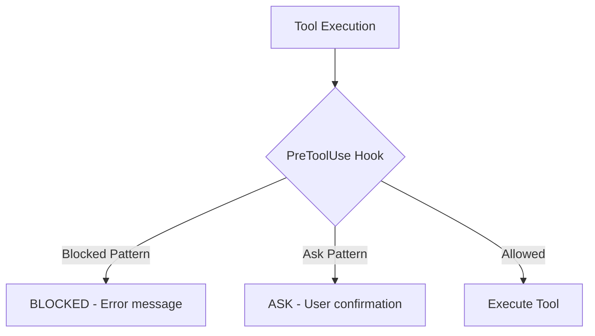
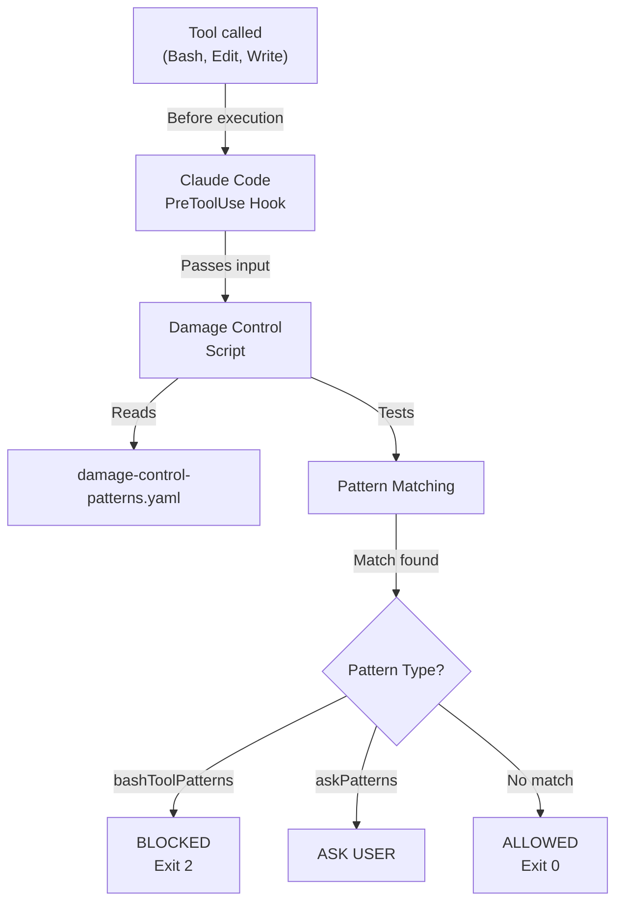

# Damage Control

Damage Control is a safety system that prevents AI agents from running destructive or dangerous commands. It uses Claude Code's **PreToolUse hooks** to validate commands before execution.

## Quick Start

```bash
# Enable with interactive wizard
/agileflow:configure damagecontrol

# Or command line
node .agileflow/scripts/agileflow-configure.js --enable=damagecontrol

# Then restart Claude Code (Cmd+Q / Ctrl+Q)
```

## How It Works



Damage Control uses three separate hooks:

| Hook | File | Protects Against |
|------|------|------------------|
| **Bash** | `damage-control-bash.js` | Dangerous shell commands |
| **Edit** | `damage-control-edit.js` | Edits to protected files |
| **Write** | `damage-control-write.js` | Writes to protected locations |

---

## Protection Layers

### Bash Command Patterns

**Automatically Blocked:**
- Destructive deletions: `rm -rf /`, `rm -rf ..`, recursive deletes
- Force push: `git push --force`, `git push -f`
- Hard reset: `git reset --hard`
- Database destruction: `DROP TABLE`, `TRUNCATE TABLE`, `DELETE FROM ... ;`
- Disk operations: `dd if=`, `mkfs.`, `fdisk`
- Credential exposure: `cat *.pem`, `cat id_rsa`
- Force kill: `kill -9`, `killall`, `pkill -9`
- And 30+ more patterns

**Requires Confirmation (Ask Patterns):**
- Database deletes with WHERE: `DELETE FROM table WHERE ...`
- Publishing: `npm publish`
- Pushing to main: `git push origin main`
- Cloud CLI deletes: `aws delete`, `gcloud delete`, `az delete`
- Database updates: `UPDATE ... SET ... WHERE`
- Removing node_modules: `rm -rf node_modules`

### Path Protection Levels

| Level | Read | Write | Edit | Delete |
|-------|------|-------|------|--------|
| **Zero Access** | No | No | No | No |
| **Read-Only** | Yes | No | No | No |
| **No Delete** | Yes | Yes | Yes | No |

**Zero Access Paths:**
- SSH keys: `~/.ssh/`, `id_rsa`, `id_ed25519`
- Cloud credentials: `~/.aws/`, `~/.gnupg/`, `~/.config/gh/`
- Production secrets: `.env.production`, `.env.local`, `.env.secrets`
- Private keys: `*.pem`, `*.key`, `credentials.json`

**Read-Only Paths:**
- Shell config: `~/.bashrc`, `~/.zshrc`, `~/.gitconfig`
- Lock files: `package-lock.json`, `yarn.lock`
- System: `/etc/`

**No Delete Paths:**
- AgileFlow core: `.agileflow/`, `.claude/`
- Project status: `docs/09-agents/status.json`
- Source control: `.git/`
- Project roots: `README.md`, `package.json`

---

## Setup Guide

### Prerequisites

- AgileFlow v2.78.0+
- Claude Code (latest)
- `.agileflow` directory installed

### Step 1: Choose Protection Level

**Standard (Recommended)**
- Fast pattern matching only
- 0ms latency added
- 40+ dangerous patterns blocked
- Perfect for most projects

**Enhanced**
- Standard + AI evaluation for unknown threats
- 50-100ms latency added
- Better for highly sensitive code
- Experimental feature

**Minimal**
- Path protection only
- No bash command patterns

### Step 2: Enable

```bash
/agileflow:configure damagecontrol
```

Or:

```bash
node .agileflow/scripts/agileflow-configure.js --enable=damagecontrol
```

### Step 3: Verify

```bash
# Check patterns file
ls -la .agileflow/config/damage-control-patterns.yaml

# Check hooks configured
grep -A 5 "PreToolUse" .claude/settings.json

# Test (should be blocked)
rm -rf /
```

### Step 4: Restart Claude Code

**Important:** Hooks only take effect after restart.

```bash
# Complete quit (Cmd+Q / Ctrl+Q)
# Wait 5 seconds
# Reopen Claude Code
```

---

## Architecture

### System Flow



### Bash Hook Example

```javascript
// Input: { command: "rm -rf /" }
// Pattern: /\brm\s+-rf\s+/
// Test: pattern.test("rm -rf /") = true
// Result: BLOCKED (exit code 2)
```

### Edit Hook Example

```javascript
// Input: { file_path: "/Users/me/.ssh/id_rsa" }
// Protected: zeroAccessPaths: ["~/.ssh/"]
// Test: path.startsWith(expandedPath)
// Result: BLOCKED (exit code 2)
```

### Exit Codes

| Code | Meaning | Action |
|------|---------|--------|
| 0 | Allow | Tool executes normally |
| 2 | Block | Tool execution prevented |

### Fail-Open Philosophy

If the patterns file is corrupted or missing, commands are **allowed** (not blocked). This ensures a broken safety system doesn't block all operations.

---

## Configuration

### Patterns File

Location: `.agileflow/config/damage-control-patterns.yaml`

```yaml
# Blocked bash commands
bashToolPatterns:
  - pattern: 'rm\s+-rf\s+/'
    reason: "Recursive delete from root"
  - pattern: 'git\s+push\s+--force'
    reason: "Force push blocked"

# Requires confirmation
askPatterns:
  - pattern: 'npm\s+publish'
    reason: "Publishing to npm"
  - pattern: 'git\s+push\s+origin\s+main'
    reason: "Pushing to main"

# Zero access (no read/write/edit)
zeroAccessPaths:
  - '~/.ssh/'
  - '.env'

# Read-only (can read, not modify)
readOnlyPaths:
  - '~/.bashrc'
  - 'package-lock.json'

# No delete (can read/write, not delete)
noDeletePaths:
  - '.agileflow/'
  - '.git/'
```

### Adding Custom Patterns

Edit the patterns file directly:

```yaml
# Add to bashToolPatterns
bashToolPatterns:
  # ... existing patterns ...
  - pattern: 'my-dangerous-command'
    reason: "Custom block reason"

# Add to askPatterns
askPatterns:
  # ... existing patterns ...
  - pattern: 'deploy\s+production'
    reason: "Production deployment"
```

### Hooks Configuration

In `.claude/settings.json`:

```json
{
  "hooks": {
    "PreToolUse": [
      {
        "matcher": "Bash",
        "hooks": [{
          "type": "command",
          "command": "node .agileflow/scripts/damage-control-bash.js"
        }]
      },
      {
        "matcher": "Edit",
        "hooks": [{
          "type": "command",
          "command": "node .agileflow/scripts/damage-control-edit.js"
        }]
      },
      {
        "matcher": "Write",
        "hooks": [{
          "type": "command",
          "command": "node .agileflow/scripts/damage-control-write.js"
        }]
      }
    ]
  }
}
```

---

## FAQ & Troubleshooting

### General Questions

**Q: Does Damage Control slow down commands?**

A: No, it adds less than 5ms per command. Pattern matching is optimized.

**Q: Can I disable it temporarily?**

A: Yes:
```bash
node .agileflow/scripts/agileflow-configure.js --disable=damagecontrol
```
Then restart Claude Code. Re-enable with `--enable=damagecontrol`.

**Q: What if it blocks something that should be allowed?**

A: Edit `.agileflow/config/damage-control-patterns.yaml`:
1. Make the pattern more specific
2. Move it from `bashToolPatterns` to `askPatterns`
3. Remove it if not needed

Then restart Claude Code.

**Q: Does it protect against human mistakes too?**

A: Yes. All commands go through hooks, whether from you or AI.

**Q: Can patterns be bypassed?**

A: Not easily. Patterns match actual command strings. Simple workarounds like `r m -rf` create syntax errors.

### Setup Issues

**Q: Hooks aren't working after enabling.**

A: Most common cause - you haven't restarted Claude Code:
1. Close completely (Cmd+Q / Ctrl+Q)
2. Wait 5 seconds
3. Reopen
4. Test with `rm -rf /`

**Q: How do I know if it's working?**

A: Test a blocked command:
```bash
rm -rf /
# Should see: [BLOCKED] rm with absolute path
```

**Q: Can't find patterns file.**

A: Create it:
```bash
mkdir -p .agileflow/config
cp .agileflow/templates/damage-control-patterns.yaml .agileflow/config/
```

**Q: settings.json got corrupted.**

A: Fix it:
```bash
cp .claude/settings.json .claude/settings.json.broken
node .agileflow/scripts/agileflow-configure.js --migrate
# If that fails:
rm .claude/settings.json
/agileflow:configure damagecontrol
```

### Troubleshooting Matrix

| Problem | Cause | Solution |
|---------|-------|----------|
| Hooks don't run | Not restarted | Quit and restart Claude Code |
| All commands blocked | Patterns too broad | Edit YAML, make patterns specific |
| Valid command blocked | False positive | Move to askPatterns or remove |
| Patterns file missing | Not created | Run `/agileflow:configure damagecontrol` |
| JSON parse error | Invalid settings | Validate with `jq empty .claude/settings.json` |

### Disabling

**Temporarily disable:**
```bash
node .agileflow/scripts/agileflow-configure.js --disable=damagecontrol
# Restart Claude Code
```

**Remove specific hook:**
```bash
jq 'del(.hooks.PreToolUse)' .claude/settings.json > tmp.json
mv tmp.json .claude/settings.json
# Restart Claude Code
```

**Re-enable:**
```bash
/agileflow:configure damagecontrol
# Restart Claude Code
```

---

## Best Practices

### Do's
- Enable Damage Control on all projects
- Use Standard protection (Enhanced is experimental)
- Test with `rm -rf /` after setup
- Keep patterns file in version control
- Review blocked operations in logs

### Don'ts
- Don't disable without good reason
- Don't make patterns too broad (false positives)
- Don't forget to restart after changes
- Don't ignore blocked command warnings

### For Teams
- Commit `.agileflow/config/damage-control-patterns.yaml`
- Document custom patterns with comments
- Test patterns before deploying to team
- Review and update patterns periodically
