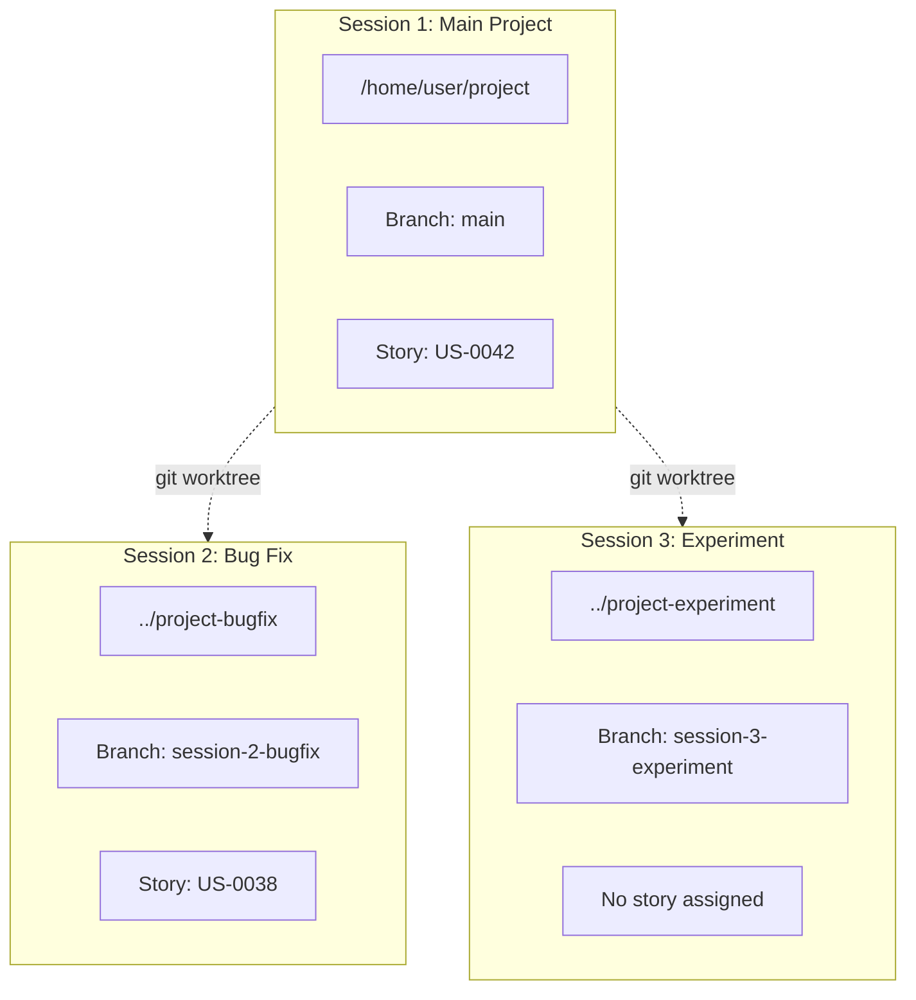
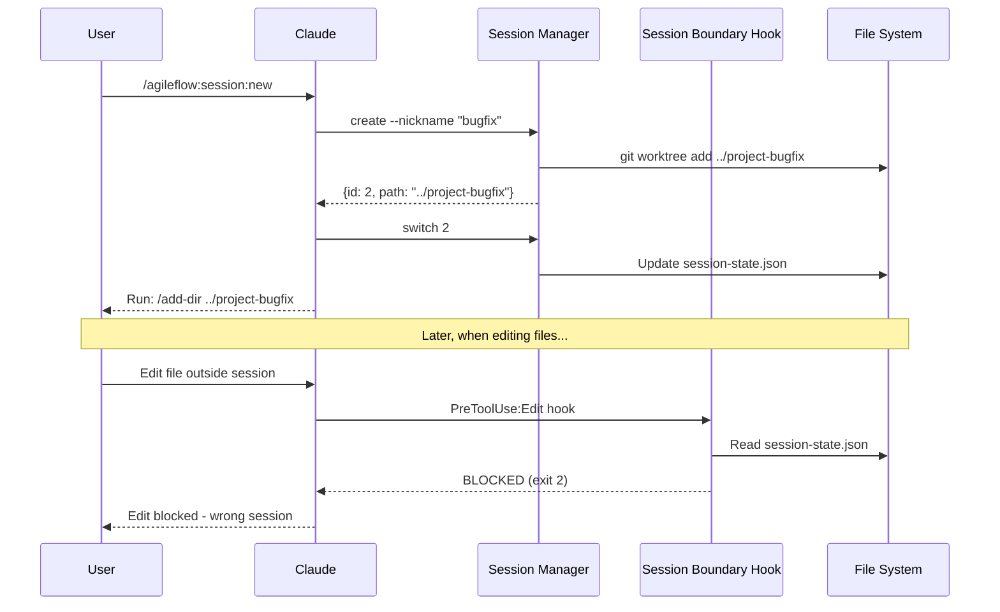
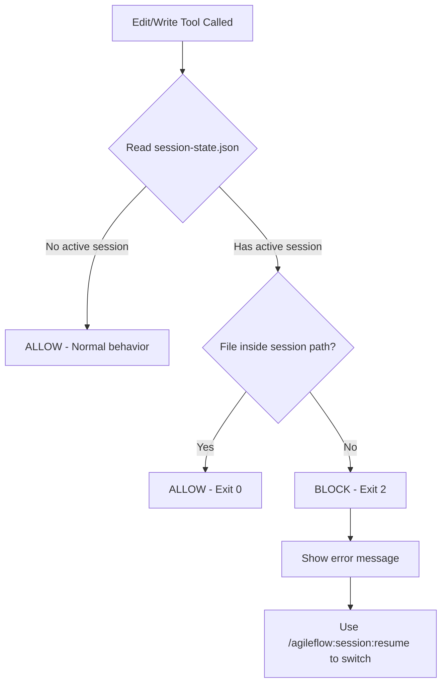

# Parallel Sessions

Parallel Sessions let you work on multiple features, bugs, or experiments simultaneously without context switching. Each session has its own isolated directory, git branch, and boundary protection to prevent accidental cross-session edits.

## Overview

When working on complex projects, you often need to:
- Fix a bug while a feature is in progress
- Experiment without affecting your main work
- Review code in one branch while developing in another

Parallel Sessions solve this by creating isolated workspaces using **git worktrees**, each tracked by AgileFlow with automatic boundary protection.



## Key Features

| Feature | Description |
|---------|-------------|
| **Git Worktrees** | Each session is a separate directory with its own branch |
| **Boundary Protection** | Edit/Write hooks prevent accidental cross-session edits |
| **Session Tracking** | AgileFlow tracks all sessions with status, stories, and activity |
| **Easy Switching** | Switch sessions with `/add-dir` - stays in same terminal |
| **Independent Context** | Each session maintains its own story and progress |

## How It Works

### Architecture



### Session State Management

Sessions are tracked in two files:

**Registry** (`.agileflow/sessions/registry.json`):
```json
{
  "sessions": [
    {
      "id": "1",
      "path": "/home/user/project",
      "branch": "main",
      "is_main": true,
      "nickname": null
    },
    {
      "id": "2",
      "path": "/home/user/project-bugfix",
      "branch": "session-2-bugfix",
      "is_main": false,
      "nickname": "bugfix"
    }
  ]
}
```

**Active Session** (`docs/09-agents/session-state.json`):
```json
{
  "active_session": {
    "id": "2",
    "nickname": "bugfix",
    "path": "/home/user/project-bugfix",
    "branch": "session-2-bugfix",
    "switched_at": "2025-01-12T10:30:00Z"
  }
}
```

### Boundary Protection

The session boundary hook runs on every Edit and Write operation:



**Protection Logic:**
```javascript
// File is allowed if:
// 1. No active session is set (normal behavior)
// 2. File path starts with active session path

const isAllowed =
  !activeSession ||
  filePath.startsWith(activeSession.path + '/') ||
  filePath === activeSession.path;
```

## Commands

### Create New Session

```
/agileflow:session:new
```

Creates a new parallel session with options:
- **Auto-create**: Generates `../project-{id}` with branch `session-{id}`
- **Named**: Creates `../project-{name}` with custom nickname
- **Existing branch**: Uses an existing git branch

**Output:**
```
Created Session 2 "bugfix"

┌───────────┬────────────────────────────────────────────┐
│ Session   │ 2 "bugfix"                                 │
│ Workspace │ ../project-bugfix                          │
│ Branch    │ session-2-bugfix                           │
└───────────┴────────────────────────────────────────────┘

To switch to this session, run:

  /add-dir ../project-bugfix
```

### Switch Sessions

```
/agileflow:session:resume
```

Lists all sessions and provides the command to switch:

```
Which session would you like to resume?

○ Session 1: main (current)
  US-0042: User Auth API │ Active now │ /home/user/project

○ Session 2: "bugfix"
  US-0038: Fix Login │ Active now │ ../project-bugfix

○ Create new session
  Start a fresh parallel workspace
```

After selection:
```
To switch to Session 2 "bugfix":

  /add-dir ../project-bugfix
```

### View Session Status

```
/agileflow:session:status
```

Shows current session information and all registered sessions.

### End Session

```
/agileflow:session:end
```

Ends the current session and optionally:
- Merges changes back to main
- Deletes the worktree
- Cleans up the branch

## Workflow Example

### Starting a Bug Fix While Feature Work is In Progress

```
# You're working on Session 1 (main) with US-0042: User Auth API

User: I need to quickly fix a login bug, but don't want to lose my current work

Claude: I'll create a new session for the bug fix.

> /agileflow:session:new

Created Session 2 "bugfix"
To switch: /add-dir ../project-bugfix

User: /add-dir ../project-bugfix

# Now working in Session 2
# Claude can only edit files in ../project-bugfix
# Any attempt to edit files in the main project is BLOCKED

User: Fix the login validation bug

Claude: [Fixes bug in ../project-bugfix/src/auth/login.ts]

User: Done, let's go back to main work

> /agileflow:session:resume
> Select: Session 1: main

To switch: /add-dir /home/user/project

User: /add-dir /home/user/project

# Back in Session 1, boundary protection now blocks edits to ../project-bugfix
```

## Configuration

### Enabling Session Boundary Protection

Session boundary hooks are automatically configured when you use parallel sessions. They're added to `.claude/settings.json`:

```json
{
  "hooks": {
    "PreToolUse": [
      {
        "matcher": "Edit",
        "hooks": [
          {
            "type": "command",
            "command": "node .agileflow/scripts/session-boundary.js"
          }
        ]
      },
      {
        "matcher": "Write",
        "hooks": [
          {
            "type": "command",
            "command": "node .agileflow/scripts/session-boundary.js"
          }
        ]
      }
    ]
  }
}
```

### Disabling Boundary Protection

To work across sessions without restrictions:

```bash
node .agileflow/scripts/session-manager.js clear-active
```

This clears the active session, allowing edits to any directory.

## Session Manager CLI

The session manager script provides direct control:

```bash
# List all sessions
node .agileflow/scripts/session-manager.js list --json

# Get current session status
node .agileflow/scripts/session-manager.js status

# Switch active session (for boundary protection)
node .agileflow/scripts/session-manager.js switch 2

# Get currently active session
node .agileflow/scripts/session-manager.js active

# Clear active session (disable boundaries)
node .agileflow/scripts/session-manager.js clear-active

# Create new session
node .agileflow/scripts/session-manager.js create --nickname "feature"

# Delete session
node .agileflow/scripts/session-manager.js delete 2 --remove-worktree
```

## Best Practices

### Do's

- **Use descriptive nicknames**: `bugfix`, `auth`, `experiment` are clearer than `session-2`
- **Switch sessions explicitly**: Always use `/agileflow:session:resume` to switch
- **Commit before switching**: Ensure work is saved before changing sessions
- **End sessions when done**: Clean up worktrees to save disk space

### Don'ts

- **Don't manually cd**: Use `/add-dir` to stay in the same Claude conversation
- **Don't disable boundaries casually**: They prevent accidental cross-contamination
- **Don't create too many sessions**: Keep it manageable (3-5 max recommended)

## Troubleshooting

### "Edit blocked" Error

**Cause**: You're trying to edit a file outside the active session.

**Solution**:
```
/agileflow:session:resume
```
Select the correct session, then run the `/add-dir` command shown.

### Session Not Found

**Cause**: The worktree directory was deleted or moved.

**Solution**:
```bash
# Check if directory exists
ls ../project-{name}

# If missing, unregister the session
node .agileflow/scripts/session-manager.js delete {id}
```

### Git Worktree Conflicts

**Cause**: Branch already checked out in another worktree.

**Solution**:
```bash
# List worktrees
git worktree list

# Remove stale worktree
git worktree remove ../project-{name}
```

## Related Features

- [Damage Control](/docs/features/damage-control) - Additional file protection
- [Compact Context](/docs/features/compact-context) - Context preservation across sessions
- [Agent Expertise](/docs/features/agent-expertise-system) - Specialized agents for sessions
