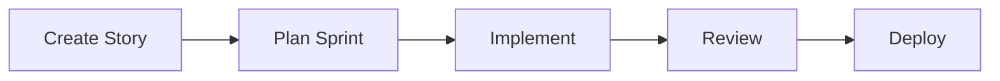

import { Callout } from 'fumadocs-ui/components/callout';
import { Steps, Step } from 'fumadocs-ui/components/steps';

# Quick Start

Get up and running with AgileFlow in just a few minutes. This tutorial will guide you through creating your first user story.

<Callout type="info">
  Before starting, make sure you've completed the [Installation Guide](/installation).
</Callout>

## Your First Story

Let's create a simple user story for adding a login feature.

<Steps>
  <Step>
    ### Create a Story

    In your IDE, run the story command:

    ```
    /agileflow:story
    ```

    This will launch the story creation wizard.
  </Step>

  <Step>
    ### Describe the Feature

    When prompted, describe your feature:

    ```
    I need a login page where users can sign in with email and password
    ```

    AgileFlow will automatically generate:
    - A properly formatted user story
    - Acceptance criteria in Given/When/Then format
    - Story points estimation
    - Technical requirements
  </Step>

  <Step>
    ### Review the Story

    AgileFlow creates a story file in `.agileflow/stories/`. Review it:

    ```bash
    cat .agileflow/stories/AF-001-user-login.md
    ```

    You should see:
    - **Title**: User Login Feature
    - **Description**: As a user, I want to...
    - **Acceptance Criteria**: Given/When/Then scenarios
    - **Story Points**: Estimated effort
  </Step>

  <Step>
    ### Start Development

    Begin implementing the story:

    ```
    /agileflow:status AF-001 in-progress
    ```

    This updates the story status and tracks it in your sprint.
  </Step>
</Steps>

## Understanding the Workflow

AgileFlow follows a structured workflow:



### 1. Create Stories

Use `/agileflow:story` to create user stories with:
- Clear acceptance criteria
- Story point estimates
- Dependencies

### 2. Plan Sprints

Organize stories into sprints:

```
/agileflow:sprint
```

This helps you:
- Group related stories
- Calculate team capacity
- Track velocity

### 3. Implement Features

As you develop:
- Update story status
- Document decisions with ADRs
- Track progress

### 4. Review & Deploy

Before deployment:
- Run automated tests
- Create pull requests
- Generate changelogs

## Example Workflow

Here's a complete workflow example:

```bash
# 1. Create a story
/agileflow:story
> "Add user authentication with JWT tokens"

# 2. Plan the sprint
/agileflow:sprint
> Add AF-001 to current sprint

# 3. Start development
/agileflow:status AF-001 in-progress

# 4. Document an architecture decision
/agileflow:adr
> "Use JWT for authentication because..."

# 5. Complete the story
/agileflow:status AF-001 completed

# 6. Create a pull request
/agileflow:pr AF-001
```

## Common Commands

Here are the most frequently used commands:

| Command | Purpose |
|---------|---------|
| `/agileflow:story` | Create a new user story |
| `/agileflow:epic` | Create an epic with multiple stories |
| `/agileflow:sprint` | Plan a sprint |
| `/agileflow:status` | Update story status |
| `/agileflow:pr` | Generate pull request description |
| `/agileflow:adr` | Create Architecture Decision Record |

<Callout>
  Run `/agileflow:help` to see all available commands.
</Callout>

## Working with Agents

AgileFlow includes 26 specialized agents. Here are some examples:

### API Agent

For backend work:

```
@api implement the login endpoint for AF-001
```

The API agent will:
- Create the endpoint
- Add validation
- Write tests
- Document the API

### UI Agent

For frontend work:

```
@ui create the login form component for AF-001
```

The UI agent will:
- Build the component
- Add accessibility
- Style with your design system
- Write component tests

### Testing Agent

For comprehensive testing:

```
@testing create test suite for AF-001
```

## Best Practices

<Callout type="warn">
  Follow these best practices for the best experience with AgileFlow.
</Callout>

1. **Write Clear Descriptions**: The better your description, the better AgileFlow can help
2. **Break Down Large Features**: Use epics to organize complex features
3. **Update Status Regularly**: Keep your story status current
4. **Document Decisions**: Use ADRs for important technical decisions
5. **Review Generated Content**: Always review and adjust AI-generated stories

## Next Steps

Now that you've created your first story:

1. Explore [Core Concepts](/concepts) to understand AgileFlow's workflow
2. Browse the [Commands Reference](/commands) for all available commands
3. Learn about [Agents](/agents) to automate more tasks
4. Check out [Sprint Planning](/sprint-planning) for team collaboration

## Getting Help

Need assistance?

- Check the [documentation](/)
- Visit the [GitHub repo](https://github.com/projectquestorg/AgileFlow)
- Review [Configuration](/configuration) options

<Callout type="info">
  AgileFlow learns from your project structure and conventions. The more you use it, the better it gets!
</Callout>
