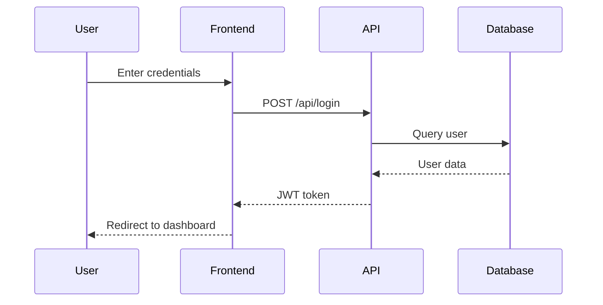

import { Callout } from 'fumadocs-ui/components/callout';

# Skills Reference

AgileFlow provides **23 reusable skills** - specialized code generators and templates that help you work faster.

## What are Skills?

Skills are:
- **Reusable templates**: Pre-built code patterns
- **Code generators**: Automated code creation
- **Best practices**: Industry-standard implementations
- **Time savers**: Eliminate repetitive work

### Using Skills

Skills are invoked directly or used by agents:

```
# Directly invoke a skill
AgileFlow:acceptance-criteria-generator

# Agents use skills automatically
@api implement login endpoint
# API agent uses type-definitions and validation-schema-generator skills
```

## Documentation Skills

### acceptance-criteria-generator

Generate Given/When/Then acceptance criteria for user stories.

**Input**: Story description
**Output**: Structured acceptance criteria

**Example**:
```markdown
Input: "User login with email and password"

Output:
**Given** I am on the login page
**When** I enter valid email and password
**Then** I should be logged in and redirected to dashboard

**Given** I enter invalid credentials
**When** I submit the form
**Then** I should see an error message
```

### adr-template

Generate Architecture Decision Record structure.

**Sections**:
- Title
- Status (proposed/accepted/deprecated)
- Context
- Decision
- Consequences
- Alternatives considered

**Example**:
```markdown
# ADR-001: Use PostgreSQL for Database

## Status
Accepted

## Context
We need a reliable database with ACID guarantees for user data.

## Decision
Use PostgreSQL 15 as primary database.

## Consequences
**Positive**: Strong consistency, JSON support
**Negative**: More complex than SQLite
**Neutral**: Team needs PostgreSQL training

## Alternatives
- MySQL: Less JSON support
- MongoDB: No ACID guarantees
- SQLite: Not scalable
```

### api-documentation-generator

Generate OpenAPI/Swagger documentation.

**Input**: API endpoints
**Output**: OpenAPI spec

**Features**:
- Request/response schemas
- Authentication
- Error codes
- Examples

### pr-description

Generate pull request descriptions.

**From**: Story ID
**Generates**:
- PR title
- Summary of changes
- Testing instructions
- Checklist
- Related issues

**Example**:
```markdown
## Summary
Implements user login functionality (AF-001)

## Changes
- Added /api/login endpoint
- Created LoginForm component
- Added JWT authentication
- Implemented session management

## Testing
1. Navigate to /login
2. Enter credentials
3. Verify successful login
4. Check session persists

## Checklist
- [x] Tests passing
- [x] Docs updated
- [x] No breaking changes
- [x] Accessibility checked
```

### changelog-entry

Generate Keep a Changelog format entries.

**Categories**:
- Added
- Changed
- Fixed
- Deprecated
- Removed
- Security

**Example**:
```markdown
## [1.2.0] - 2024-01-15

### Added
- User login with JWT authentication
- Password reset via email
- Two-factor authentication support

### Changed
- Updated session timeout to 24 hours
- Improved login error messages

### Fixed
- Session not persisting after page reload
- Email validation regex
```

### deployment-guide-generator

Generate deployment guides.

**Includes**:
- Deployment steps
- Environment variables
- Rollback procedures
- Verification steps
- Troubleshooting

## Code Generation Skills

### type-definitions

Generate TypeScript interfaces and types.

**From**: Data structures or API responses
**Generates**: Type-safe definitions

**Example**:
```typescript
// Input: User object from API
{
  id: 1,
  email: "user@example.com",
  name: "John Doe",
  createdAt: "2024-01-01T00:00:00Z"
}

// Output:
interface User {
  id: number;
  email: string;
  name: string;
  createdAt: string;
}

type UserResponse = {
  data: User;
  meta: {
    timestamp: string;
  };
};
```

### validation-schema-generator

Generate input validation schemas.

**Supports**:
- Zod (TypeScript)
- Joi (JavaScript)
- Yup (React)
- Pydantic (Python)

**Example** (Zod):
```typescript
import { z } from 'zod';

const loginSchema = z.object({
  email: z.string().email('Invalid email'),
  password: z.string().min(8, 'Password must be 8+ chars'),
  rememberMe: z.boolean().optional(),
});

type LoginInput = z.infer<typeof loginSchema>;
```

### error-handler-template

Generate error handling boilerplate.

**Includes**:
- Custom error classes
- Error handlers
- Try/catch patterns
- Logging
- User-friendly messages

**Example**:
```typescript
class AuthenticationError extends Error {
  constructor(message: string) {
    super(message);
    this.name = 'AuthenticationError';
  }
}

const handleError = (error: Error) => {
  if (error instanceof AuthenticationError) {
    return { status: 401, message: 'Invalid credentials' };
  }
  // ... other error types
  return { status: 500, message: 'Internal error' };
};
```

### sql-schema-generator

Generate SQL schemas and migrations.

**Features**:
- Table definitions
- Indexes
- Constraints
- Foreign keys
- Migration up/down

**Example**:
```sql
-- Migration: create_users_table

-- Up
CREATE TABLE users (
  id SERIAL PRIMARY KEY,
  email VARCHAR(255) UNIQUE NOT NULL,
  password_hash VARCHAR(255) NOT NULL,
  created_at TIMESTAMP DEFAULT CURRENT_TIMESTAMP
);

CREATE INDEX idx_users_email ON users(email);

-- Down
DROP INDEX idx_users_email;
DROP TABLE users;
```

## Testing Skills

### test-case-generator

Generate test cases from acceptance criteria.

**Test types**:
- Unit tests
- Integration tests
- E2E tests

**Example**:
```typescript
describe('User Login', () => {
  it('should log in with valid credentials', async () => {
    const user = await login('user@example.com', 'password123');
    expect(user).toBeDefined();
    expect(user.email).toBe('user@example.com');
  });

  it('should reject invalid credentials', async () => {
    await expect(
      login('user@example.com', 'wrong')
    ).rejects.toThrow('Invalid credentials');
  });

  it('should require email format', async () => {
    await expect(
      login('invalid-email', 'password123')
    ).rejects.toThrow('Invalid email');
  });
});
```

## Planning Skills

### story-skeleton

Generate user story template with boilerplate.

**Sections**:
- Title
- Description (As a/I want/So that)
- Acceptance criteria
- Story points
- Status
- Dependencies
- Technical notes

### diagram-generator

Generate Mermaid/ASCII diagrams.

**Diagram types**:
- Flowcharts
- Sequence diagrams
- Entity relationships
- Architecture diagrams

**Example** (Mermaid):


### migration-checklist

Generate data migration checklists.

**Includes**:
- Pre-migration steps
- Migration execution
- Validation procedures
- Rollback plan
- Post-migration verification

**Example**:
```markdown
## Migration Checklist: User Table Schema Update

### Pre-Migration
- [ ] Backup production database
- [ ] Test migration on staging
- [ ] Notify team of maintenance window
- [ ] Verify rollback script

### Migration
- [ ] Set application to maintenance mode
- [ ] Run migration script
- [ ] Verify row count matches
- [ ] Check for errors in logs

### Validation
- [ ] Query sample data
- [ ] Run automated tests
- [ ] Verify foreign key constraints
- [ ] Check application functionality

### Rollback (if needed)
- [ ] Run rollback script
- [ ] Restore from backup
- [ ] Verify data integrity
```

## Infrastructure Skills

### commit-message-formatter

Generate Conventional Commits format messages.

**Format**: `<type>(<scope>): <description>`

**Types**:
- feat: New feature
- fix: Bug fix
- docs: Documentation
- style: Formatting
- refactor: Code restructure
- test: Tests
- chore: Maintenance

**Example**:
```
feat(auth): implement user login

- Added /api/login endpoint
- Created JWT token generation
- Implemented session management

Closes #123
```

## Skill Composition

Skills can be combined:

```
# Use multiple skills together
1. story-skeleton → Generate story structure
2. acceptance-criteria-generator → Add criteria
3. test-case-generator → Create tests
4. type-definitions → Define types
5. validation-schema-generator → Add validation
```

Agents automatically compose skills:

```
@api implement user registration

Agent uses:
- type-definitions (User type)
- validation-schema-generator (input validation)
- error-handler-template (error handling)
- test-case-generator (unit tests)
- api-documentation-generator (OpenAPI spec)
```

## Custom Skills

You can create custom skills:

1. **Create skill file** in `.claude/skills/`
2. **Define template** with placeholders
3. **Add to skill registry**
4. **Use in workflows**

**Example skill template**:
```markdown
<!-- .claude/skills/my-custom-skill.md -->

# My Custom Skill

**Input**: {{input_description}}
**Output**: {{output_description}}

**Template**:
\```typescript
// Generated code here
\```
```

<Callout>
  Custom skills extend AgileFlow for your specific needs and patterns.
</Callout>

## Best Practices

### 1. Use Skills Early

Generate boilerplate first:
```
1. Create story → story-skeleton
2. Add criteria → acceptance-criteria-generator
3. Define types → type-definitions
4. Generate tests → test-case-generator
```

### 2. Customize Output

Skills provide starting points - always customize:
- Add project-specific logic
- Adjust to your conventions
- Enhance with domain knowledge

### 3. Chain Skills

Combine skills for complex tasks:
```
API endpoint implementation:
1. type-definitions → Data models
2. validation-schema-generator → Input validation
3. api-documentation-generator → OpenAPI spec
4. test-case-generator → Test suite
5. error-handler-template → Error handling
```

### 4. Review Generated Code

Always review and test generated code:
- Ensure correctness
- Check edge cases
- Verify security
- Test thoroughly

## Skill Development

Want to contribute a skill?

1. **Identify pattern**: Common, repetitive task
2. **Create template**: Reusable structure
3. **Add variables**: Parameterize the template
4. **Document usage**: Clear examples
5. **Test thoroughly**: Multiple scenarios
6. **Submit PR**: Share with community

<Callout type="info">
  Skills are open source. Contribute at [github.com/projectquestorg/AgileFlow](https://github.com/projectquestorg/AgileFlow)
</Callout>

## Next Steps

- Explore [Commands](/commands) that invoke skills
- Learn about [Agents](/agents) that use skills
- Read [Configuration](/configuration) for skill settings
