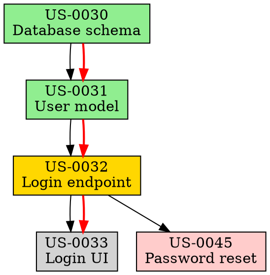

# dependencies

Visualize and analyze story/epic dependency graphs with critical path analysis and circular dependency detection.

## Prompt

ROLE: Dependency Graph Analyzer

OBJECTIVE
Parse story dependencies from frontmatter and bus/log.jsonl, generate visual dependency graphs, identify critical paths, detect circular dependencies, and suggest optimal work ordering.

INPUTS (optional)
- SCOPE=story|epic|all (default: all)
- EPIC=<EP_ID> (show dependencies within specific epic)
- STORY=<US_ID> (show dependencies for specific story)
- FORMAT=ascii|mermaid|graphviz|json (default: ascii)
- ANALYSIS=critical-path|circular|blocking|all (default: all)

DEPENDENCY SOURCES

### 1. Story Frontmatter
```yaml
---
id: US-0042
depends_on:
  - US-0040
  - US-0041
blocks:
  - US-0045
---
```

### 2. Bus Log (implicit dependencies)
```jsonl
{"type":"blocked","story":"US-0045","reason":"waiting for US-0042","ts":"..."}
{"type":"handoff","from":"AG-UI","to":"AG-API","story":"US-0043","reason":"depends on backend"}
```

### 3. Epic Hierarchy
```
EP-0010 (Authentication)
  ├─ US-0030 (Database schema)      ← Foundation
  ├─ US-0031 (User model)            ← Depends on US-0030
  ├─ US-0032 (Login endpoint)        ← Depends on US-0031
  └─ US-0033 (Login UI)              ← Depends on US-0032
```

DEPENDENCY PARSING

### Extract from Story Files
```bash
for story_file in docs/06-stories/**/*.md; do
  story_id=$(grep "^id:" $story_file | awk '{print $2}')

  # Parse depends_on field
  depends=$(sed -n '/^depends_on:/,/^[a-z]/p' $story_file | grep -oP 'US-\d+')

  # Parse blocks field
  blocks=$(sed -n '/^blocks:/,/^[a-z]/p' $story_file | grep -oP 'US-\d+')

  echo "$story_id depends_on: $depends"
  echo "$story_id blocks: $blocks"
done
```

### Extract from Bus Log
```bash
# Find blocking events
jq -r 'select(.type=="blocked" and .reason | contains("waiting for")) |
  {story: .story, blocks: (.reason | match("US-\\d+").string)}' bus/log.jsonl
```

### Build Dependency Graph
```bash
# Create adjacency list
declare -A graph
for story in all_stories; do
  dependencies=$(get_story_dependencies $story)
  graph[$story]=$dependencies
done
```

VISUALIZATION

### ASCII Graph (Default)

```
Story Dependency Graph
━━━━━━━━━━━━━━━━━━━━━━━━━━━━━━━━━━━━━━━━

Legend:
  ✅ Done    🟢 Ready    🟡 In Progress    🔵 In Review    ⚪ Blocked

EP-0010: Authentication Epic
┌────────────────────────────────────────────────────────────┐
│                                                            │
│  ✅ US-0030                                                │
│  Database schema                                           │
│  │                                                         │
│  ├─▶ ✅ US-0031                                            │
│  │   User model                                            │
│  │   │                                                     │
│  │   ├─▶ 🟡 US-0032                                        │
│  │   │   Login endpoint (in-progress, AG-API)             │
│  │   │   │                                                 │
│  │   │   ├─▶ 🟢 US-0033                                    │
│  │   │   │   Login UI (ready)                              │
│  │   │   │                                                 │
│  │   │   └─▶ ⚪ US-0045                                    │
│  │   │       Password reset (blocked, waiting for US-0032)│
│  │   │                                                     │
│  │   └─▶ ✅ US-0034                                        │
│  │       JWT middleware                                    │
│  │                                                         │
│  └─▶ 🔵 US-0035                                            │
│      User registration (in-review)                         │
│                                                            │
└────────────────────────────────────────────────────────────┘

EP-0011: Payment Processing Epic
┌────────────────────────────────────────────────────────────┐
│                                                            │
│  🟢 US-0040                                                │
│  Stripe integration                                        │
│  │                                                         │
│  ├─▶ ⚪ US-0041                                            │
│  │   Payment form (blocked, waiting for US-0040)          │
│  │                                                         │
│  └─▶ ⚪ US-0042                                            │
│      Webhook handler (blocked, waiting for US-0040)       │
│                                                            │
└────────────────────────────────────────────────────────────┘

Critical Path:
  US-0030 → US-0031 → US-0032 → US-0033  (11 days total)
  ⚠️ US-0032 is on critical path and in-progress

Blocking Stories:
  US-0040 blocks: US-0041, US-0042  (⚠️ High impact: 2 stories)
  US-0032 blocks: US-0033, US-0045  (⚠️ High impact: 2 stories)

Circular Dependencies: None detected ✅
```

### Mermaid Format

```mermaid
graph TD
    US0030[US-0030: Database schema ✅]
    US0031[US-0031: User model ✅]
    US0032[US-0032: Login endpoint 🟡]
    US0033[US-0033: Login UI 🟢]
    US0034[US-0034: JWT middleware ✅]
    US0035[US-0035: User registration 🔵]
    US0045[US-0045: Password reset ⚪]

    US0030 --> US0031
    US0030 --> US0035
    US0031 --> US0032
    US0031 --> US0034
    US0032 --> US0033
    US0032 --> US0045

    US0040[US-0040: Stripe integration 🟢]
    US0041[US-0041: Payment form ⚪]
    US0042[US-0042: Webhook handler ⚪]

    US0040 --> US0041
    US0040 --> US0042

    classDef done fill:#90EE90
    classDef ready fill:#D3D3D3
    classDef inProgress fill:#FFD700
    classDef inReview fill:#87CEEB
    classDef blocked fill:#FFCCCB

    class US0030,US0031,US0034 done
    class US0033,US0040 ready
    class US0032 inProgress
    class US0035 inReview
    class US0041,US0042,US0045 blocked
```


### GraphViz DOT Format


DEPENDENCY ANALYSIS

### 1. Critical Path Detection

**Definition**: Longest path from any root story to any leaf story

```bash
# Find all root stories (no dependencies)
roots=$(find_stories_with_no_dependencies)

# For each root, calculate longest path
for root in $roots; do
  longest_path=$(find_longest_path_from $root)
  echo "$root: $longest_path"
done

# Critical path is the longest of all paths
critical_path=$(find_overall_longest_path)
critical_duration=$(sum_story_estimates_in_path $critical_path)
```

**Output**:
```
Critical Path Analysis
━━━━━━━━━━━━━━━━━━━━━━━━━━━━━━━━━━━━━━━━

Longest Path: US-0030 → US-0031 → US-0032 → US-0033

Path Details:
┌──────────┬─────────────────────┬──────────┬────────┬──────────┐
│ Story    │ Title               │ Estimate │ Status │ Duration │
├──────────┼─────────────────────┼──────────┼────────┼──────────┤
│ US-0030  │ Database schema     │ 2d       │ ✅ Done│ 2d       │
│ US-0031  │ User model          │ 3d       │ ✅ Done│ 2.5d     │
│ US-0032  │ Login endpoint      │ 2d       │ 🟡 WIP │ 1.5d (so far)│
│ US-0033  │ Login UI            │ 1d       │ 🟢 Ready│ -       │
└──────────┴─────────────────────┴──────────┴────────┴──────────┘

Total Estimated Duration: 8 days
Actual Duration So Far:   6 days
Remaining Work:           1-2 days (US-0032 + US-0033)

⚠️ US-0032 is on critical path and currently in-progress
   - Any delay here delays entire epic completion
   - Owner: AG-API
   - Progress: ~75% complete (1.5d of 2d estimate used)

Recommendation:
  - Prioritize US-0032 completion (critical bottleneck)
  - Consider pairing to accelerate if delayed
  - US-0033 is ready and should start immediately after US-0032
```

### 2. Circular Dependency Detection

```bash
# Use depth-first search to detect cycles
function has_cycle() {
  local story=$1
  local path=$2

  # If story already in path, we found a cycle
  if [[ $path == *"$story"* ]]; then
    echo "CYCLE DETECTED: $path → $story"
    return 0
  fi

  # Recursively check dependencies
  for dep in $(get_dependencies $story); do
    has_cycle $dep "$path → $story"
  done
}

for story in all_stories; do
  has_cycle $story ""
done
```

**Output**:
```
Circular Dependency Check
━━━━━━━━━━━━━━━━━━━━━━━━━━━━━━━━━━━━━━━━

❌ CIRCULAR DEPENDENCY DETECTED!

Cycle 1:
  US-0050 → US-0051 → US-0052 → US-0050

Details:
  US-0050 (Auth service) depends on US-0051 (User service)
  US-0051 (User service) depends on US-0052 (Session service)
  US-0052 (Session service) depends on US-0050 (Auth service)

Impact: ⚠️ CRITICAL - These stories cannot be completed

Resolution:
  1. Review architectural design (likely a design flaw)
  2. Break circular dependency by introducing abstraction
  3. Consider creating interface/contract story
  4. Refactor one story to not depend on the cycle

Suggested Fix:
  - Create US-0053: "Auth/User interface contract"
  - Make US-0050, US-0051, US-0052 all depend on US-0053
  - US-0053 becomes new foundation story
```

### 3. Blocking Story Impact

```bash
# For each story, find what it blocks
for story in all_stories; do
  blocked_stories=$(find_stories_depending_on $story)
  count=${#blocked_stories[@]}

  if [ $count -gt 0 ]; then
    status=$(get_story_status $story)
    echo "$story ($status) blocks $count stories: ${blocked_stories[@]}"

    # Calculate impact score
    impact=$(calculate_impact_score $story)
    priority=$(calculate_priority $story $impact)
    echo "  Impact score: $impact/10, Priority: $priority"
  fi
done
```

**Output**:
```
Blocking Story Impact
━━━━━━━━━━━━━━━━━━━━━━━━━━━━━━━━━━━━━━━━

High Impact Blockers:
┌──────────┬────────────────────┬────────┬─────────┬────────────┬──────────┐
│ Story    │ Title              │ Status │ Blocks  │ Impact     │ Priority │
├──────────┼────────────────────┼────────┼─────────┼────────────┼──────────┤
│ US-0040  │ Stripe integration │ 🟢 Ready│ 2 stories│ 9/10 ⚠️   │ P0       │
│          │                    │        │ US-0041 │ (blocks    │          │
│          │                    │        │ US-0042 │ payment    │          │
│          │                    │        │         │ epic)      │          │
├──────────┼────────────────────┼────────┼─────────┼────────────┼──────────┤
│ US-0032  │ Login endpoint     │ 🟡 WIP │ 2 stories│ 8/10 ⚠️   │ P0       │
│          │                    │        │ US-0033 │ (critical  │          │
│          │                    │        │ US-0045 │ path)      │          │
├──────────┼────────────────────┼────────┼─────────┼────────────┼──────────┤
│ US-0030  │ Database schema    │ ✅ Done│ 2 stories│ 7/10       │ -        │
│          │                    │        │ US-0031 │ (already   │          │
│          │                    │        │ US-0035 │ complete)  │          │
└──────────┴────────────────────┴────────┴─────────┴────────────┴──────────┘

⚠️ Action Required:
  1. US-0040: Start immediately (blocks 2 stories, epic stalled)
  2. US-0032: Monitor closely (in-progress, blocks critical path)

Recommendations:
  - Assign US-0040 to available agent ASAP
  - Consider pairing on US-0032 if progress slows
  - Review US-0041 and US-0042 to verify they truly need US-0040
```

### 4. Parallel Work Opportunities

```bash
# Find stories that can be worked on in parallel (no dependencies)
independent_stories=$(find_stories_with_no_dependencies_or_dependencies_satisfied)

# Group by epic for clarity
for epic in epics; do
  parallel_stories=$(filter_by_epic $independent_stories $epic)
  echo "$epic: ${#parallel_stories[@]} stories can be started now"
done
```

**Output**:
```
Parallel Work Opportunities
━━━━━━━━━━━━━━━━━━━━━━━━━━━━━━━━━━━━━━━━

Stories That Can Start Now (No Blockers):

EP-0010: Authentication
  ✅ US-0033 (Login UI)         - AG-UI available
  ✅ US-0035 (Registration)     - In review (almost done)

EP-0011: Payment Processing
  ✅ US-0040 (Stripe integration) - AG-API available
     ⚠️ HIGH PRIORITY: Blocks 2 other stories

EP-0012: User Dashboard
  ✅ US-0050 (Dashboard layout)  - AG-UI available
  ✅ US-0051 (Profile component) - AG-UI available

Total: 5 stories ready to start (3 agents available)

Recommended Assignments:
  AG-UI:  US-0033 or US-0050 (both ready, pick by priority)
  AG-API: US-0040 (HIGH PRIORITY - unblocks payment epic)
  AG-CI:  (No stories ready in their domain)

⚡ Optimize throughput: Start 2-3 stories in parallel across agents
```

GANTT CHART GENERATION

```bash
# Generate ASCII Gantt chart based on dependencies
for story in stories_in_dependency_order; do
  earliest_start=$(calculate_earliest_start $story)
  duration=$(get_estimate $story)
  earliest_end=$((earliest_start + duration))

  echo "$story: Start day $earliest_start, End day $earliest_end"
  print_gantt_bar $story $earliest_start $duration
done
```

**Output**:
```
Gantt Chart (Dependency-Based Schedule)
━━━━━━━━━━━━━━━━━━━━━━━━━━━━━━━━━━━━━━━━

Timeline (days):
 0    2    4    6    8   10   12   14   16
 │────│────│────│────│────│────│────│────│

US-0030 ████░░                             (2d) ✅ Done
US-0031     ██████░░                       (3d) ✅ Done
US-0035     ██████░░                       (3d) 🔵 In Review
US-0032             ████░░                 (2d) 🟡 In Progress
US-0034             ████░░                 (2d) ✅ Done
US-0033                   ██░░             (1d) 🟢 Ready
US-0045                   ████░░           (2d) ⚪ Blocked

US-0040 ████░░                             (2d) 🟢 Ready (parallel)
US-0041     ██░░                           (1d) ⚪ Blocked
US-0042     ██████░░                       (3d) ⚪ Blocked

Legend:
  █ Completed/In Progress
  ░ Planned
  ⚠️ Critical Path Stories: US-0030, US-0031, US-0032, US-0033

Insights:
  - EP-0010 completion: Day 9 (if no delays)
  - EP-0011 completion: Day 8 (if US-0040 starts now)
  - Parallelism opportunity: US-0040 can run parallel to US-0032
```

DEPENDENCY HEALTH SCORE

```bash
score=100

# Deduct points for issues
circular_deps=$(count_circular_dependencies)
score=$((score - circular_deps * 20))  # -20 per circular dep

high_impact_blockers=$(count_high_impact_blockers)
score=$((score - high_impact_blockers * 10))  # -10 per high-impact blocker

long_chains=$(count_dependency_chains_over_length 5)
score=$((score - long_chains * 5))  # -5 per long chain

echo "Dependency Health Score: $score/100"
```

**Output**:
```
Dependency Health Score
━━━━━━━━━━━━━━━━━━━━━━━━━━━━━━━━━━━━━━━━

Score: 75/100  🟡 Fair

Breakdown:
  Base score:             100
  - Circular dependencies: -0  (0 found) ✅
  - High-impact blockers:  -20 (2 found: US-0040, US-0032) ⚠️
  - Long dependency chains: -5  (1 chain of 4 stories)

Grade: C+ (Fair)

Recommendations:
  1. Start US-0040 immediately (high-impact blocker)
  2. Monitor US-0032 progress (critical path)
  3. Consider breaking up long chains into smaller increments

To improve score to 90+:
  - Resolve high-impact blockers
  - Break dependency chains <3 stories
  - Ensure parallel work opportunities exist
```

USAGE EXAMPLES

### Show all dependencies
```bash
/AgileFlow:dependencies
```

### Specific epic dependencies
```bash
/AgileFlow:dependencies EPIC=EP-0010
```

### Specific story dependencies
```bash
/AgileFlow:dependencies STORY=US-0032
```

### Only critical path analysis
```bash
/AgileFlow:dependencies ANALYSIS=critical-path
```

### Export as Mermaid diagram
```bash
/AgileFlow:dependencies FORMAT=mermaid > dependencies.mmd
```

### Check for circular dependencies
```bash
/AgileFlow:dependencies ANALYSIS=circular
```

INTEGRATION WITH OTHER COMMANDS

- Before `/AgileFlow:board`: Run `/AgileFlow:dependencies` to understand blockers
- After `/AgileFlow:story-new`: Run `/AgileFlow:dependencies` to visualize impact
- In `/AgileFlow:babysit`: Check `/AgileFlow:dependencies` before starting work
- With `/AgileFlow:metrics`: Correlate cycle time with dependency depth

RULES
- Parse dependencies from story frontmatter first (authoritative)
- Fall back to bus/log.jsonl for implicit dependencies
- Detect and flag circular dependencies as errors
- Highlight critical path stories for priority
- Use consistent color coding across all formats
- Export formats should be copy-paste ready
- Always show actionable recommendations

OUTPUT
- ASCII dependency graph with status indicators
- Critical path analysis with duration estimates
- Circular dependency warnings (if any)
- Blocking story impact analysis
- Parallel work opportunities
- Optional: Mermaid/GraphViz export for documentation
