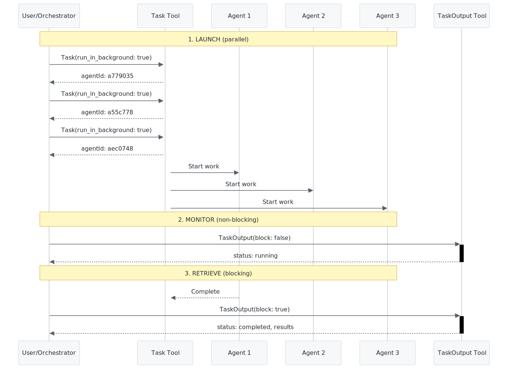

# Async Agent Spawning

Patterns for launching, monitoring, and retrieving results from background agents.

## Quick Reference

### Launch Background Agent

```xml
<invoke name="Task">
<parameter name="subagent_type">Explore</parameter>
<parameter name="description">Find auth handlers</parameter>
<parameter name="prompt">Search for authentication middleware</parameter>
<parameter name="run_in_background">true</parameter>
</invoke>
```

Returns immediately with `agentId` (e.g., `a779035`).

### Check Status (Non-Blocking)

```xml
<invoke name="TaskOutput">
<parameter name="task_id">a779035</parameter>
<parameter name="block">false</parameter>
</invoke>
```

Returns `status: "running"` with progress, or `status: "completed"` with results.

### Get Results (Blocking)

```xml
<invoke name="TaskOutput">
<parameter name="task_id">a779035</parameter>
<parameter name="block">true</parameter>
</invoke>
```

Waits until agent completes, then returns full results.

---

## Task Tool Parameters

| Parameter | Required | Type | Description |
|-----------|----------|------|-------------|
| `prompt` | Yes | string | Detailed instructions for the agent |
| `subagent_type` | Yes | string | Which agent type to use |
| `description` | Yes | string | Short 3-5 word summary |
| `run_in_background` | No | boolean | `true` = async, `false` = sync (default) |
| `model` | No | string | `"haiku"`, `"sonnet"`, or `"opus"` |
| `resume` | No | string | Agent ID to continue previous work |

---

## TaskOutput Parameters

| Parameter | Required | Default | Description |
|-----------|----------|---------|-------------|
| `task_id` | Yes | - | The agentId from Task |
| `block` | No | `true` | Wait for completion |
| `timeout` | No | `30000` | Max wait (ms), up to 600000 |

---

## Available Agent Types

| Type | Purpose | Best For |
|------|---------|----------|
| `general-purpose` | Complex multi-step tasks | Code search, refactoring |
| `Explore` | Fast codebase exploration | Finding files, patterns |
| `Plan` | Design implementation strategies | Architecture planning |
| `claude-code-guide` | Claude Code feature questions | Documentation lookup |
| `statusline-setup` | Configure status line | IDE settings |

---

## Async Workflow

<picture>
  <source media="(prefers-color-scheme: dark)" srcset="images/async-agent-spawning-1.dark.svg">
  
</picture>

> Sequence diagram showing the full async lifecycle: parallel agent launches, non-blocking progress checks, blocking result retrieval, and optional agent resume.

**Workflow steps:**
1. **LAUNCH** - Task with `run_in_background: true` returns agentId immediately
2. **MONITOR** - TaskOutput with `block: false` checks progress without waiting
3. **RETRIEVE** - TaskOutput with `block: true` waits for completion
4. **RESUME** - Task with `resume: agentId` continues previous work

---

## Common Patterns

### Parallel Search

<picture>
  <source media="(prefers-color-scheme: dark)" srcset="images/async-agent-spawning-2.dark.svg">
  
</picture>

> Flowchart showing three Task calls in a single message that execute in parallel, each returning independent results.

Launch multiple agents simultaneously for comprehensive search:

```xml
<!-- Launch all three in the same message -->
<invoke name="Task">
<parameter name="subagent_type">Explore</parameter>
<parameter name="description">Find API routes</parameter>
<parameter name="prompt">Find all API route handlers</parameter>
<parameter name="run_in_background">true</parameter>
</invoke>

<invoke name="Task">
<parameter name="subagent_type">Explore</parameter>
<parameter name="description">Find database models</parameter>
<parameter name="prompt">Find all database model definitions</parameter>
<parameter name="run_in_background">true</parameter>
</invoke>

<invoke name="Task">
<parameter name="subagent_type">Explore</parameter>
<parameter name="description">Find test files</parameter>
<parameter name="prompt">Find all test files and patterns</parameter>
<parameter name="run_in_background">true</parameter>
</invoke>
```

### Check Progress Without Waiting

```xml
<invoke name="TaskOutput">
<parameter name="task_id">a779035</parameter>
<parameter name="block">false</parameter>
</invoke>
```

**Returns running:**
```json
{
  "status": "running",
  "progress": "Found 3 API files so far..."
}
```

**Returns completed:**
```json
{
  "status": "completed",
  "result": "Full agent output here..."
}
```

### Resume Previous Work

Continue where an agent left off:

```xml
<invoke name="Task">
<parameter name="subagent_type">Explore</parameter>
<parameter name="description">Continue search</parameter>
<parameter name="prompt">Continue analyzing the files you found</parameter>
<parameter name="resume">a779035</parameter>
</invoke>
```

Agent retains full context from previous execution.

### Sync vs Async Decision

<picture>
  <source media="(prefers-color-scheme: dark)" srcset="images/async-agent-spawning-4.dark.svg">
  
</picture>

> Decision flowchart comparing sync (blocking) vs async (background) execution paths, helping you choose the right approach for your task.

| Use SYNC (default) when | Use ASYNC when |
|-------------------------|----------------|
| Single quick lookup | Multiple parallel searches |
| Result needed immediately | Long-running analysis |
| Simple task < 30 seconds | Want to work while agent runs |

---

## Best Practices

### 1. Parallel When Independent

Launch multiple agents in a single message when tasks don't depend on each other:

```
Good:  3 parallel explores in one message
Bad:   3 sequential explores in 3 messages
```

### 2. Non-Blocking Checks for Progress

Use `block: false` to monitor without waiting:

```xml
<invoke name="TaskOutput">
<parameter name="task_id">a779035</parameter>
<parameter name="block">false</parameter>
</invoke>
```

Continue other work if still running.

### 3. Choose Right Model

| Task | Model | Rationale |
|------|-------|-----------|
| Quick search | `haiku` | Fast, cheap |
| Code analysis | `sonnet` | Balanced |
| Complex architecture | `opus` | Highest quality |

```xml
<invoke name="Task">
<parameter name="subagent_type">Explore</parameter>
<parameter name="description">Quick file search</parameter>
<parameter name="prompt">Find config files</parameter>
<parameter name="run_in_background">true</parameter>
<parameter name="model">haiku</parameter>
</invoke>
```

### 4. Detailed Prompts

More detail = better results:

```
Bad:  "Find API files"
Good: "Find all API route handlers. Look in src/api/, routes/,
       and pages/api/. Include route definitions, middleware,
       and authentication handlers."
```

### 5. Resume for Follow-Up

Don't start fresh when continuing work:

```xml
<!-- Instead of new agent with repeated context -->
<invoke name="Task">
<parameter name="subagent_type">Explore</parameter>
<parameter name="description">Analyze deeper</parameter>
<parameter name="prompt">Now analyze the authentication patterns</parameter>
<parameter name="resume">a779035</parameter>
</invoke>
```

---

## Error Handling

### Agent Times Out

```xml
<invoke name="TaskOutput">
<parameter name="task_id">a779035</parameter>
<parameter name="block">true</parameter>
<parameter name="timeout">120000</parameter>
</invoke>
```

Increase timeout for complex tasks (max 600000ms = 10 min).

### Agent Not Found

If `task_id` is invalid, TaskOutput returns error. Always store agentIds from Task responses.

### Partial Results

If agent is still running, `block: false` returns partial progress. Check `status` field:

```
status: "running"  → Still working, partial results
status: "completed" → Done, full results available
```

### Agent State Lifecycle

<picture>
  <source media="(prefers-color-scheme: dark)" srcset="images/async-agent-spawning-3.dark.svg">
  
</picture>

> State diagram showing agent lifecycle: Launched → Running (with progress checks) → Completed, with optional Resume path back to Running.

---

## Integration with AgileFlow

### Babysit Orchestration

Babysit uses async agents for domain expert spawning:

```xml
<!-- Babysit spawns UI expert for component work -->
<invoke name="Task">
<parameter name="subagent_type">AgileFlow:ui</parameter>
<parameter name="description">Build login form</parameter>
<parameter name="prompt">Implement login form component...</parameter>
<parameter name="run_in_background">true</parameter>
</invoke>
```

Note: AgileFlow-specific agents (e.g., `AgileFlow:ui`) are only available within AgileFlow commands, not as standalone Task subagent_types.

### Multi-Expert Pattern

For complex questions, spawn multiple domain experts:

```
User: "How should we implement authentication?"

Spawn:
├── AgileFlow:api    → Backend auth patterns
├── AgileFlow:security → Security best practices
└── AgileFlow:database → User/session storage

Synthesize results for comprehensive answer.
```

---

## Checklist

Before launching background agent:
- [ ] Task is complex enough to warrant async
- [ ] Prompt is detailed with clear goals
- [ ] Appropriate model selected (haiku/sonnet/opus)
- [ ] Know whether to `block: true` or `block: false`
- [ ] Plan to store agentId for later retrieval

Before retrieving results:
- [ ] Have the correct task_id
- [ ] Set appropriate timeout for long tasks
- [ ] Decide: wait (block: true) or check (block: false)
