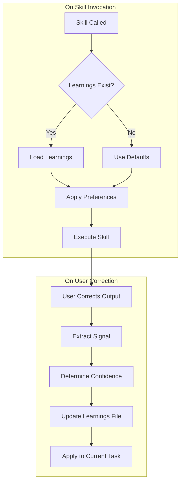
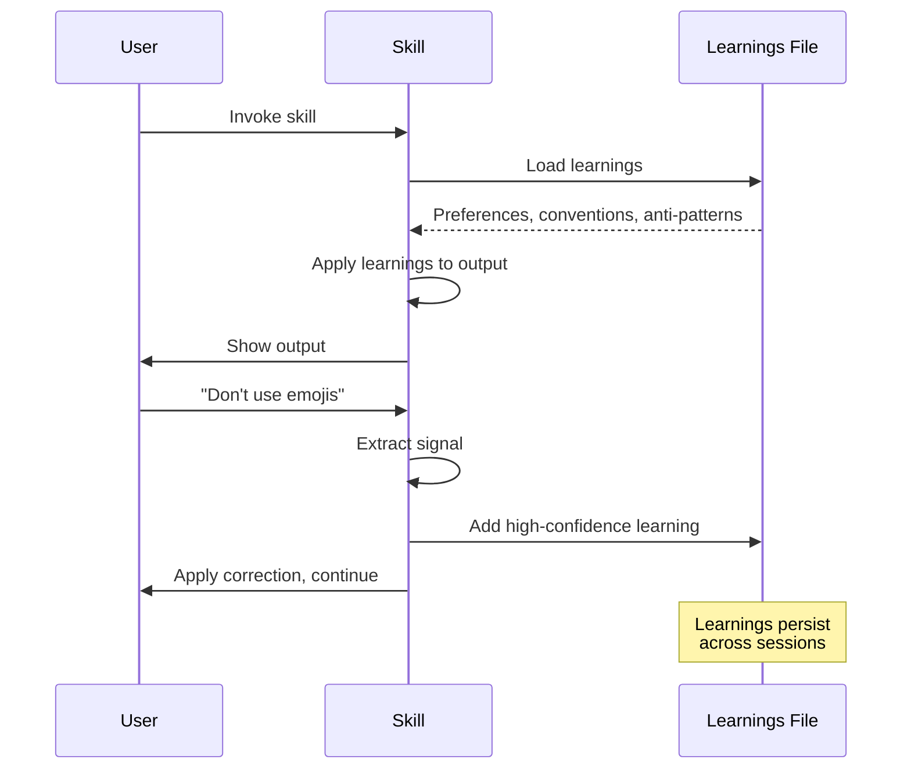

# Self-Improving Skills Pattern

Skills that learn from user corrections and preferences, persisting knowledge across sessions.

## Overview

Self-improving skills follow the same pattern as [Agent Experts](../04-architecture/agent-expert-system.md) but for user-facing skills. They:

1. **Read learnings** on invocation from `.agileflow/skills/_learnings/{skill}.yaml`
2. **Apply preferences** (conventions, anti-patterns, custom rules)
3. **Extract signals** when users correct output
4. **Update learnings** with new preferences and confidence levels



## Learnings File Schema

Each skill has a corresponding `.yaml` file in `.agileflow/skills/_learnings/`:

```yaml
# .agileflow/skills/_learnings/story-writer.yaml

skill: story-writer
version: 1
last_updated: 2026-01-09T00:00:00.000Z

# =============================================================================
# PREFERENCES
# =============================================================================
# Learned from user corrections
preferences:
  - signal: "User said 'use P0-P3 not HIGH/MEDIUM'"
    learning: "Use P0-P3 priority format instead of HIGH/MEDIUM/LOW"
    confidence: high
    captured: 2026-01-09T10:30:00.000Z

  - signal: "User approved story with technical notes"
    learning: "Always include Technical Notes section"
    confidence: medium
    captured: 2026-01-09T11:00:00.000Z

# =============================================================================
# CONVENTIONS
# =============================================================================
# Established patterns this skill should always follow
conventions:
  - "Use 'As a [role], I want [action], So that [benefit]' format"
  - "Include 2-5 acceptance criteria with Given/When/Then"
  - "Use Fibonacci estimation (1,2,3,5,8,13)"

# =============================================================================
# ANTI-PATTERNS
# =============================================================================
# Things this skill should never do
anti_patterns:
  - "Don't create stories > 13 points"
  - "Don't skip acceptance criteria"
  - "Don't use vague descriptions"

# =============================================================================
# CONTEXT
# =============================================================================
# Project-specific context
context:
  story_location: docs/06-stories/
  status_file: docs/09-agents/status.json

# =============================================================================
# EXAMPLES
# =============================================================================
examples:
  good:
    - "US-0042: User Login Form (clear, specific, testable)"
  bad:
    - "US-0099: Implement stuff (vague)"

# =============================================================================
# METADATA
# =============================================================================
metadata:
  corrections_count: 3
  approvals_count: 12
  created: 2026-01-09T00:00:00.000Z
  sessions: ["session-1", "session-2"]
```

## Confidence Levels

| Level | Trigger | Treatment |
|-------|---------|-----------|
| **high** | Explicit correction ("never do X", "always do Y") | Treated as rule, always applied |
| **medium** | User approved output or pattern worked well | Applied by default, may override |
| **low** | Observation from behavior | Consider but verify in future |

### Examples

**High Confidence:**
```yaml
- signal: "User said 'no emojis in commits'"
  learning: "Never include emojis in commit messages"
  confidence: high
```

**Medium Confidence:**
```yaml
- signal: "User approved story with 3 acceptance criteria"
  learning: "3 acceptance criteria is appropriate for medium stories"
  confidence: medium
```

**Low Confidence:**
```yaml
- signal: "User shortened estimate from 8 to 5 points"
  learning: "User may prefer smaller story scope"
  confidence: low
```

## Adding Self-Improvement to a Skill

### Step 1: Add Self-Improving Learnings Section

Add this section to your skill's SKILL.md:

```markdown
## Self-Improving Learnings

This skill learns from your corrections and preferences.

**On invocation**:
1. Check if `.agileflow/skills/_learnings/{skill-name}.yaml` exists
2. If exists, read and apply learned preferences
3. Follow conventions and avoid anti-patterns from learnings

**On correction**:
1. When user corrects output, extract the signal
2. Determine confidence level (high/medium/low)
3. Update the learnings file with new preference

**Learnings file location**: `.agileflow/skills/_learnings/{skill-name}.yaml`
```

### Step 2: Update Instructions

Add learnings loading as the first step:

```markdown
## Instructions

1. **Load learnings** (if exists):
   - Read `.agileflow/skills/_learnings/{skill-name}.yaml`
   - Apply preferences and conventions
   - Skip if file doesn't exist (first run)

2. **Execute skill** with learned preferences applied
   ...

N. **If user corrects** (self-improve):
   - Extract signal from correction
   - Update learnings file
   - Continue with corrected approach
```

### Step 3: Update Quality Checklist

```markdown
## Quality Checklist

- [ ] Loaded learnings file (if exists) and applied preferences
- [ ] ... existing checks ...
- [ ] If user corrected, updated learnings file
```

### Step 4: Create Learnings File

Create the initial `.agileflow/skills/_learnings/{skill-name}.yaml`:

```yaml
skill: skill-name
version: 1
last_updated: 2026-01-09T00:00:00.000Z

preferences: []

conventions:
  - "Default convention 1"
  - "Default convention 2"

anti_patterns:
  - "Default anti-pattern 1"

context: {}

examples:
  good: []
  bad: []

metadata:
  corrections_count: 0
  approvals_count: 0
  created: 2026-01-09T00:00:00.000Z
  sessions: []
```

## Using /skill:upgrade

For existing skills, use the upgrade command:

```bash
/agileflow:skill:upgrade SKILL=story-writer
```

This will:
1. Check if skill already has self-improvement
2. Add Self-Improving Learnings section to SKILL.md
3. Create the learnings.yaml file from template
4. Show diff for approval before applying

For batch upgrade:
```bash
/agileflow:skill:upgrade --all
```

## Skills with Self-Improvement

| Skill | Learnings File | What It Learns |
|-------|----------------|----------------|
| `story-writer` | `story-writer.yaml` | Priority format, estimation scale, AC style |
| `code-review` | `code-review.yaml` | Severity thresholds, focus areas, custom rules |
| `commit-message-formatter` | `commit.yaml` | Attribution preferences, format style |

## Best Practices

### DO

- ✅ Load learnings as first instruction step
- ✅ Apply all high-confidence learnings as rules
- ✅ Extract signals from explicit corrections
- ✅ Update learnings file immediately on correction
- ✅ Include examples in learnings (good and bad)

### DON'T

- ❌ Skip learnings check on invocation
- ❌ Treat low-confidence learnings as rules
- ❌ Update learnings without user correction
- ❌ Overwrite existing learnings file on install

## How Learnings Evolve



## Tracking Improvement

The `metadata` section tracks skill evolution:

```yaml
metadata:
  corrections_count: 15  # Times user corrected output
  approvals_count: 42    # Times user approved output
  created: 2026-01-09T00:00:00.000Z
  sessions: ["session-1", "session-2", "session-3"]
```

Over time:
- High approval rate → skill is well-calibrated
- High correction rate → skill is learning actively
- Sessions list → shows usage history

## Related

- [Agent Expert System](../04-architecture/agent-expert-system.md) - Similar pattern for agents
- [Skill Template](../../packages/cli/src/core/templates/skill-template.md) - Base template with self-improvement
- `/agileflow:skill:create` - Create new skills
- `/agileflow:skill:upgrade` - Add self-improvement to existing skills
