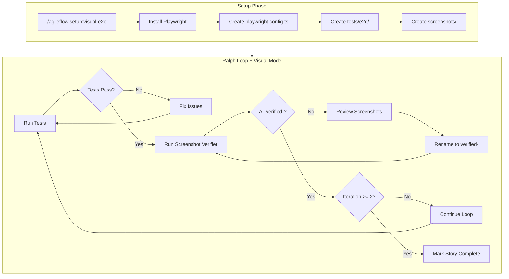
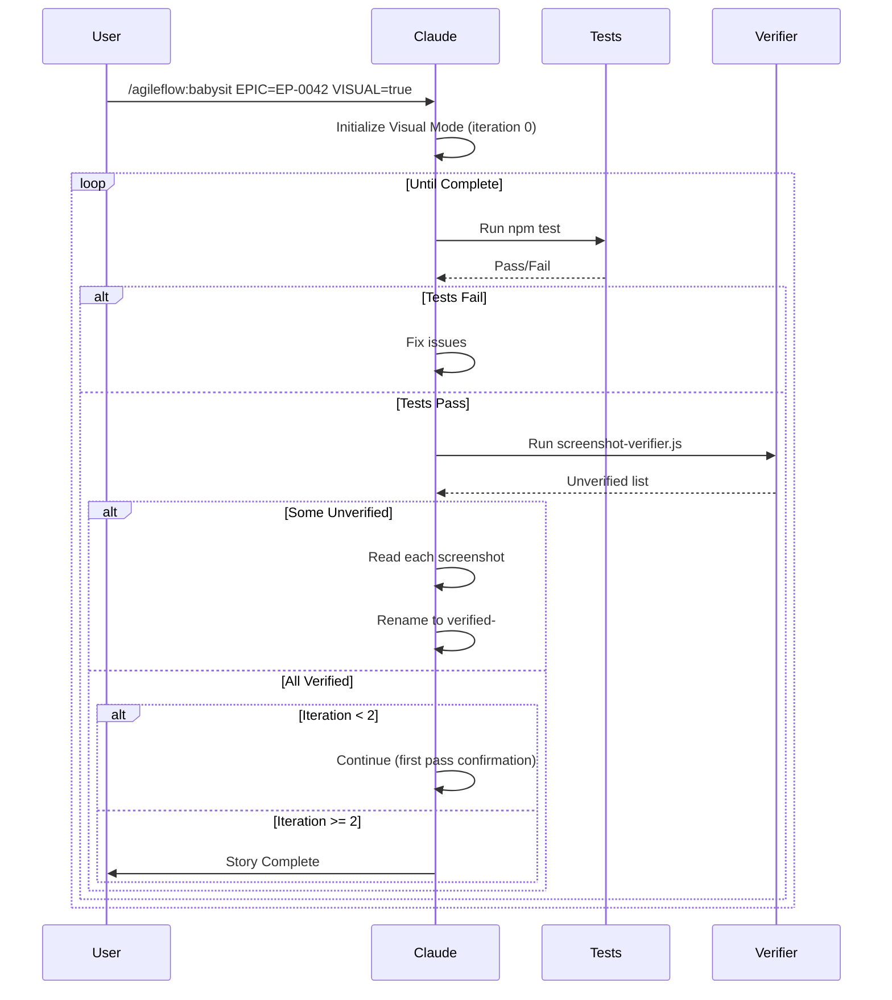

# Visual E2E Testing

Visual E2E testing combines Playwright end-to-end tests with screenshot verification to catch UI issues that functional tests miss.

## The Problem

**Tests pass but UI is broken.**

Functional tests verify behavior but not visual appearance. A button can "work" but be:
- Wrong color
- Wrong position
- Overlapping other elements
- Missing entirely (replaced by error state)

Visual E2E with screenshot verification catches these issues.

---

## Architecture



---

## Screenshot Verification Protocol

### The verified- Prefix Pattern

1. **Tests capture screenshots** - E2E tests save screenshots to `screenshots/`
2. **Claude reviews visually** - Reads each screenshot using the Read tool
3. **Claude renames verified** - Adds `verified-` prefix to approved screenshots
4. **Verifier confirms** - `screenshot-verifier.js` checks all have prefix

### Why This Works

The prefix protocol ensures Claude actually reviewed each screenshot rather than declaring completion prematurely. It's a forcing function for thorough visual QA.

### Example

```bash
# Before verification
screenshots/
├── homepage.png
├── login-form.png
└── dashboard.png

# After verification
screenshots/
├── verified-homepage.png
├── verified-login-form.png
└── verified-dashboard.png
```

---

## Getting Started

### 1. Run Setup Command

```
/agileflow:setup:visual-e2e
```

This creates:
- `playwright.config.ts` with webServer config
- `tests/e2e/` directory with example test
- `screenshots/` directory
- `test:e2e` script in package.json

### 2. Run Tests

```bash
npm run test:e2e
```

### 3. Review Screenshots

After tests run, Claude should read each screenshot and verify:
- Layout matches design
- Colors are correct
- Text is readable
- No visual artifacts

### 4. Rename Verified

```bash
mv screenshots/homepage.png screenshots/verified-homepage.png
```

### 5. Check Verification

```bash
node scripts/screenshot-verifier.js --path ./screenshots
```

---

## Using Visual Mode in Ralph Loop

### Enable Visual Mode

```
/agileflow:babysit EPIC=EP-0042 MODE=loop VISUAL=true
```

Or initialize directly:

```bash
node scripts/ralph-loop.js --init --epic=EP-0042 --visual
```

### Visual Mode Behavior

1. Runs tests (existing behavior)
2. Runs screenshot verifier
3. Requires BOTH to pass
4. Enforces minimum 2 iterations
5. Prevents premature completion

### When to Use Visual Mode

| Scenario | Use Visual Mode? |
|----------|------------------|
| UI component development | Yes |
| Shadcn/UI styling work | Yes |
| Layout changes | Yes |
| API/backend work | No |
| Database migrations | No |
| CLI tools | No |

---

## Example E2E Test

```typescript
// tests/e2e/visual-example.spec.ts
import { test, expect } from '@playwright/test';

test.describe('Visual Verification', () => {
  test('homepage renders correctly', async ({ page }) => {
    await page.goto('/');

    // Capture full-page screenshot
    await page.screenshot({
      path: 'screenshots/homepage-full.png',
      fullPage: true,
    });

    // Basic assertion
    await expect(page).toHaveTitle(/./);
  });

  test('login form displays correctly', async ({ page }) => {
    await page.goto('/login');

    // Capture form element
    const form = page.locator('form');
    await form.screenshot({
      path: 'screenshots/login-form.png',
    });

    // Verify form elements exist
    await expect(page.locator('input[name="email"]')).toBeVisible();
    await expect(page.locator('input[name="password"]')).toBeVisible();
    await expect(page.locator('button[type="submit"]')).toBeVisible();
  });

  test('dashboard layout after login', async ({ page }) => {
    // Login first
    await page.goto('/login');
    await page.fill('input[name="email"]', 'test@example.com');
    await page.fill('input[name="password"]', 'password123');
    await page.click('button[type="submit"]');

    // Wait for dashboard
    await page.waitForURL('**/dashboard');

    // Capture dashboard
    await page.screenshot({
      path: 'screenshots/dashboard.png',
      fullPage: true,
    });

    // Verify key elements
    await expect(page.locator('nav')).toBeVisible();
    await expect(page.locator('main')).toBeVisible();
  });
});
```

---

## Playwright Configuration

```typescript
// playwright.config.ts
import { defineConfig, devices } from '@playwright/test';

export default defineConfig({
  testDir: './tests/e2e',
  fullyParallel: true,
  forbidOnly: !!process.env.CI,
  retries: process.env.CI ? 2 : 0,
  workers: process.env.CI ? 1 : undefined,
  reporter: 'html',

  use: {
    baseURL: 'http://localhost:3000',
    screenshot: 'on',  // Capture on every test
    trace: 'on-first-retry',
  },

  // Auto-start dev server
  webServer: {
    command: 'npm run dev',
    url: 'http://localhost:3000',
    reuseExistingServer: !process.env.CI,
    timeout: 120000,
  },

  projects: [
    {
      name: 'chromium',
      use: { ...devices['Desktop Chrome'] },
    },
  ],
});
```

---

## Multi-Iteration Workflow



---

## Anti-Patterns

### 1. Declaring Completion Without Review

```markdown
❌ WRONG
"Tests pass, story complete!"

✅ RIGHT
"Tests pass. Let me review each screenshot..."
[Reads screenshots/homepage.png]
"Homepage looks correct: header, hero section, footer all visible."
[Renames to verified-homepage.png]
```

### 2. Skipping Screenshots

```markdown
❌ WRONG
"I'll just verify a couple of screenshots..."

✅ RIGHT
"I need to verify ALL 5 screenshots before completion."
```

### 3. Premature Completion Promise

```markdown
❌ WRONG (first iteration)
"Everything looks good! I've completed the story."

✅ RIGHT (first iteration)
"First pass complete. Running second iteration to confirm..."
```

### 4. Not Using Minimum Iterations

```markdown
❌ WRONG
Visual Mode with max_iterations: 1

✅ RIGHT
Visual Mode enforces minimum 2 iterations automatically
```

---

## Related Commands

| Command | Purpose |
|---------|---------|
| `/agileflow:setup:visual-e2e` | Set up Playwright and screenshots directory |
| `/agileflow:babysit VISUAL=true` | Enable Visual Mode in Ralph Loop |
| `/agileflow:verify` | Run tests and update story status |

## Related Scripts

| Script | Purpose |
|--------|---------|
| `scripts/screenshot-verifier.js` | Check all screenshots have verified- prefix |
| `scripts/ralph-loop.js --visual` | Initialize loop with Visual Mode |

---

## Research Source

This pattern is based on the TDD + Ralph Loop workflow for reliable Shadcn/UI development. See:
- `docs/10-research/20260109-ralph-loop-tdd-ui-workflow.md`
