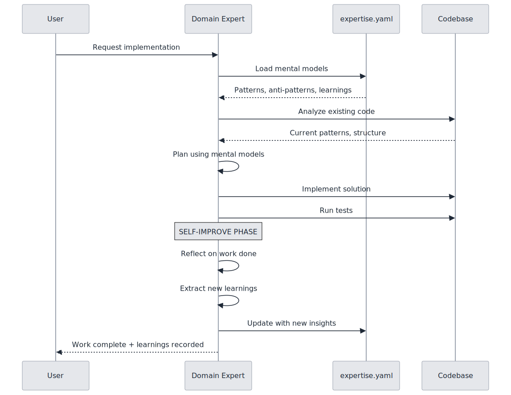

# Agent Expert System Architecture

**Research**: See [Agent Experts Research](../10-research/20251216-agent-experts-self-improving-agents.md)

The Agent Expert System enables self-improving AI agents that learn from their work and accumulate domain expertise over time.

---

## Overview


---

## Three-Step Workflow

Every Agent Expert follows the same workflow pattern:




---

## Expertise File Structure

Each domain expert has a dedicated directory with mental models and workflows:




### expertise.yaml Schema

```yaml
domain: database
description: Database and data layer specialist

mental_models:
  - name: Schema Design Patterns
    description: Normalization, indexing, constraints
    key_files:
      - src/db/schema.ts
      - prisma/schema.prisma
    patterns:
      - Use UUID for primary keys
      - Add indexes on foreign keys
    anti_patterns:
      - N+1 queries
      - Missing indexes on frequently queried columns

learnings:
  - date: 2025-12-16
    context: Implemented user authentication tables
    insight: Always add soft-delete columns for audit trails
    files_involved:
      - prisma/migrations/001_users.sql
```

---

## Domain Expert Routing

The `/AgileFlow:babysit` command automatically routes requests to appropriate domain experts:




---

## Self-Improvement Protocol

After completing work, agents update their expertise files:




---

## Multi-Expert Orchestration

For complex cross-domain tasks, multiple experts can be deployed in parallel:




---

## State Diagram: Expert Lifecycle




---

## Integration Points




---

## Key Benefits

1. **Accumulated Knowledge**: Expertise files grow smarter over time
2. **Consistent Patterns**: Mental models enforce best practices
3. **Reduced Mistakes**: Anti-patterns prevent known issues
4. **Domain Specialization**: Each expert deeply understands their area
5. **Parallel Analysis**: Multi-expert mode for complex decisions

---

## Related Documentation

- [Multi-Expert Orchestration](./multi-expert-orchestration.md)
- [AgileFlow CLI Overview](./agileflow-cli-overview.md)
- [Research: Agent Experts](../10-research/20251216-agent-experts-self-improving-agents.md)
