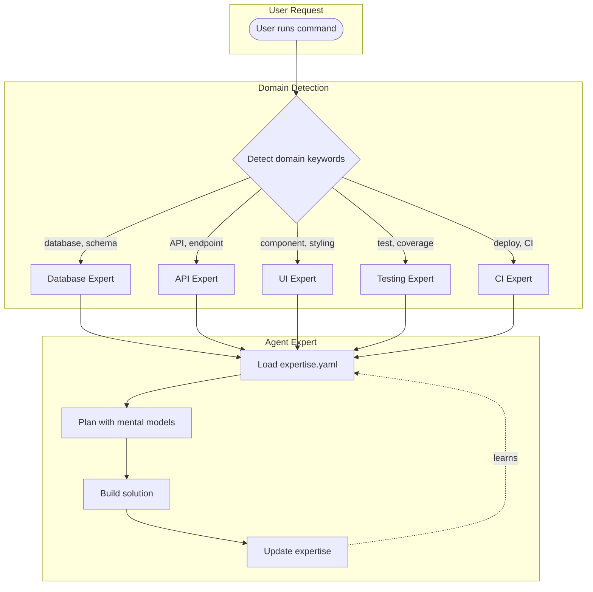
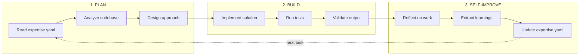
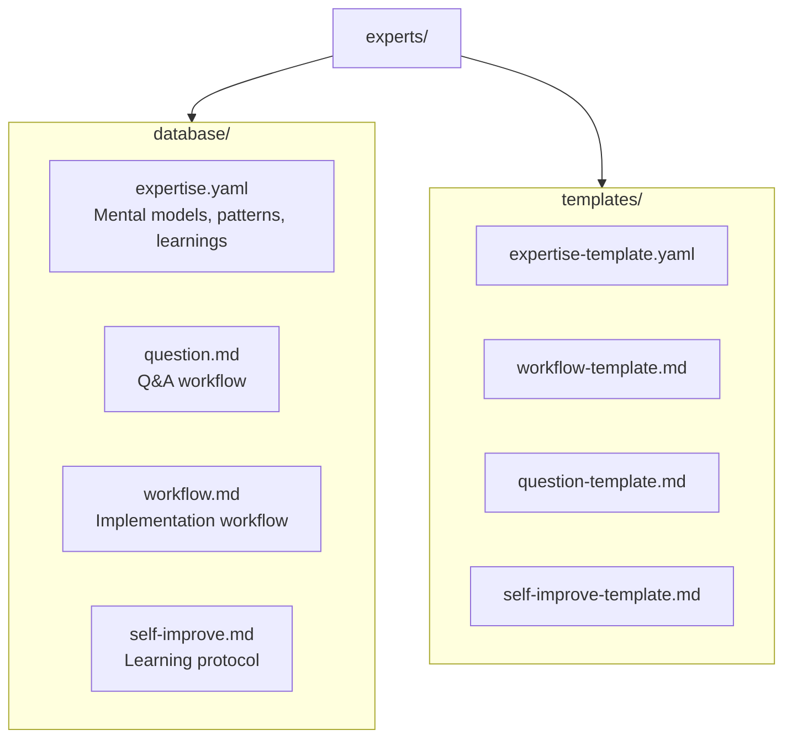
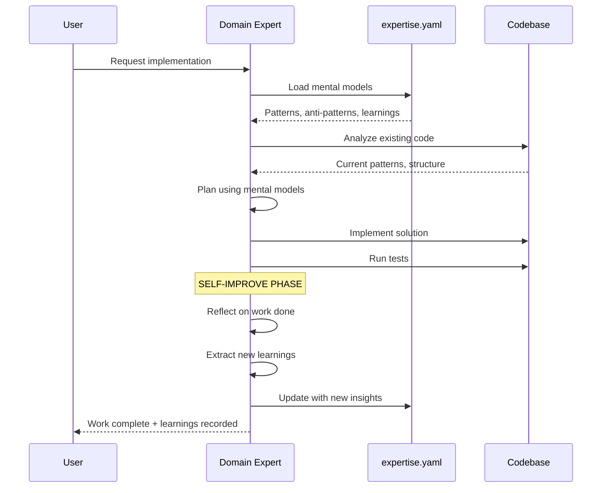
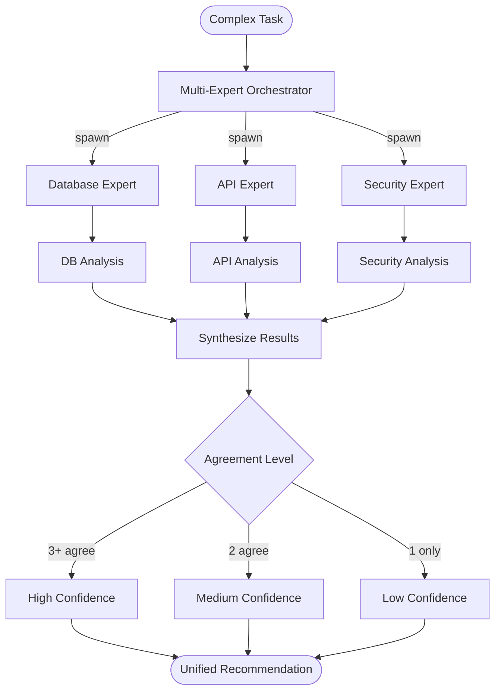
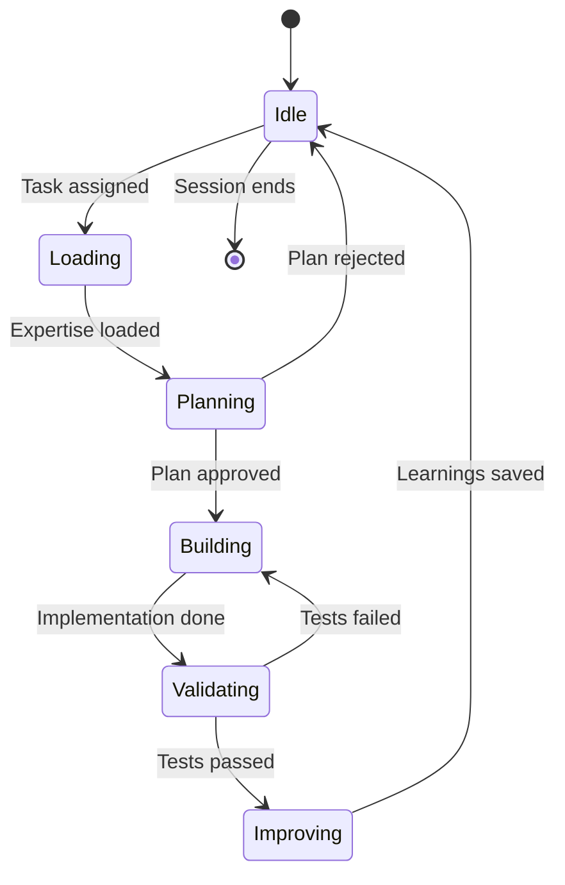

# Agent Expert System Architecture

**Research**: See [Agent Experts Research](../10-research/20251216-agent-experts-self-improving-agents.md)

The Agent Expert System enables self-improving AI agents that learn from their work and accumulate domain expertise over time.

---

## Overview



---

## Three-Step Workflow

Every Agent Expert follows the same workflow pattern:



---

## Expertise File Structure

Each domain expert has a dedicated directory with mental models and workflows:



### expertise.yaml Schema

```yaml
domain: database
description: Database and data layer specialist

mental_models:
  - name: Schema Design Patterns
    description: Normalization, indexing, constraints
    key_files:
      - src/db/schema.ts
      - prisma/schema.prisma
    patterns:
      - Use UUID for primary keys
      - Add indexes on foreign keys
    anti_patterns:
      - N+1 queries
      - Missing indexes on frequently queried columns

learnings:
  - date: 2025-12-16
    context: Implemented user authentication tables
    insight: Always add soft-delete columns for audit trails
    files_involved:
      - prisma/migrations/001_users.sql
```

---

## Domain Expert Routing

The `/AgileFlow:babysit` command automatically routes requests to appropriate domain experts:

```mermaid
flowchart TD
  accTitle: Domain Expert Routing
  accDescr: Shows how user requests are routed to domain experts based on keywords

  user([User Request])

  user --> analyze{Analyze keywords}

  analyze -->|"database, SQL, schema,<br/>migration, query"| db[/AgileFlow:agents:database]
  analyze -->|"API, endpoint, REST,<br/>GraphQL, route"| api[/AgileFlow:agents:api]
  analyze -->|"component, styling,<br/>CSS, theme, UI"| ui[/AgileFlow:agents:ui]
  analyze -->|"test, spec, coverage,<br/>mock, fixture"| test[/AgileFlow:agents:testing]
  analyze -->|"CI, pipeline, deploy,<br/>workflow, action"| ci[/AgileFlow:agents:ci]
  analyze -->|"security, auth, OWASP,<br/>vulnerability"| sec[/AgileFlow:agents:security]
  analyze -->|"performance, optimize,<br/>profile, cache"| perf[/AgileFlow:agents:performance]

  db & api & ui & test & ci & sec & perf --> expert[Expert executes with expertise.yaml]
```

---

## Self-Improvement Protocol

After completing work, agents update their expertise files:



---

## Multi-Expert Orchestration

For complex cross-domain tasks, multiple experts can be deployed in parallel:



---

## State Diagram: Expert Lifecycle



---

## Integration Points

```mermaid
flowchart LR
  accTitle: Agent Expert Integration Points
  accDescr: Shows how the expert system integrates with other AgileFlow components

  subgraph Commands[Slash Commands]
    babysit[/babysit]
    multiexp[/multi-expert]
    validate[/validate-expertise]
  end

  subgraph Experts[Expert System]
    routing[Domain Routing]
    expertise[Expertise Files]
    learning[Self-Improvement]
  end

  subgraph Agents[Specialized Agents]
    db[database]
    api[api]
    ui[ui]
    more[...25 domains]
  end

  babysit --> routing
  multiexp --> routing
  validate --> expertise

  routing --> Agents
  Agents --> expertise
  Agents --> learning
  learning --> expertise
```

---

## Key Benefits

1. **Accumulated Knowledge**: Expertise files grow smarter over time
2. **Consistent Patterns**: Mental models enforce best practices
3. **Reduced Mistakes**: Anti-patterns prevent known issues
4. **Domain Specialization**: Each expert deeply understands their area
5. **Parallel Analysis**: Multi-expert mode for complex decisions

---

## Related Documentation

- [Multi-Expert Orchestration](./multi-expert-orchestration.md)
- [AgileFlow CLI Overview](./agileflow-cli-overview.md)
- [Research: Agent Experts](../10-research/20251216-agent-experts-self-improving-agents.md)
