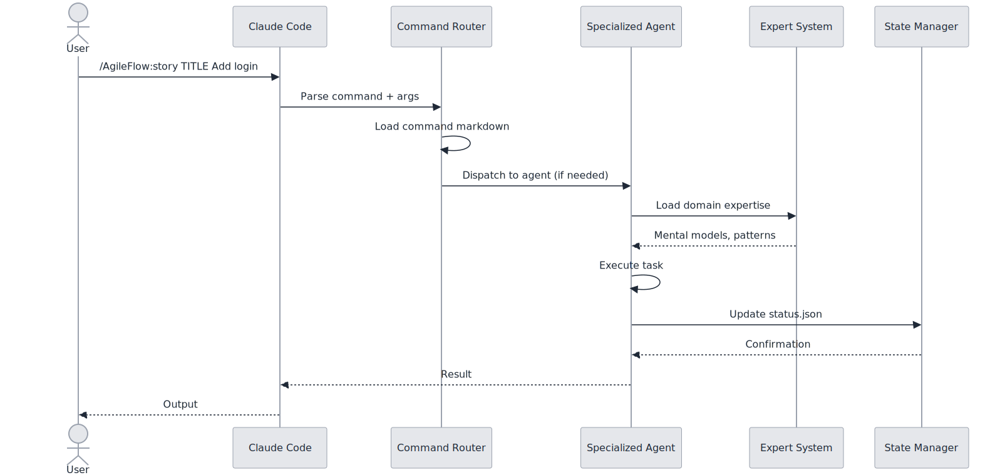
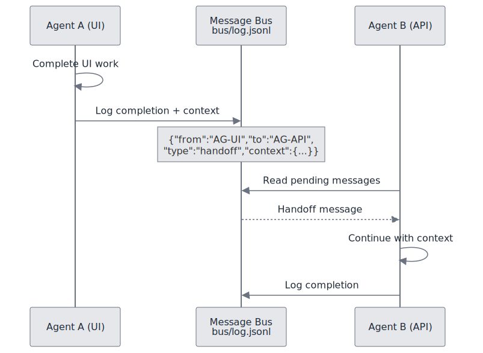

# AgileFlow CLI Architecture Overview

AgileFlow is an agile workflow system for Claude Code that provides slash commands, specialized agents, and self-improving experts.

---

## System Architecture

---

## Installation Structure

When you run `npx agileflow setup`, this structure is created:

---

## Command Flow

---

## Component Layers

---

## Data Flow

---

## State Management

---

## Agent Communication

---

## Key Directories

| Directory | Purpose |
|-----------|---------|
| `.agileflow/` | Core installation (commands, agents, experts) |
| `.agileflow/experts/` | Domain expertise files (25 domains) |
| `.claude/commands/AgileFlow/` | Slash command definitions |
| `docs/02-practices/` | Development practices |
| `docs/03-decisions/` | Architecture Decision Records |
| `docs/04-architecture/` | System architecture docs |
| `docs/10-research/` | Research notes |

---

## Integration with Claude Code

---

## Related Documentation

- [Agent Expert System](./agent-expert-system.md)
- [Multi-Expert Orchestration](./multi-expert-orchestration.md)
- [Command & Agent Flow](./command-agent-flow.md)
- [Monorepo Setup](./monorepo-setup.md)
