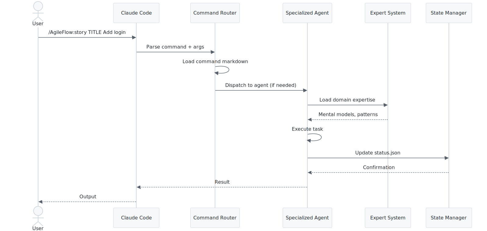
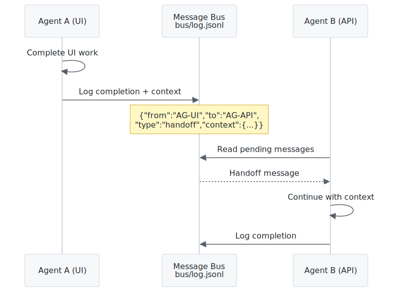

# AgileFlow CLI Architecture Overview

AgileFlow is an agile workflow system for Claude Code that provides slash commands, specialized agents, and self-improving experts.

---

## System Architecture

<picture>
  <source media="(prefers-color-scheme: dark)" srcset="images/agileflow-cli-overview-1.dark.svg">
  
</picture>

> High-level view of AgileFlow components: CLI interface, slash commands, agents, experts, and storage layers.

---

## Installation Structure

When you run `npx agileflow setup`, this structure is created:

<picture>
  <source media="(prefers-color-scheme: dark)" srcset="images/agileflow-cli-overview-2.dark.svg">
  
</picture>

> Directory structure created by setup: .agileflow/ for core files, .claude/commands/ for slash commands, and docs/ for project documentation.

---

## Command Flow

<picture>
  <source media="(prefers-color-scheme: dark)" srcset="images/agileflow-cli-overview-3.dark.svg">
  
</picture>

> How slash commands are processed: from user input through command parser to agent router to expert system and finally output.

---

## Component Layers

<picture>
  <source media="(prefers-color-scheme: dark)" srcset="images/agileflow-cli-overview-4.dark.svg">
  
</picture>

> Five-layer architecture: Presentation (commands/CLI), Orchestration (babysit/multi-expert), Agent (25 domain experts), Expert (mental models), Storage (JSON state).

---

## Data Flow

<picture>
  <source media="(prefers-color-scheme: dark)" srcset="images/agileflow-cli-overview-5.dark.svg">
  
</picture>

> Request/response flow through the system including state updates to status.json and bus/log.jsonl.

---

## State Management

<picture>
  <source media="(prefers-color-scheme: dark)" srcset="images/agileflow-cli-overview-6.dark.svg">
  
</picture>

> How AgileFlow tracks state: status.json for story status, bus/log.jsonl for agent messages, expertise.yaml for domain knowledge.

---

## Agent Communication

<picture>
  <source media="(prefers-color-scheme: dark)" srcset="images/agileflow-cli-overview-7.dark.svg">
  
</picture>

> Message bus pattern for agent coordination: agents read/write to bus/log.jsonl for async communication.

---

## Key Directories

| Directory | Purpose |
|-----------|---------|
| `.agileflow/` | Core installation (commands, agents, experts) |
| `.agileflow/experts/` | Domain expertise files (25 domains) |
| `.claude/commands/agileflow/` | Slash command definitions |
| `docs/02-practices/` | Development practices |
| `docs/03-decisions/` | Architecture Decision Records |
| `docs/04-architecture/` | System architecture docs |
| `docs/10-research/` | Research notes |

---

## Integration with Claude Code

<picture>
  <source media="(prefers-color-scheme: dark)" srcset="images/agileflow-cli-overview-8.dark.svg">
  
</picture>

> How AgileFlow integrates with Claude Code: slash commands exposed in .claude/commands/, skills auto-loaded, agents spawned via Task tool.

---

## Related Documentation

- [Agent Expert System](./agent-expert-system.md)
- [Multi-Expert Orchestration](./multi-expert-orchestration.md)
- [Command & Agent Flow](./command-agent-flow.md)
- [Monorepo Setup](./monorepo-setup.md)
