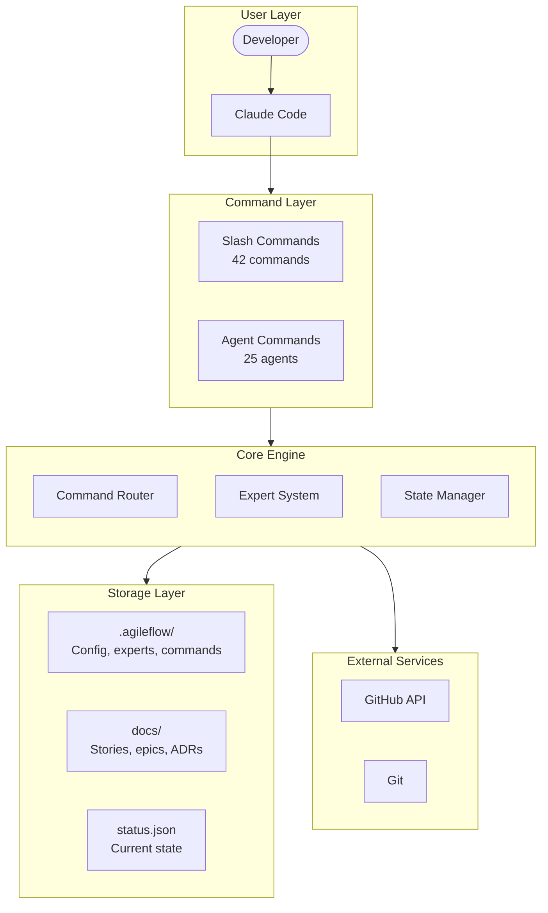
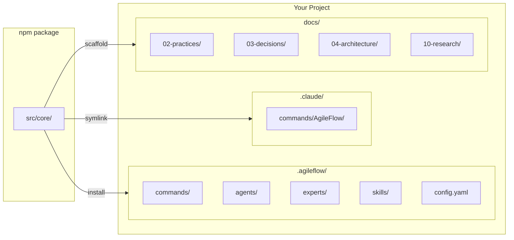
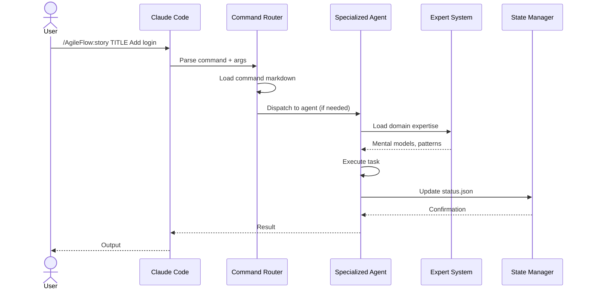
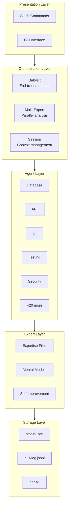
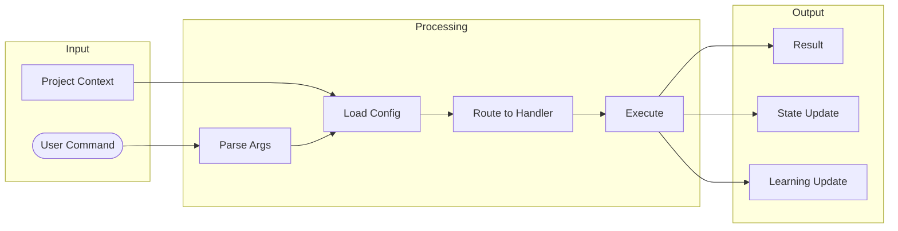
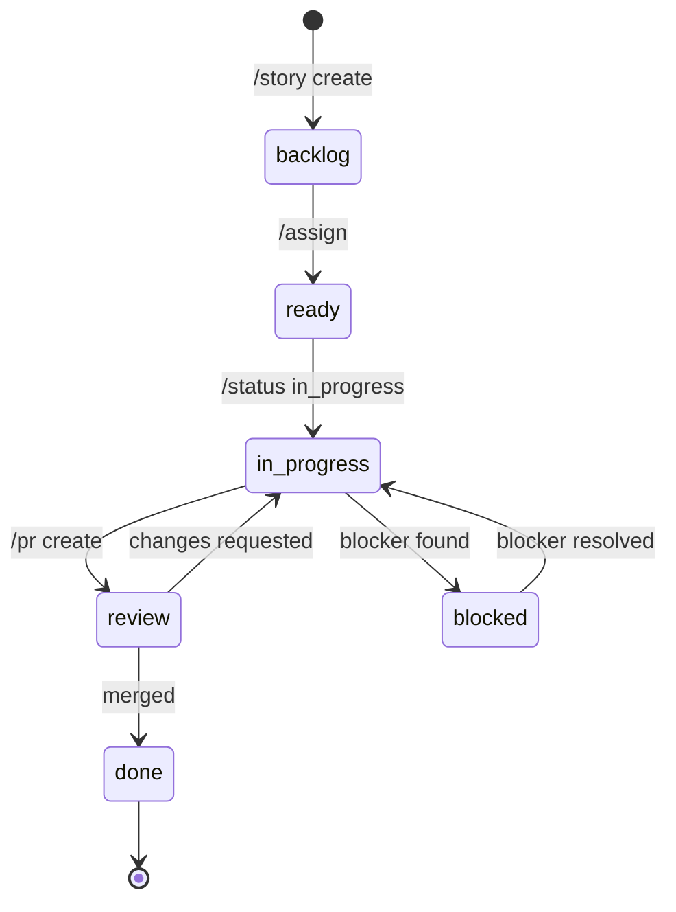
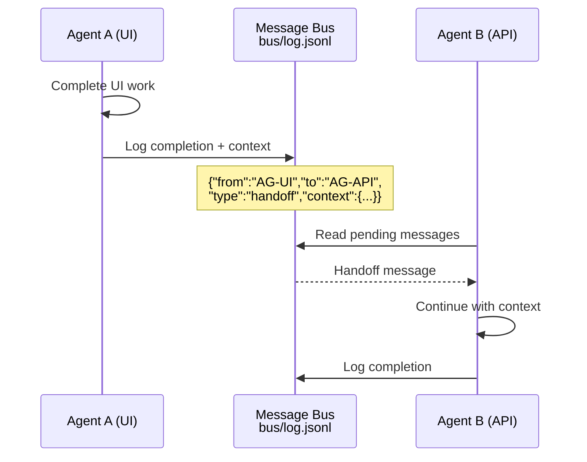

# AgileFlow CLI Architecture Overview

AgileFlow is an agile workflow system for Claude Code that provides slash commands, specialized agents, and self-improving experts.

---

## System Architecture



---

## Installation Structure

When you run `npx agileflow setup`, this structure is created:



---

## Command Flow



---

## Component Layers



---

## Data Flow



---

## State Management



---

## Agent Communication



---

## Key Directories

| Directory | Purpose |
|-----------|---------|
| `.agileflow/` | Core installation (commands, agents, experts) |
| `.agileflow/experts/` | Domain expertise files (25 domains) |
| `.claude/commands/AgileFlow/` | Slash command definitions |
| `docs/02-practices/` | Development practices |
| `docs/03-decisions/` | Architecture Decision Records |
| `docs/04-architecture/` | System architecture docs |
| `docs/10-research/` | Research notes |

---

## Integration with Claude Code

```mermaid
flowchart LR
  accTitle: Claude Code Integration
  accDescr: Shows how AgileFlow integrates with Claude Code

  subgraph CC[Claude Code]
    tools[Tool Use]
    context[Context Window]
    commands[/slash commands]
  end

  subgraph AF[AgileFlow]
    handlers[Command Handlers]
    agents[Agents]
    experts[Experts]
  end

  subgraph Project[Project]
    code[Source Code]
    docs[Documentation]
    state[State Files]
  end

  commands --> handlers
  handlers --> agents
  agents --> experts
  agents --> tools
  tools --> code
  tools --> docs
  tools --> state
  context --> experts
```

---

## Related Documentation

- [Agent Expert System](./agent-expert-system.md)
- [Multi-Expert Orchestration](./multi-expert-orchestration.md)
- [Command & Agent Flow](./command-agent-flow.md)
- [Monorepo Setup](./monorepo-setup.md)
