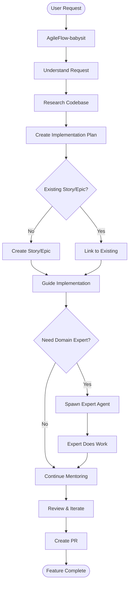
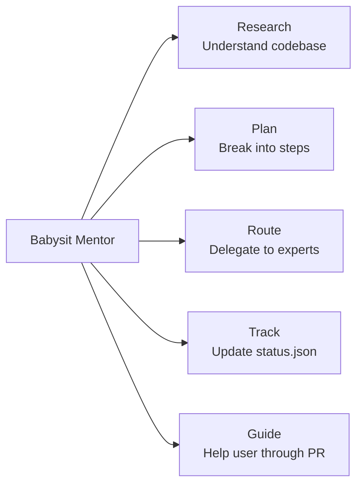
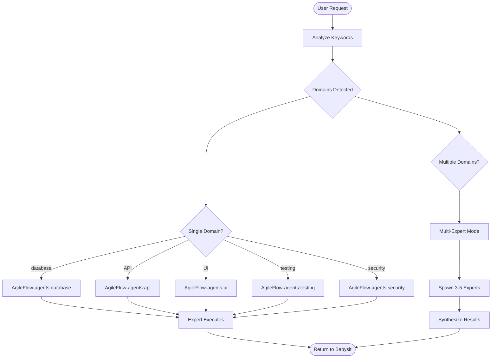
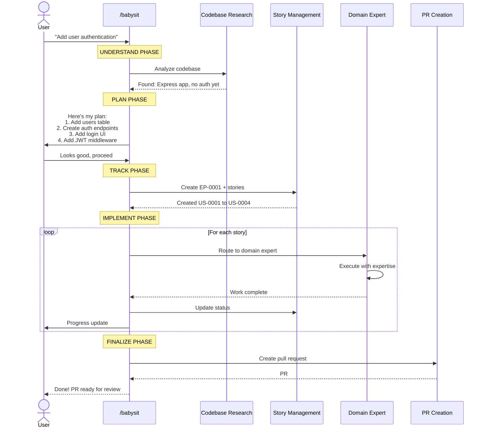
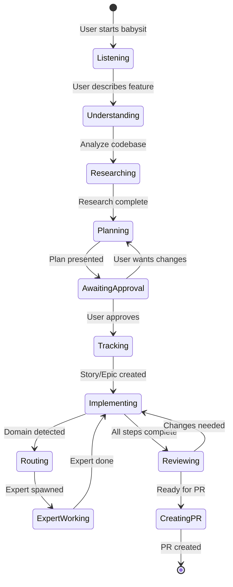
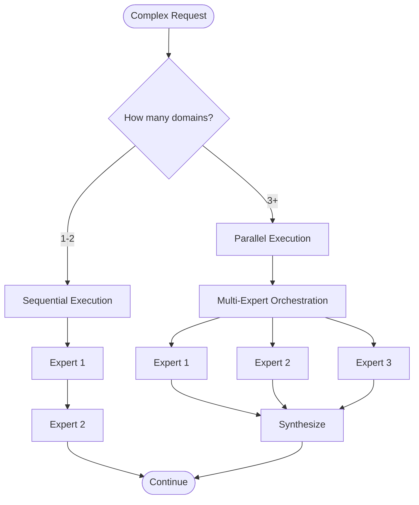

# Babysit Mentor System Architecture

The `/AgileFlow:babysit` command is an end-to-end implementation mentor that guides users through feature development from idea to PR.

---

## Overview



---

## Core Responsibilities



---

## Domain Expert Routing

Babysit automatically detects domains from user requests and spawns appropriate experts:



### Domain Keyword Map

| Keywords | Domain Expert |
|----------|---------------|
| database, schema, SQL, migration, query | database |
| API, endpoint, REST, GraphQL, route | api |
| component, styling, CSS, theme, layout | ui |
| test, spec, coverage, mock, fixture | testing |
| auth, security, OWASP, vulnerability | security |
| CI, pipeline, deploy, workflow | ci |
| performance, optimize, cache, profile | performance |
| docs, README, guide, tutorial | documentation |

---

## Workflow Sequence



---

## State Management



---

## Multi-Domain Handling

When a request spans multiple domains, babysit can either:
1. **Sequential**: Route to experts one at a time
2. **Parallel**: Use multi-expert orchestration



---

## Integration Points

```mermaid
flowchart LR
  accTitle: Babysit Integration Points
  accDescr: How babysit integrates with other AgileFlow components

  babysit[/babysit]

  babysit --> story[/story<br/>Create stories]
  babysit --> epic[/epic<br/>Create epics]
  babysit --> status[/status<br/>Update progress]
  babysit --> agents[Domain Agents<br/>Delegate work]
  babysit --> multiexp[/multi-expert<br/>Complex analysis]
  babysit --> pr[/pr<br/>Create PR]
  babysit --> verify[/verify<br/>Run tests]
```

---

## When to Use Babysit

```mermaid
flowchart TD
  accTitle: When to Use Babysit
  accDescr: Decision tree for when babysit is appropriate

  start{What do you need?}

  start -->|End-to-end feature| babysit[Use /babysit]
  start -->|Single domain task| agent[Use specific agent]
  start -->|Quick question| direct[Ask directly]
  start -->|Complex analysis| multi[Use /multi-expert]

  babysit --> examples1["Add user authentication"<br/>"Implement payment system"<br/>"Build notification feature"]

  agent --> examples2["Fix database query"<br/>"Add API endpoint"<br/>"Style a component"]
```

**Use babysit for:**
- Features that span multiple domains
- When you want guided, step-by-step implementation
- When you need story/epic tracking
- When you want a PR at the end

**Don't use babysit for:**
- Quick single-domain tasks (use specific agent)
- Pure research/analysis (use /multi-expert)
- Simple questions (ask directly)

---

## Example Session

```
User: /AgileFlow:babysit I want to add a dark mode toggle

Babysit: I'll help you implement dark mode. Let me research your codebase...

Found:
- React app with Tailwind CSS
- No existing theme system
- Components in src/components/

Here's my implementation plan:
1. Add theme context (React Context API)
2. Create theme toggle component
3. Update Tailwind config for dark variants
4. Apply dark classes to existing components

This will need:
- US-0001: Theme context and provider
- US-0002: Theme toggle component
- US-0003: Tailwind dark mode config
- US-0004: Apply to existing components

Shall I proceed? (YES to continue, or suggest changes)

User: YES

Babysit: Creating epic EP-0010 "Dark Mode Support"...
Creating stories US-0051 through US-0054...

Starting with US-0051: Theme Context
[Routes to UI Expert]

UI Expert: Created src/contexts/ThemeContext.tsx with:
- ThemeProvider component
- useTheme hook
- localStorage persistence

Babysit: US-0051 complete. Moving to US-0052...

[Continues through all stories]

Babysit: All stories complete! Creating PR...

PR #45 created: "feat: Add dark mode toggle"
- 4 commits
- 8 files changed
- Tests passing

Ready for review!
```

---

## Related Documentation

- [Agent Expert System](./agent-expert-system.md)
- [Multi-Expert Orchestration](./multi-expert-orchestration.md)
- [Command & Agent Flow](./command-agent-flow.md)
