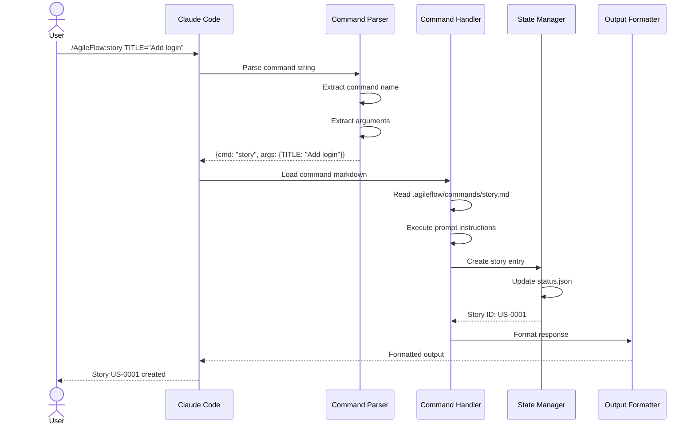
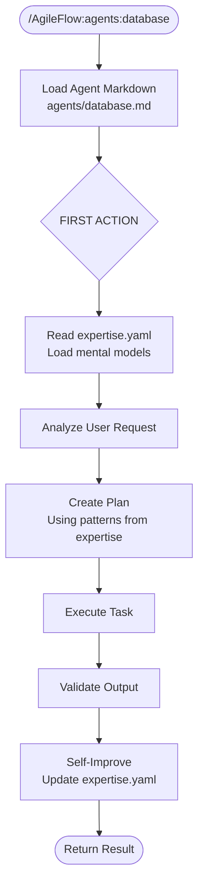
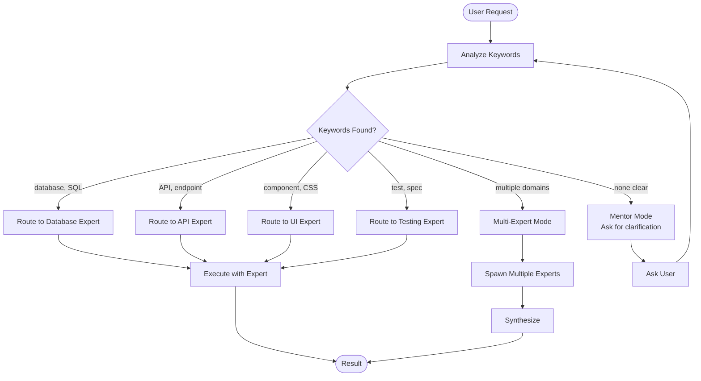
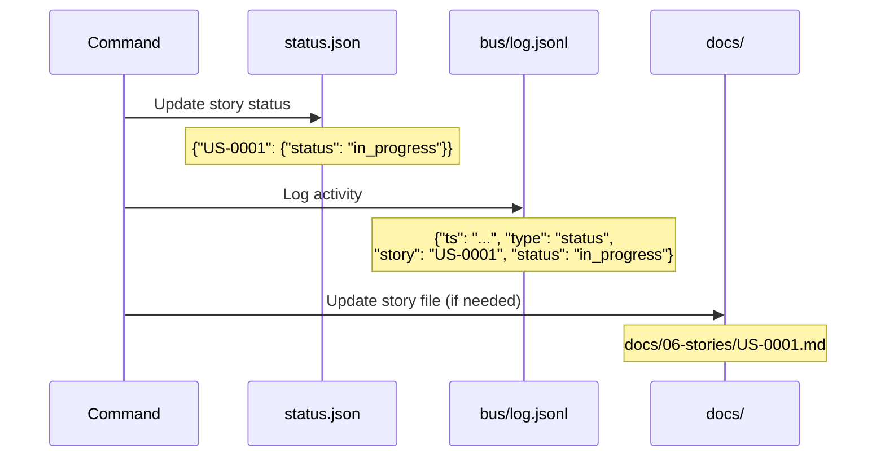
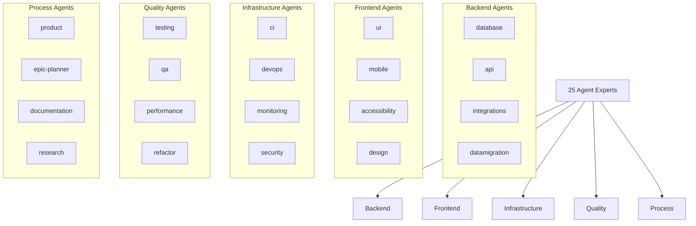
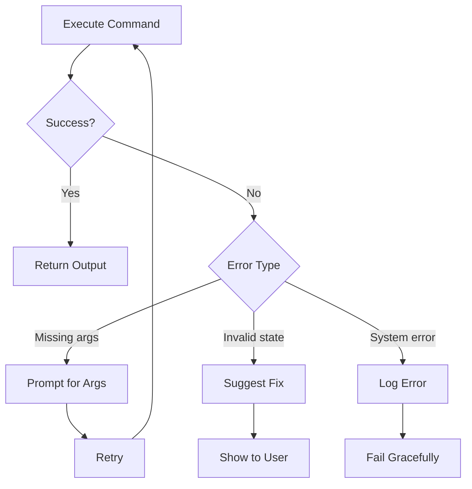

# Command & Agent Flow Architecture

This document describes how slash commands and agents work together in AgileFlow.

---

## Command Types

```mermaid
flowchart TD
  accTitle: AgileFlow Command Types
  accDescr: Shows the different types of commands and their purposes

  commands[AgileFlow Commands]

  commands --> workflow[Workflow Commands]
  commands --> tracking[Tracking Commands]
  commands --> agents[Agent Commands]
  commands --> utility[Utility Commands]

  subgraph Workflow[Workflow]
    babysit[/babysit<br/>End-to-end mentor]
    sprint[/sprint<br/>Sprint planning]
    retro[/retro<br/>Retrospective]
  end

  subgraph Tracking[Tracking]
    story[/story<br/>Create story]
    epic[/epic<br/>Create epic]
    status[/status<br/>Update status]
    board[/board<br/>Kanban view]
  end

  subgraph Agents[Agents]
    db[/agents:database]
    api[/agents:api]
    ui[/agents:ui]
    more[+22 more]
  end

  subgraph Utility[Utility]
    context[/context<br/>Export context]
    validate[/validate-expertise]
    multiexp[/multi-expert]
  end

  workflow --> Workflow
  tracking --> Tracking
  agents --> Agents
  utility --> Utility
```

---

## Command Execution Flow



---

## Agent Execution Pattern



---

## Agent vs Command Relationship

```mermaid
flowchart LR
  accTitle: Agent vs Command Relationship
  accDescr: Shows how commands can invoke agents

  subgraph Commands[Commands]
    story[/story]
    babysit[/babysit]
    multiexp[/multi-expert]
  end

  subgraph Agents[Agents]
    db[database]
    api[api]
    ui[ui]
    epic[epic-planner]
  end

  story -.->|"may invoke"| epic
  babysit -->|"routes to"| db & api & ui
  multiexp -->|"spawns multiple"| db & api & ui
```

**Key distinction:**
- **Commands**: User-facing actions (create story, view board, run sprint)
- **Agents**: Specialized workers with domain expertise (database, api, security)

---

## Babysit Routing Logic



---

## State Updates



---

## Command Categories

### Tracking Commands

```mermaid
flowchart LR
  accTitle: Tracking Commands
  accDescr: Commands for project tracking

  subgraph Create[Create]
    story[/story]
    epic[/epic]
    adr[/adr]
  end

  subgraph Update[Update]
    status[/status]
    assign[/assign]
    blockers[/blockers]
  end

  subgraph View[View]
    board[/board]
    deps[/deps]
    metrics[/metrics]
  end

  Create --> status.json
  Update --> status.json
  View --> status.json
```

### Workflow Commands

```mermaid
flowchart LR
  accTitle: Workflow Commands
  accDescr: Commands for agile workflow

  sprint[/sprint] --> plan[Sprint Planning]
  retro[/retro] --> review[Retrospective]
  velocity[/velocity] --> track[Velocity Tracking]
  update[/update] --> report[Stakeholder Update]
```

### Session Commands

```mermaid
flowchart LR
  accTitle: Session Commands
  accDescr: Commands for session management

  init[/session:init] --> start[Start Session]
  resume[/session:resume] --> continue[Resume Work]
  status[/session:status] --> check[Check State]
  end_[/session:end] --> close[Close Session]
```

---

## Agent Specialization Map



---

## Error Handling



---

## Related Documentation

- [AgileFlow CLI Overview](./agileflow-cli-overview.md)
- [Agent Expert System](./agent-expert-system.md)
- [Multi-Expert Orchestration](./multi-expert-orchestration.md)
