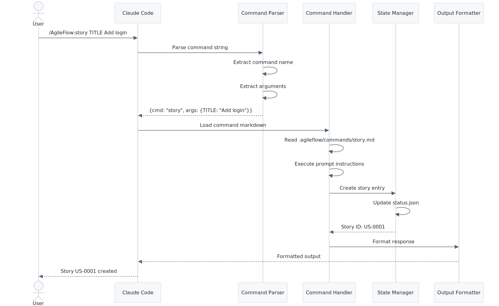

# Command & Agent Flow Architecture

This document describes how slash commands and agents work together in AgileFlow.

---

## Command Types

<picture>
  <source media="(prefers-color-scheme: dark)" srcset="images/command-agent-flow-1.dark.svg">
  
</picture>

> Three command types: tracking commands (story, epic, board), workflow commands (sprint, review, pr), and session commands (resume, baseline, verify).

---

## Command Execution Flow

<picture>
  <source media="(prefers-color-scheme: dark)" srcset="images/command-agent-flow-2.dark.svg">
  
</picture>

> Command execution flow: user invokes command → parser extracts parameters → router determines handler → handler executes → response returned.

---

## Agent Execution Pattern

<picture>
  <source media="(prefers-color-scheme: dark)" srcset="images/command-agent-flow-3.dark.svg">
  
</picture>

> Agent execution pattern: load expertise file → validate against mental models → execute task → self-improve by updating expertise.

---

## Agent vs Command Relationship

<picture>
  <source media="(prefers-color-scheme: dark)" srcset="images/command-agent-flow-4.dark.svg">
  
</picture>

> Relationship diagram: commands are user-facing actions that may spawn agents; agents are specialized workers with domain expertise that can be invoked by commands.

**Key distinction:**
- **Commands**: User-facing actions (create story, view board, run sprint)
- **Agents**: Specialized workers with domain expertise (database, api, security)

---

## Babysit Routing Logic

<picture>
  <source media="(prefers-color-scheme: dark)" srcset="images/command-agent-flow-5.dark.svg">
  
</picture>

> Babysit routing logic: analyzes user request keywords, maps to appropriate domain expert(s), spawns expert with context, collects results.

---

## State Updates

<picture>
  <source media="(prefers-color-scheme: dark)" srcset="images/command-agent-flow-6.dark.svg">
  
</picture>

> State update flow: commands and agents update status.json with story progress, write to bus/log.jsonl for inter-agent communication.

---

## Command Categories

### Tracking Commands

<picture>
  <source media="(prefers-color-scheme: dark)" srcset="images/command-agent-flow-7.dark.svg">
  
</picture>

> Tracking commands: story, epic, board, status, assign, blockers - manage work items and visualize progress.

### Workflow Commands

<picture>
  <source media="(prefers-color-scheme: dark)" srcset="images/command-agent-flow-8.dark.svg">
  
</picture>

> Workflow commands: sprint, review, pr, deploy, changelog - manage development lifecycle from planning to release.

### Session Commands

<picture>
  <source media="(prefers-color-scheme: dark)" srcset="images/command-agent-flow-9.dark.svg">
  
</picture>

> Session commands: resume, baseline, verify, session-init - manage session state, checkpoints, and test verification.

---

## Agent Specialization Map

<picture>
  <source media="(prefers-color-scheme: dark)" srcset="images/command-agent-flow-10.dark.svg">
  
</picture>

> Agent specialization map: 25 domain experts grouped by focus area (data layer, presentation, infrastructure, quality, planning).

---

## Error Handling

<picture>
  <source media="(prefers-color-scheme: dark)" srcset="images/command-agent-flow-11.dark.svg">
  
</picture>

> Error handling flow: detect error → classify type → apply recovery strategy → log to bus → notify user if unrecoverable.

---

## Related Documentation

- [AgileFlow CLI Overview](./agileflow-cli-overview.md)
- [Agent Expert System](./agent-expert-system.md)
- [Multi-Expert Orchestration](./multi-expert-orchestration.md)
