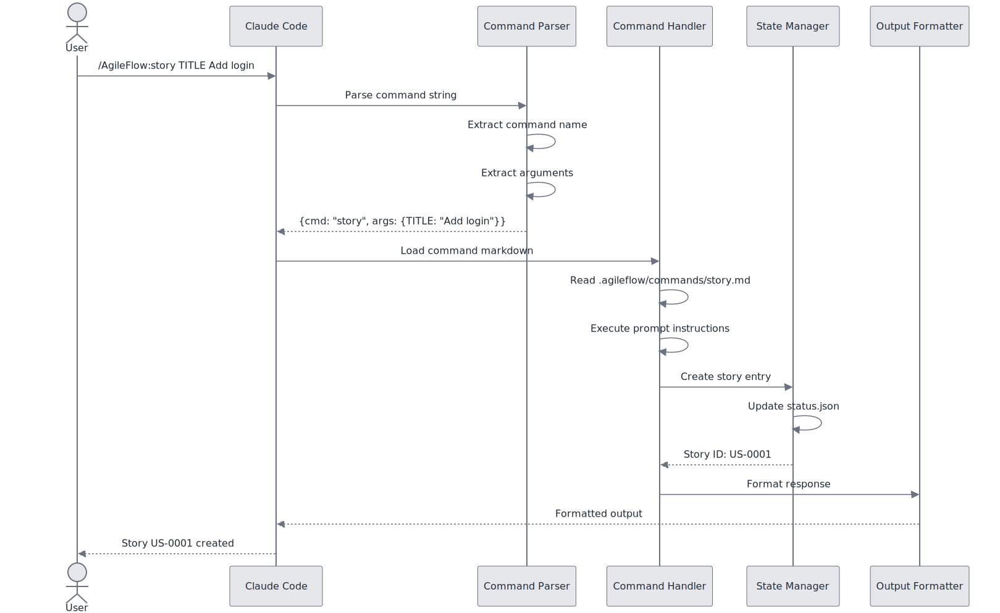
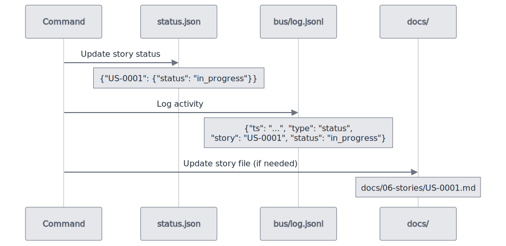

# Command & Agent Flow Architecture

This document describes how slash commands and agents work together in AgileFlow.

---

## Command Types

---

## Command Execution Flow

---

## Agent Execution Pattern

---

## Agent vs Command Relationship

**Key distinction:**
- **Commands**: User-facing actions (create story, view board, run sprint)
- **Agents**: Specialized workers with domain expertise (database, api, security)

---

## Babysit Routing Logic

---

## State Updates

---

## Command Categories

### Tracking Commands

### Workflow Commands

### Session Commands

---

## Agent Specialization Map

---

## Error Handling

---

## Related Documentation

- [AgileFlow CLI Overview](./agileflow-cli-overview.md)
- [Agent Expert System](./agent-expert-system.md)
- [Multi-Expert Orchestration](./multi-expert-orchestration.md)
