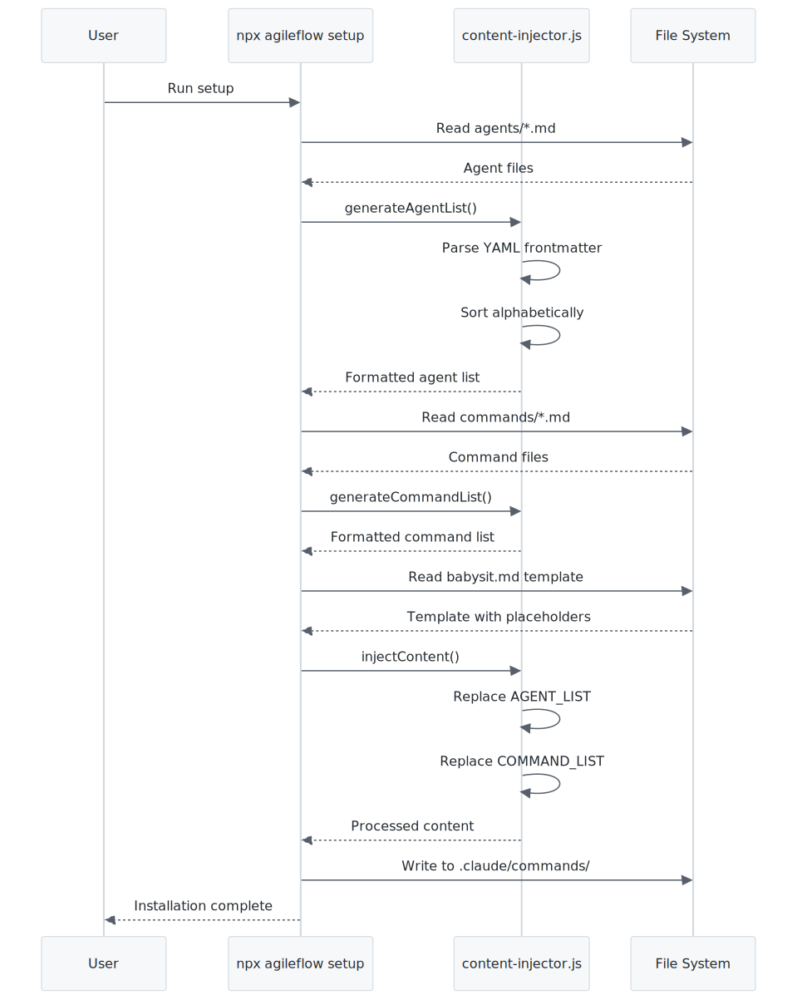

# Dynamic Content Injection System

## Overview

The Dynamic Content Injection system automatically generates and injects up-to-date lists of commands and agents into command files during installation. This eliminates manual maintenance - when you add a new command or agent, it automatically appears in babysit.md and other files that use placeholders.

## Architecture Diagram

<picture>
  <source media="(prefers-color-scheme: dark)" srcset="images/dynamic-content-injection-1.dark.svg">
  
</picture>

> Dynamic content injection flow: Source files are scanned, frontmatter parsed, lists generated, and placeholders replaced during installation.

---

## Key Files

| File | Purpose |
|------|---------|
| `packages/cli/tools/cli/lib/content-injector.js` | Core injection logic |
| `packages/cli/src/core/commands/babysit.md` | Main template with both placeholders |
| `packages/cli/src/core/agents/*.md` | Agent definitions with YAML frontmatter |
| `packages/cli/src/core/commands/*.md` | Command definitions with YAML frontmatter |

---

## How It Works

### 1. Placeholder Syntax

Templates use HTML comment placeholders that get replaced:

```markdown
## Available Commands

<!-- {{COMMAND_LIST}} -->

## Available Agents

<!-- {{AGENT_LIST}} -->
```

### 2. Agent Frontmatter Schema

Each agent file must have YAML frontmatter:

```yaml
---
name: database
description: Database schema design and query optimization
tools:
  - Read
  - Write
  - Bash
  - Grep
model: haiku
---
```

**Required fields:**
- `name` - Agent identifier (used in `subagent_type: "AgileFlow:name"`)
- `description` - What the agent does

**Optional fields:**
- `tools` - Array of allowed tools (defaults to empty)
- `model` - AI model to use (defaults to "haiku")

### 3. Command Frontmatter Schema

Each command file must have YAML frontmatter:

```yaml
---
description: Create a new user story with acceptance criteria
argument-hint: EPIC=<EP-ID> STORY=<US-ID> TITLE=<text>
---
```

**Required fields:**
- `description` - One-line description of the command

**Optional fields:**
- `argument-hint` - Usage hint shown after command name

### 4. Generated Output Format

**Agent List Output:**
```markdown
**AVAILABLE AGENTS (26 total)**:

1. **api** (model: haiku)
   - **Purpose**: Backend API development and endpoint design
   - **Tools**: Read, Write, Bash, Grep
   - **Usage**: `subagent_type: "AgileFlow:api"`

2. **database** (model: haiku)
   - **Purpose**: Database schema design and query optimization
   ...
```

**Command List Output:**
```markdown
Available commands (42 total):
- `/agileflow:babysit` - Interactive mentor for feature implementation
- `/agileflow:board` - Display visual kanban board with WIP limits
- `/agileflow:configure` - Configure AgileFlow features
...
```

---

## Injection Process

<picture>
  <source media="(prefers-color-scheme: dark)" srcset="images/dynamic-content-injection-2.dark.svg">
  
</picture>

> Sequence diagram showing the full injection process during `npx agileflow setup`.

---

## Adding New Commands/Agents

### Adding a New Command

1. Create file: `packages/cli/src/core/commands/my-command.md`
2. Add frontmatter:
   ```yaml
   ---
   description: What this command does
   argument-hint: [OPTIONAL_ARGS]
   ---
   ```
3. Add command content below frontmatter
4. Next `npx agileflow setup` will include it automatically

### Adding a New Agent

1. Create file: `packages/cli/src/core/agents/my-agent.md`
2. Add frontmatter:
   ```yaml
   ---
   name: my-agent
   description: What this agent specializes in
   tools:
     - Read
     - Write
     - Bash
   model: haiku
   ---
   ```
3. Add agent prompt content below frontmatter
4. Next `npx agileflow setup` will include it automatically

---

## Benefits

1. **Zero Maintenance** - No manual list updates when adding commands/agents
2. **Always Current** - Users always get the latest list
3. **Single Source of Truth** - Frontmatter is the authoritative source
4. **Consistent Formatting** - Generated lists have uniform structure
5. **Sorted Output** - Lists are alphabetically sorted for easy scanning

---

## Error Handling

- Files without valid YAML frontmatter are silently skipped
- Missing optional fields use sensible defaults
- Parse errors don't break installation (graceful degradation)

---

## Related Documentation

- [CLAUDE.md](../../CLAUDE.md) - Mentions dynamic content injection in Key Principles
- [Adding Commands](../../CLAUDE.md#adding-a-new-command) - How to add new commands
- [Adding Agents](../../CLAUDE.md#adding-a-new-agent) - How to add new agents
