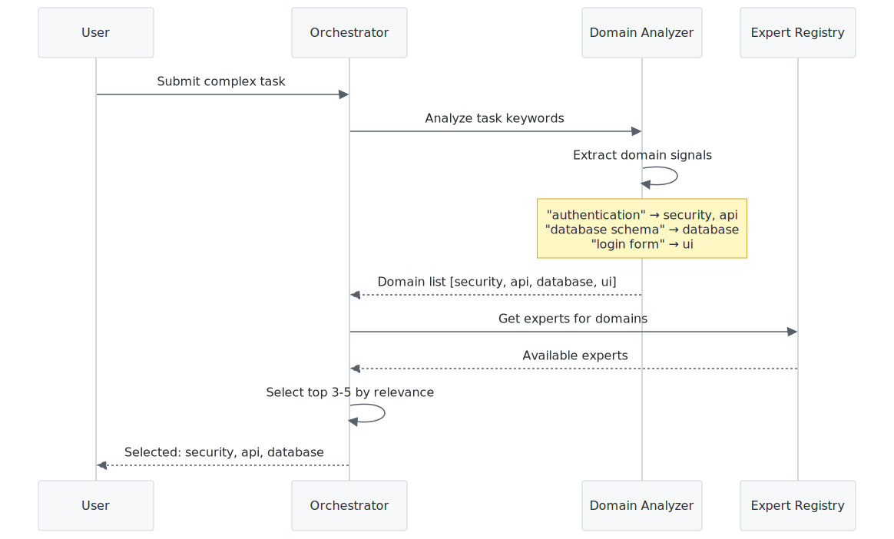
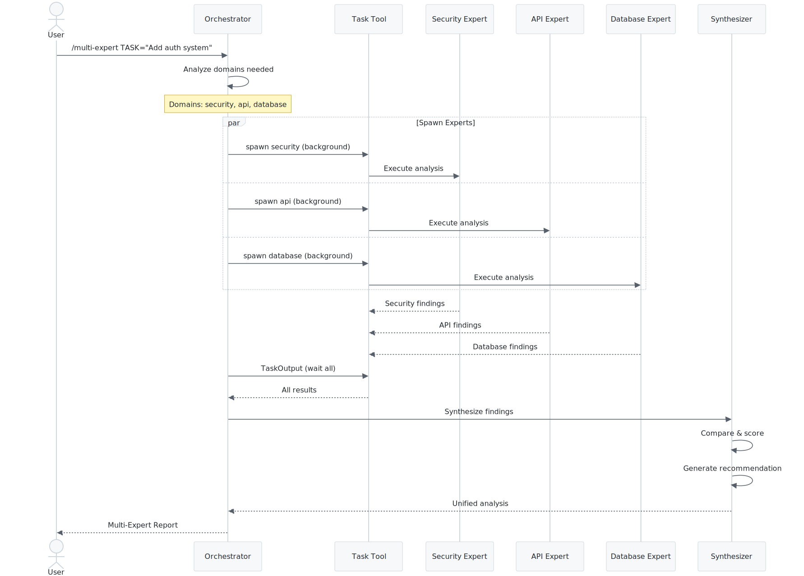

# Multi-Expert Orchestration Architecture

Multi-Expert Orchestration deploys multiple domain experts in parallel to analyze complex, cross-domain problems and synthesize their findings into unified recommendations.

---

## Overview

<picture>
  <source media="(prefers-color-scheme: dark)" srcset="images/multi-expert-orchestration-1.dark.svg">
  
</picture>

> Multi-expert overview: orchestrator receives complex request, deploys multiple domain experts in parallel, synthesizes their analyses into unified recommendation.

---

## When to Use Multi-Expert

<picture>
  <source media="(prefers-color-scheme: dark)" srcset="images/multi-expert-orchestration-2.dark.svg">
  
</picture>

> Decision flowchart: use multi-expert when task spans 3+ domains, requires diverse perspectives, or needs validation from multiple angles.

**Use Multi-Expert when:**
- Task spans 3+ domains (e.g., "Add user authentication" touches DB, API, UI, Security)
- Making architectural decisions that affect multiple systems
- Need diverse perspectives on a complex problem
- Want to validate an approach from multiple angles

---

## Expert Selection Process

<picture>
  <source media="(prefers-color-scheme: dark)" srcset="images/multi-expert-orchestration-3.dark.svg">
  
</picture>

> Expert selection process: analyze request keywords → identify relevant domains → select 3-5 experts → load their expertise files → prepare prompts.

---

## Parallel Execution Pattern

<picture>
  <source media="(prefers-color-scheme: dark)" srcset="images/multi-expert-orchestration-4.dark.svg">
  
</picture>

> Parallel execution: all selected experts run simultaneously via Task tool with run_in_background, results collected via TaskOutput when complete.

---

## Synthesis Process

<picture>
  <source media="(prefers-color-scheme: dark)" srcset="images/multi-expert-orchestration-5.dark.svg">
  
</picture>

> Synthesis process: collect expert responses → identify agreements and disagreements → weight by domain relevance → generate unified recommendation.

---

## Confidence Scoring

<picture>
  <source media="(prefers-color-scheme: dark)" srcset="images/multi-expert-orchestration-6.dark.svg">
  
</picture>

> Confidence scoring: HIGH when 3+ experts agree, MEDIUM when 2 agree, LOW when all differ. Higher confidence enables auto-proceeding.

| Experts Agree | Confidence | Action |
|---------------|------------|--------|
| 3+ of 5 | HIGH | Proceed with recommendation |
| 2 of 5 | MEDIUM | Review disagreements |
| 1 each | LOW | Manual review required |

---

## Output Format

<picture>
  <source media="(prefers-color-scheme: dark)" srcset="images/multi-expert-orchestration-7.dark.svg">
  
</picture>

> Output format structure: header with experts deployed and confidence, key findings, unique insights per expert, areas of disagreement, unified recommendation, action items.

### Example Output

```markdown
## Multi-Expert Analysis: User Authentication System

**Experts Deployed**: security, api, database, ui
**Overall Confidence**: HIGH (3/4 agree on core approach)

### Key Findings (High Confidence)
- Use JWT tokens with 15-minute expiry
- Store refresh tokens in httpOnly cookies
- Add rate limiting on auth endpoints

### Unique Insights
- **Security**: Consider adding device fingerprinting
- **Database**: Use partial indexes on active sessions

### Areas of Disagreement
- Token storage: Security prefers cookies, UI prefers localStorage
- **Resolution**: Use httpOnly cookies (security wins for auth)

### Recommendation
Implement JWT-based auth with:
1. Access tokens (15min) in memory
2. Refresh tokens (7d) in httpOnly cookies
3. Rate limiting: 5 attempts/minute

### Action Items
- [ ] Create users table migration
- [ ] Implement /auth/login endpoint
- [ ] Add JWT middleware
- [ ] Build login form component
```

---

## Sequence: Full Orchestration

<picture>
  <source media="(prefers-color-scheme: dark)" srcset="images/multi-expert-orchestration-8.dark.svg">
  
</picture>

> Full orchestration sequence: user request → expert selection → parallel spawning → result collection → synthesis → confidence scoring → output generation.

---

## Expert Registry

Available experts for orchestration:

| Domain | Expert | Specialization |
|--------|--------|----------------|
| database | `/agileflow:agents:database` | Schema, queries, migrations |
| api | `/agileflow:agents:api` | Endpoints, REST, GraphQL |
| ui | `/agileflow:agents:ui` | Components, styling, UX |
| security | `/agileflow:agents:security` | Auth, OWASP, vulnerabilities |
| testing | `/agileflow:agents:testing` | Unit, integration, E2E |
| performance | `/agileflow:agents:performance` | Optimization, caching |
| devops | `/agileflow:agents:devops` | CI/CD, deployment |
| documentation | `/agileflow:agents:documentation` | API docs, guides |

---

## Related Documentation

- [Agent Expert System](./agent-expert-system.md)
- [AgileFlow CLI Overview](./agileflow-cli-overview.md)
- [Command: /multi-expert](../../.agileflow/commands/multi-expert.md)
