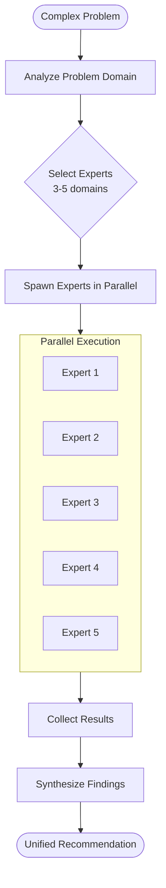
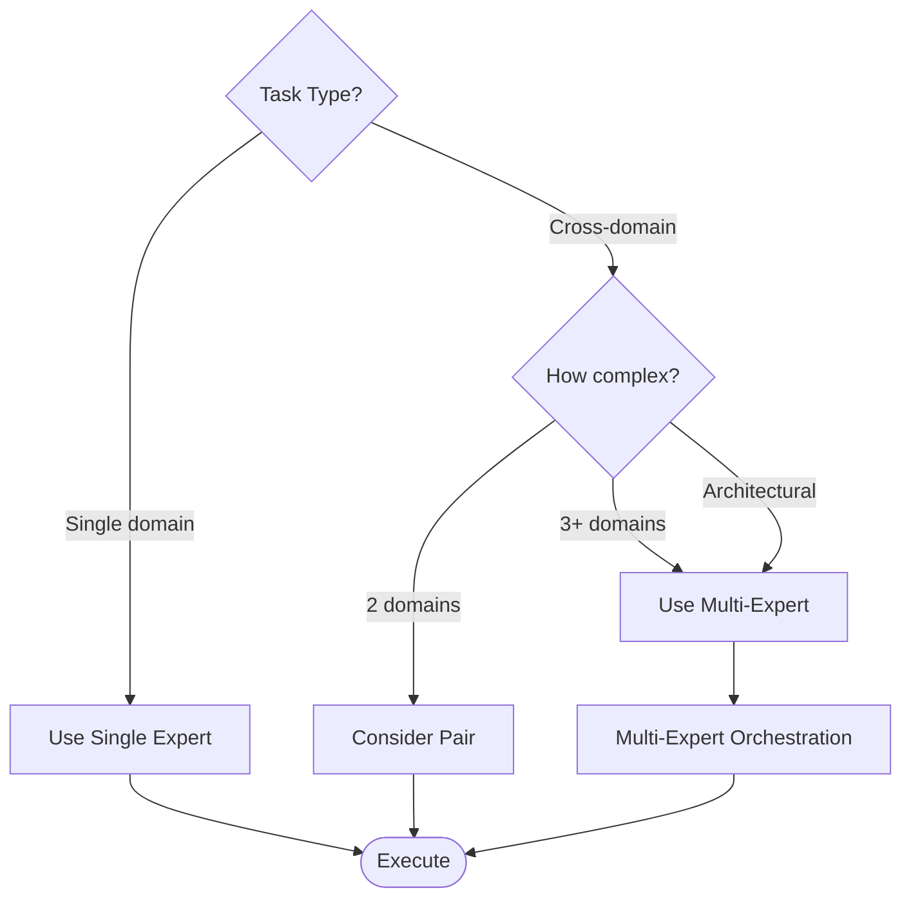
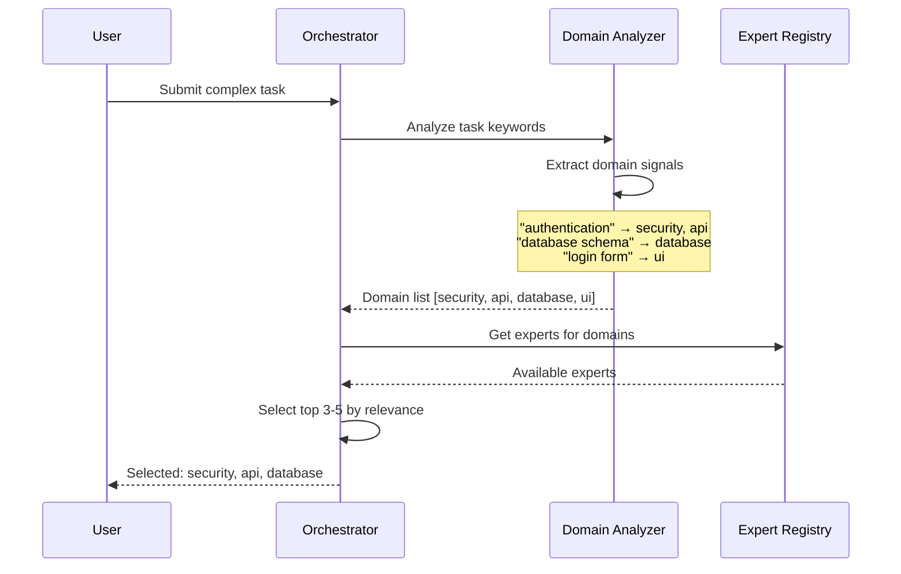
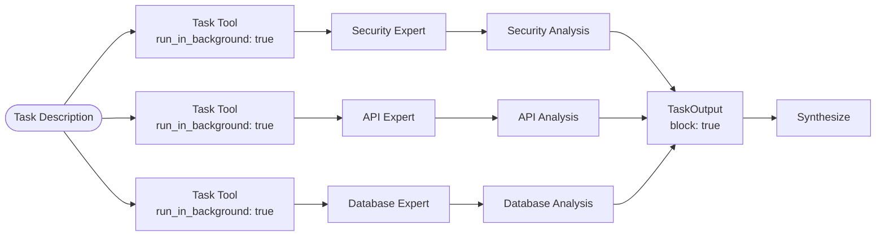
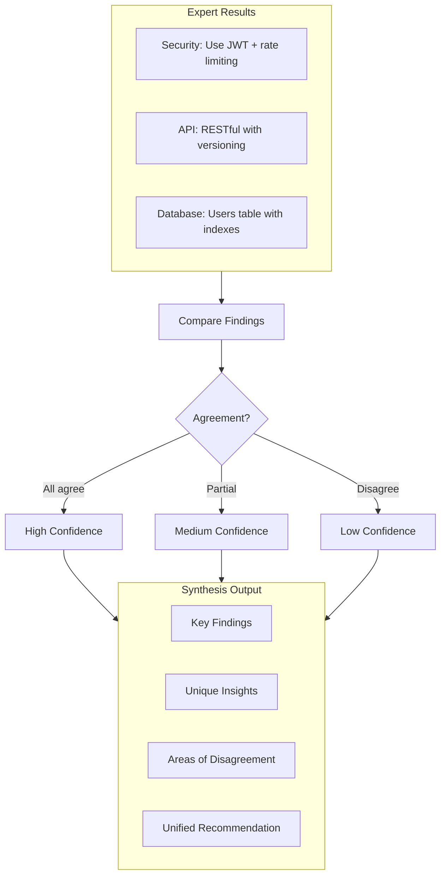
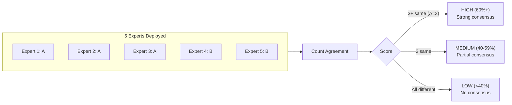
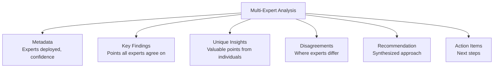
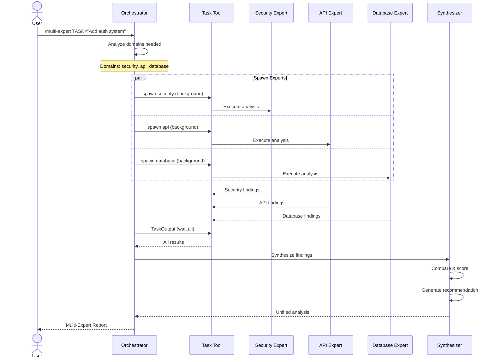

# Multi-Expert Orchestration Architecture

Multi-Expert Orchestration deploys multiple domain experts in parallel to analyze complex, cross-domain problems and synthesize their findings into unified recommendations.

---

## Overview



---

## When to Use Multi-Expert



**Use Multi-Expert when:**
- Task spans 3+ domains (e.g., "Add user authentication" touches DB, API, UI, Security)
- Making architectural decisions that affect multiple systems
- Need diverse perspectives on a complex problem
- Want to validate an approach from multiple angles

---

## Expert Selection Process



---

## Parallel Execution Pattern



---

## Synthesis Process



---

## Confidence Scoring



| Experts Agree | Confidence | Action |
|---------------|------------|--------|
| 3+ of 5 | HIGH | Proceed with recommendation |
| 2 of 5 | MEDIUM | Review disagreements |
| 1 each | LOW | Manual review required |

---

## Output Format



### Example Output

```markdown
## Multi-Expert Analysis: User Authentication System

**Experts Deployed**: security, api, database, ui
**Overall Confidence**: HIGH (3/4 agree on core approach)

### Key Findings (High Confidence)
- Use JWT tokens with 15-minute expiry
- Store refresh tokens in httpOnly cookies
- Add rate limiting on auth endpoints

### Unique Insights
- **Security**: Consider adding device fingerprinting
- **Database**: Use partial indexes on active sessions

### Areas of Disagreement
- Token storage: Security prefers cookies, UI prefers localStorage
- **Resolution**: Use httpOnly cookies (security wins for auth)

### Recommendation
Implement JWT-based auth with:
1. Access tokens (15min) in memory
2. Refresh tokens (7d) in httpOnly cookies
3. Rate limiting: 5 attempts/minute

### Action Items
- [ ] Create users table migration
- [ ] Implement /auth/login endpoint
- [ ] Add JWT middleware
- [ ] Build login form component
```

---

## Sequence: Full Orchestration



---

## Expert Registry

Available experts for orchestration:

| Domain | Expert | Specialization |
|--------|--------|----------------|
| database | `/AgileFlow:agents:database` | Schema, queries, migrations |
| api | `/AgileFlow:agents:api` | Endpoints, REST, GraphQL |
| ui | `/AgileFlow:agents:ui` | Components, styling, UX |
| security | `/AgileFlow:agents:security` | Auth, OWASP, vulnerabilities |
| testing | `/AgileFlow:agents:testing` | Unit, integration, E2E |
| performance | `/AgileFlow:agents:performance` | Optimization, caching |
| devops | `/AgileFlow:agents:devops` | CI/CD, deployment |
| documentation | `/AgileFlow:agents:documentation` | API docs, guides |

---

## Related Documentation

- [Agent Expert System](./agent-expert-system.md)
- [AgileFlow CLI Overview](./agileflow-cli-overview.md)
- [Command: /multi-expert](../../.agileflow/commands/multi-expert.md)
