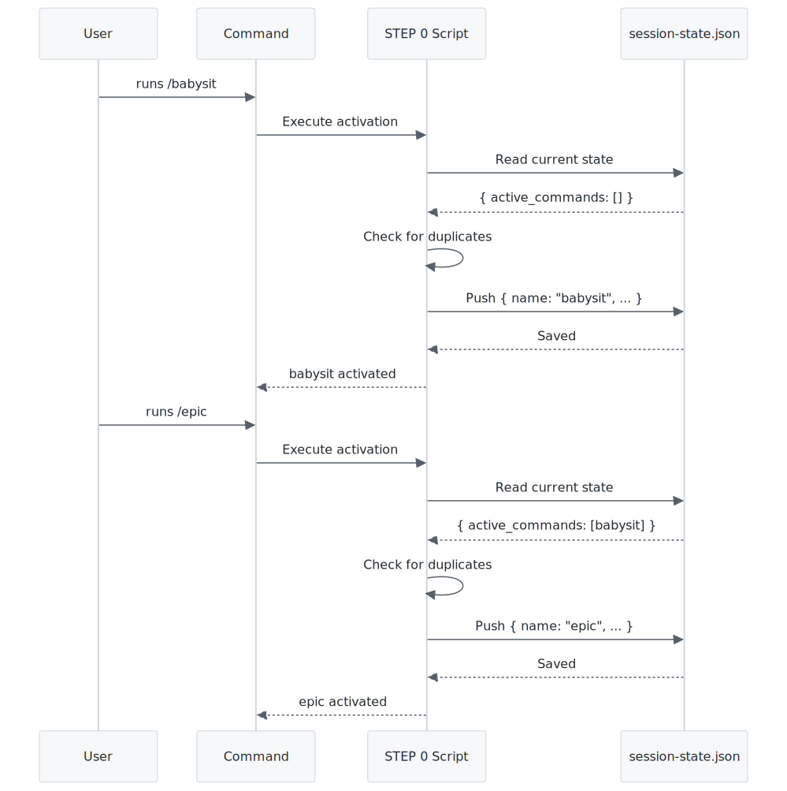

# PreCompact Context Preservation System

## Overview

The PreCompact system ensures critical command context survives Claude Code's conversation compaction. When a conversation gets too long, Claude summarizes it - this system preserves active command rules and behavioral guidelines.

## Problem Solved

Without this system:
1. User runs `/babysit` which has specific behavioral rules (use AskUserQuestion, etc.)
2. Conversation grows long and gets compacted
3. Claude forgets babysit's rules and stops following them

With this system:
1. Commands register themselves as "active" when run
2. PreCompact hook extracts their Compact Summary sections
3. Summaries are injected into the compacted context
4. Claude continues following the rules

## Architecture

### System Overview

<picture>
  <source media="(prefers-color-scheme: dark)" srcset="images/precompact-context-1.dark.svg">
  
</picture>

> The PreCompact system: commands register on execution, summaries are extracted during compaction, and state resets on new sessions.

---

### Command Registration Flow

<picture>
  <source media="(prefers-color-scheme: dark)" srcset="images/precompact-context-2.dark.svg">
  
</picture>

> Multiple commands can be active simultaneously. Duplicates are prevented.

---

### PreCompact Extraction Flow

<picture>
  <source media="(prefers-color-scheme: dark)" srcset="images/precompact-context-3.dark.svg">
  
</picture>

> Each active command's Compact Summary is extracted and concatenated into the preserved context.

## Key Files

| File | Purpose |
|------|---------|
| `docs/09-agents/session-state.json` | Stores `active_commands[]` array |
| `scripts/precompact-context.sh` | Extracts summaries from active commands |
| `scripts/clear-active-command.js` | Clears commands on new session |
| `.claude/settings.json` | Configures PreCompact and SessionStart hooks |

## Data Flow

### session-state.json Structure

```json
{
  "active_commands": [
    {
      "name": "babysit",
      "activated_at": "2025-12-22T02:16:52.089Z",
      "state": {}
    },
    {
      "name": "epic",
      "activated_at": "2025-12-22T02:17:30.000Z",
      "state": {}
    }
  ]
}
```

### Command Registration (STEP 0)

Each command has a STEP 0 activation script that runs first:

```javascript
const cmd = { name: 'COMMAND_NAME', activated_at: new Date().toISOString(), state: {} };
state.active_commands = state.active_commands || [];
if (!state.active_commands.some(c => c.name === cmd.name)) state.active_commands.push(cmd);
```

Key features:
- Initializes array if missing (backward compatible)
- Prevents duplicates (same command won't be added twice)
- Preserves existing commands (multiple commands can be active)

### PreCompact Extraction

The `precompact-context.sh` script:

1. Reads `active_commands` array from session-state.json
2. For each command name, finds the command file (checks in order):
   - `packages/cli/src/core/commands/{name}.md` (development)
   - `.agileflow/commands/{name}.md` (installed)
   - `.claude/commands/agileflow/{name}.md` (installed)
3. Extracts content between `<!-- COMPACT_SUMMARY_START -->` and `<!-- COMPACT_SUMMARY_END -->`
4. Outputs all summaries concatenated

### Output Format

```
AGILEFLOW PROJECT CONTEXT (preserve during compact):
====================================================

## Project Status
- Project: AgileFlow v2.40.0
- Branch: main
- Active Stories: US-0009: Feature X
- WIP Count: 1

## ACTIVE COMMAND: /agileflow:babysit

**ROLE**: Babysitter (Mentor + Orchestrator)...
[full compact summary]

## ACTIVE COMMAND: /agileflow:epic

**Purpose**: Create structured epics...
[full compact summary]

## Key Files to Check After Compact
...
```

## Hook Configuration

In `.claude/settings.json`:

```json
{
  "hooks": {
    "PreCompact": [
      {
        "matcher": "",
        "hooks": [
          {
            "type": "command",
            "command": "bash scripts/precompact-context.sh"
          }
        ]
      }
    ],
    "SessionStart": [
      {
        "matcher": "",
        "hooks": [
          {
            "type": "command",
            "command": "node scripts/clear-active-command.js"
          }
        ]
      }
    ]
  }
}
```

## Design Decisions

### Why an Array Instead of Single Object?

Users often run multiple commands in sequence:
- `/babysit` to start mentored development
- `/epic` to create a new epic
- `/story` to add stories

All these commands have behavioral rules that should be preserved. A single `active_command` field would overwrite previous commands.

### Why Clear on Session Start?

A new chat session is a fresh context. Commands from the previous session shouldn't carry over because:
- User might not want those rules anymore
- Commands might have left incomplete state
- Clean slate is more predictable

### Why Check Source First in Development?

During development, installed command files may be outdated. Checking `packages/cli/src/core/commands/` first ensures the latest Compact Summary is always used.

## Limitations

1. **Command names must be unique** - Same command can't be registered twice
2. **State is session-scoped** - Commands don't persist across Claude Code restarts
3. **Requires markers** - Commands without `COMPACT_SUMMARY_START/END` markers won't have summaries extracted

## Related Documentation

- [Compact Summary Practice](../02-practices/compact-summary.md) - How to add summaries to commands
- [Hooks System](../../CLAUDE.md#hooks-system) - Hook configuration details
