# Theme Test - Pick Your Favorite

This test shows all elements: rectangles, diamonds (Yes/No), circles, subgraphs, and edge labels.

---

## Option 1: Neutral Gray
Light gray fills, dark text.

---

## Option 2: Dark Strokes Only
No fills, just outlines - minimal look.

---

## Option 3: Soft Gray
Medium gray fills, darker borders.

---

## Option 4: Adaptive (Light/Dark Mode) ⭐
**Auto-switches colors based on your phone's theme setting!**
- Light mode: Light gray nodes, dark text
- Dark mode: Dark gray nodes, light text

---

**Which one looks best?** Reply 1, 2, 3, or 4

(Try switching your phone between light/dark mode to test option 4)
