# Unified Context Gathering System

## Overview

The Unified Context Gathering system provides a single-script solution for loading project state across all AgileFlow commands and agents. Instead of each command making 8-10 separate tool calls to gather context, they now run one script that outputs everything needed.

**Problem Solved:**
- Commands/agents were making multiple Read, Bash, and Glob calls at startup
- Each tool call adds latency and consumes context tokens
- Duplicated context-gathering logic across 60+ files

**Solution:**
- Single `obtain-context.js` script gathers all context in one execution
- Outputs structured, colored summary to terminal
- Optionally registers command for PreCompact context preservation

## Architecture

<picture>
  <source media="(prefers-color-scheme: dark)" srcset="images/unified-context-gathering-1.dark.svg">
  
</picture>

> Context gathering flow from commands/agents through the unified script

---

## Key Files

| File | Purpose |
|------|---------|
| `scripts/obtain-context.js` | Main context gathering script |
| `docs/09-agents/status.json` | Story/epic status tracking |
| `docs/09-agents/session-state.json` | Session and active command state |
| `docs/09-agents/bus/log.jsonl` | Agent communication log |
| `packages/cli/src/core/commands/*.md` | 28 commands with STEP 0 |
| `packages/cli/src/core/agents/*.md` | 34 agents with STEP 0 |

## How It Works

### 1. Command/Agent Invocation

Every command and agent has a standardized STEP 0 section:

````markdown
## STEP 0: Gather Context

```bash
node scripts/obtain-context.js <command-name>
```
````

### 2. Script Execution

The script performs these actions in sequence:

<picture>
  <source media="(prefers-color-scheme: dark)" srcset="images/unified-context-gathering-2.dark.svg">
  
</picture>

> Script execution flow

### 3. Context Sections Output

The script outputs 8 sections:

| Section | Data Source | Information |
|---------|-------------|-------------|
| Git Status | `git` commands | Branch, last commit, uncommitted files |
| Stories & Epics | `status.json` | Stories by status, ready items highlighted |
| Session State | `session-state.json` | Active session, working story, last session |
| Documentation | `docs/` directory | Folder structure with file counts |
| Research Notes | `docs/10-research/` | Recent research files |
| Agent Messages | `bus/log.jsonl` | Last 5 bus messages |
| Key Files | Various paths | Presence check for critical files |
| Epic Files | `docs/05-epics/` | List of epic markdown files |

### 4. PreCompact Integration

When a command name is provided, the script registers it in `session-state.json`:

```json
{
  "active_command": {
    "name": "babysit",
    "activated_at": "2025-12-22T18:30:00.000Z",
    "state": {}
  }
}
```

This allows the PreCompact hook to preserve context when conversations are compacted.

## Usage

### Basic (no registration)
```bash
node scripts/obtain-context.js
```

### With command registration
```bash
node scripts/obtain-context.js babysit
node scripts/obtain-context.js mentor
node scripts/obtain-context.js api
```

### Example Output

```
AgileFlow Context [babysit]
Generated: 2025-12-22T18:30:00.000Z

═══ Git Status ═══
Branch: main
Last commit: a717be4 chore: bump version to v2.43.0
Uncommitted: clean

═══ Stories & Epics ═══
─── Epics
  EP-0001: Agent Expert System [complete]
  EP-0002: Session Harness [complete]
─── Stories by Status
  done: 12
─── Ready to Implement
  (none)

═══ Session State ═══
No active session

═══ Documentation ═══
  00-meta/ (2 md, 1 json)
  02-practices/ (5 md)
  ...

═══ Key Files ═══
  ✓ CLAUDE.md (project instructions)
  ✓ README.md (project overview)
  ✓ Roadmap
  ○ Practices index

─────────────────────────────────────────
Context gathered in single execution. Ready for task selection.
```

## Benefits

| Before | After |
|--------|-------|
| 8-10 tool calls per command | 1 tool call |
| ~15 lines inline script per file | 1-line reference |
| Duplicated logic in 60+ files | Single source of truth |
| No PreCompact integration | Automatic registration |
| Plain text output | Colored, structured output |

## Adding to New Commands/Agents

Add this section after the YAML frontmatter:

````markdown
## STEP 0: Gather Context

```bash
node scripts/obtain-context.js <your-command-name>
```

---
````

## Related Documentation

- [PreCompact Context Preservation](precompact-context.md) - How context survives conversation compacts
- [Babysit/Mentor System](babysit-mentor-system.md) - Primary users of context gathering
- [Session Harness](../05-epics/EP-0002-session-harness.md) - Session management system
