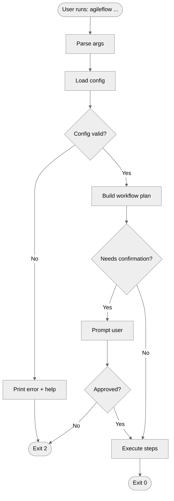

# Mermaid.js for Technical Documentation Diagrams

**Research Date**: 2025-12-16
**Topic**: Mermaid.js diagramming library
**Use Case**: Architecture documentation with visual diagrams for AgileFlow CLI
**Sources**: Official Mermaid docs, GitHub docs, Docusaurus, Fumadocs

---

## Summary

Mermaid.js lets you write diagrams as text inside Markdown, which keeps architecture docs versionable, reviewable, and easy to update as the code changes. It supports the core diagram types needed for AgileFlow CLI—flowcharts (process + decisions), sequence diagrams (API/system interactions), state diagrams (workflow state machines), and UML-style class diagrams—plus newer `architecture-beta` diagrams for component views.

**Best practices**: Keep diagrams small and composable (split big diagrams into subgraphs/sections), use consistent naming + directions, and add accessibility metadata (`accTitle`/`accDescr`) when your renderer supports it.

---

## Diagram Types

### A) Flowcharts (Process Flows, Decision Trees)

**Start line**: `flowchart TD | LR | TB | RL`

**Node shapes**:
- `A[Rectangle]` - standard process
- `B(Round edges)` - rounded
- `C([Stadium])` - terminal
- `D[[Subroutine]]` - subprocess
- `E[(Database)]` - cylinder/storage
- `F((Circle))` - start/end
- `G{Diamond}` - decision

**Edges/arrows**:
- `A --> B` solid arrow
- `A --- B` line
- `A -.-> B` dotted arrow
- `A ==> B` thick arrow
- `A -->|label| B` labeled

**Subgraphs**:
```mermaid
subgraph SG1[Title]
  direction TB
  A --> B
end
```

**Example (AgileFlow CLI pipeline)**:


---

### B) Sequence Diagrams (API Calls, System Interactions)

**Start line**: `sequenceDiagram`

**Participants**: `participant CLI` or `actor User` or `participant GH as GitHub API`

**Messages**:
- `A->>B: request` solid with arrow
- `A-->>B: response` dotted with arrow

**Control frames**: `alt/else/end`, `opt/end`, `loop/end`, `par/and/end`

**Example (CLI → Claude Code → GitHub)**:


---

### C) Architecture / Block Diagrams

**Option 1: `architecture-beta`** (newer, purpose-built for components)


**Option 2: Flowchart with layer subgraphs** (more portable)


---

### D) Class Diagrams (Agent Relationships)

**Start line**: `classDiagram`

**Relationships**:
- `Base <|-- Derived` inheritance
- `Whole *-- Part` composition
- `Whole o-- Part` aggregation
- `A --> B` association
- `A ..> B` dependency

**Example (agent roles)**:


---

### E) State Diagrams (Workflow States)

**Start line**: `stateDiagram-v2`

**Syntax**:
- `[*] --> StateA` start
- `StateZ --> [*]` end
- `A --> B: event` transition

**Example (workflow run lifecycle)**:


---

## Syntax Quick Reference

### Node Shapes (Flowcharts)
| Syntax | Shape |
|--------|-------|
| `A[text]` | Rectangle |
| `A(text)` | Rounded |
| `A([text])` | Stadium |
| `A[[text]]` | Subroutine |
| `A[(text)]` | Cylinder/DB |
| `A((text))` | Circle |
| `A{text}` | Diamond |

### Arrow Types
| Syntax | Type |
|--------|------|
| `-->` | Solid arrow |
| `---` | Line |
| `-.->` | Dotted arrow |
| `==>` | Thick arrow |
| `-->\|label\|` | Labeled |

### Direction Keywords
- `TD` / `TB` - top to bottom
- `LR` - left to right
- `RL` - right to left
- `BT` - bottom to top

### Styling


**Built-in themes**: `default`, `dark`, `forest`, `neutral`

---

## GitHub/Markdown Integration

### Embedding in GitHub
Use fenced code block with `mermaid` language:

````markdown

````

### Platform Support
| Platform | Support |
|----------|---------|
| GitHub | Native via ```mermaid fences |
| GitLab | Native in GLFM |
| Docusaurus | Enable `@docusaurus/theme-mermaid` |
| Fumadocs | Client component pattern |

### Limits
- `maxTextSize` commonly ~50k chars
- Split large diagrams by scenario/layer

### Accessibility
- Use `accTitle` and `accDescr` for metadata
- Test in both light and dark modes

---

## Best Practices Checklist

- [ ] **Naming**: Short IDs (`cfg`, `plan`), descriptive labels (`Load config`)
- [ ] **Direction**: Pick one per doc set (LR for architecture, TD for procedures)
- [ ] **Subgraphs**: Use for layers (CLI/Core/External) or phases (Plan/Apply)
- [ ] **Labels**: Keep short; push details to adjacent Markdown
- [ ] **Split**: Break big diagrams by scenario
- [ ] **Legend**: Document styling conventions if used

---

## Gotchas & Limitations

1. **Character escaping**: Labels with `|`, `"`, `:` can break parsing
2. **Complexity**: Readability collapses past ~20 nodes; split aggressively
3. **Version mismatch**: `architecture-beta` may not render on older hosts
4. **Size limits**: Some platforms enforce smaller than 50k chars
5. **Security**: Interactive features (click/callbacks) may be blocked by CSP

---

## Recommended Diagram Type by Use Case

| Use Case | Diagram Type |
|----------|--------------|
| Process flows / decisions | Flowchart |
| API/system interactions | Sequence |
| Workflow lifecycle | State |
| Component overview | Architecture-beta (or layered flowchart) |
| Agent relationships | Class diagram |

---

## Template Snippets

### Basic Flowchart


### Basic Sequence


### Basic Architecture


---

## References

1. [Creating Mermaid diagrams - GitHub Docs](https://docs.github.com/en/get-started/writing-on-github/working-with-advanced-formatting/creating-diagrams) - 2025-12-16
2. [Mermaid - Diagramming and charting tool](https://mermaid.js.org/) - 2025-12-16
3. [Flowcharts - Basic Syntax](https://docs.mermaidchart.com/mermaid-oss/syntax/flowchart.html) - 2025-12-16
4. [Sequence diagrams](https://mermaid.js.org/syntax/sequenceDiagram.html) - 2025-12-16
5. [Architecture Diagrams (v11.1.0+)](https://mermaid.js.org/syntax/architecture.html) - 2025-12-16
6. [Class diagrams](https://mermaid.js.org/syntax/classDiagram.html) - 2025-12-16
7. [State diagrams](https://docs.mermaidchart.com/mermaid-oss/syntax/stateDiagram.html) - 2025-12-16
8. [Theme Configuration](https://mermaid.js.org/config/theming.html) - 2025-12-16
9. [Accessibility Options](https://mermaid.js.org/config/accessibility.html) - 2025-12-16
10. [Diagrams - Docusaurus](https://docusaurus.io/docs/next/markdown-features/diagrams) - 2025-12-16
11. [Mermaid - Fumadocs](https://fumadocs.dev/docs/ui/markdown/mermaid) - 2025-12-16
