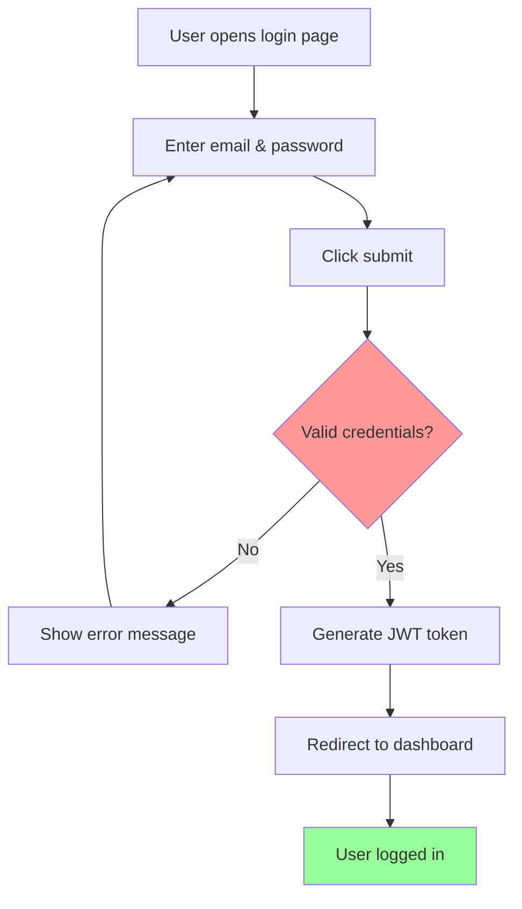
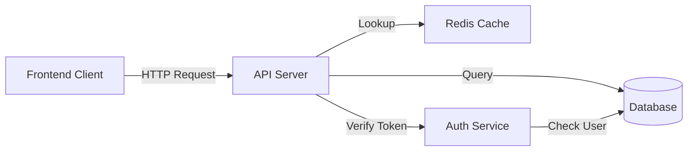

# diagram-generator

Generate Mermaid/ASCII diagrams from descriptions.

## Activation Keywords
- "diagram", "ASCII", "Mermaid", "flowchart", "architecture", "sequence diagram"

## When to Use
- Creating architecture diagrams
- Visualizing user workflows
- Drawing sequence diagrams
- System design documentation

## What This Does
Generates diagrams in Mermaid format (renders in GitHub/Markdown):
- **Flowcharts** (user flows, decision trees)
- **Sequence diagrams** (API interactions, service calls)
- **Architecture diagrams** (system components, data flow)
- **ER diagrams** (database relationships)
- **Gantt charts** (timeline/roadmap)
- **State diagrams** (state machines)

Also supports ASCII art for simple diagrams.

## Output
Mermaid code blocks ready for markdown files

## Example Activation
User: "Draw user login flow"
Skill: Generates:

Architecture diagram example:

